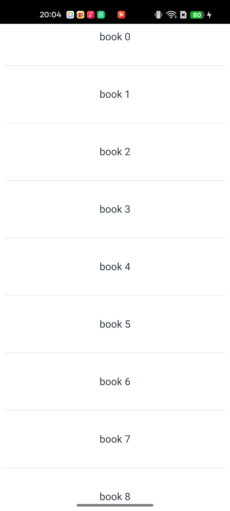
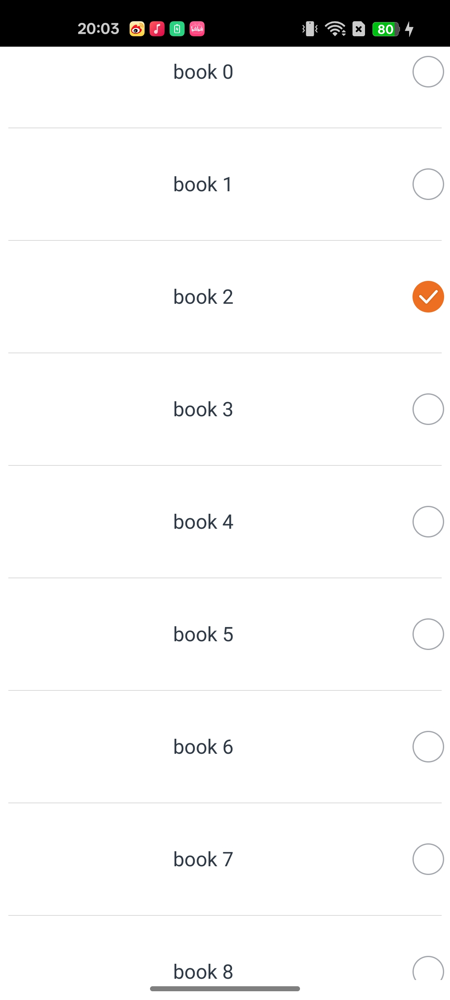
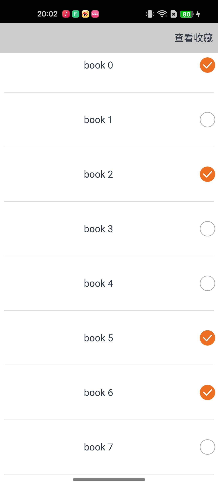

<a id="创建 CJMP 应用"></a>
# 一、创建 CJMP 应用
本指南将带您创建第一个 CJMP 应用。完成后，您将得到一个简单的书籍收藏应用：用户可以收藏和取消收藏书籍，点击导航栏右上角查看已收藏的书籍，并返回原页面。

您将学到以下内容：

- 利用插件创建 CJMP 项目的基本工作流程
- 如何创建一个可滚动的延迟加载列表
- 状态管理装饰器的使用
- 用户交互事件的处理
- 页面导航和参数传递
- 新页面的构建与数据展示

在 `VS Code` 中安装和配置 CJMP 相关插件，可参考 [CJMP 插件使用快速指南](start-plugins.md)；如需使用命令行，可参考 [CJMP Tools 命令行快速指南](start-tools.md)；更多支持的组件可参考 [已支持的仓颉组件](../../framework-dev/cj-ui/README.md)。

<a id="开发方式"></a>
## 开发方式
CJMP 应用开发支持以下两种方式，创建、构建、运行等操作请参考对应文档：

- 借助插件：参考 [CJMP 插件使用快速指南](start-plugins.md)。
- 借助命令行：参考 [CJMP Tools 命令行快速指南](start-tools.md)。

项目调试目前仅支持借助插件，参考 [CJMP 插件使用快速指南](start-plugins.md#运行和调试项目)。

初始化应用运行成功后的真机画面如下：  


<a id="创建一个可以滚动的列表"></a>
# 二、创建一个可以滚动的列表
在这一步中，您将在 `lib/index.cj` 页面创建一个可滚动列表，用于展示书籍名称。借助 `LazyForEach`，可以从数据源中按需迭代数据，并在每次迭代时创建对应组件。当 `LazyForEach` 用于列表等滚动容器时，框架会根据可视区域按需创建组件；当组件滑出可视区域后，框架会将其销毁回收，以降低内存占用。

`lib/index.cj` 中的 `EntryView` 类是 UI 组件的容器，负责管理组件的状态、生命周期和用户交互。因此，通常将数据模型、数据源、工具函数等定义在类外，因为它们不依赖 UI 组件的状态和生命周期，便于独立复用；而类内则定义与 UI 组件状态和生命周期相关的逻辑。

1. 首先，为了使用 `LazyForEach` 实现数据驱动的 UI 更新，需要在 `EntryView` 类外定义一个数据模型 `Book`，以及一个实现 `IDataSource` 接口的数据源 `BookDataSource`。`IDataSource` 是 `LazyForEach` 使用的数据源接口，需要开发者实现相关方法以完成初始化。更多说明可参考 [仓颉组件-LazyForEach](https://developer.huawei.com/consumer/cn/doc/cangjie-references-V5/cj-rendering-control-lazyforeach-V5)。
```
    public class Book {
        public Book(
            let name: String,
            let id: Int64
        ) {}
    }

    class BookDataSource <: IDataSource<Book> {
        public BookDataSource(let data_: ArrayList<Book>) {}
        public var listenerOp: Option<DataChangeListener> = None
        public func totalCount(): Int64 {
            return data_.size
        }
        public func getData(index: Int64): Book {
            return data_[index]
        }

        public func onRegisterDataChangeListener(listener: DataChangeListener): Unit {
            listenerOp = listener
        }

        public func onUnregisterDataChangeListener(listener: DataChangeListener): Unit {
            listenerOp = None
        }

        public func notifyChange(): Unit {
            let listener: DataChangeListener = listenerOp.getOrThrow()
            listener.onDataReloaded()
        }
    }
```
2. 在 `EntryView` 类外创建数据源，定义一个 `getDS` 函数，生成包含 50 本书的 `ArrayList`，并返回 `BookDataSource`。
```
//头文件新增
import std.collection.ArrayList


func getDS(): BookDataSource
{
    let data: ArrayList<Book> = ArrayList<Book>()
    for (i in 0..50) {
        data.add(Book("book ${i}", i * i))
    }
    let dataSourcebook: BookDataSource = BookDataSource(data)
    return dataSourcebook
}

let dataSourcebook: BookDataSource = getDS()
```

3. 在 `EntryView` 类内使用 `List` 组件创建列表，并在 `List` 内遍历 `BookDataSource`。`LazyForEach` 会根据需要动态创建和销毁列表项。对于每个数据对象，创建一个 `ListItem` 用于显示书籍名称，同时还可以为列表添加分割线。
```
@Entry
@Component
class EntryView {
    public func build(): Unit {
        Column() {
            List(space: 50, initialIndex: 0) {
                LazyForEach(dataSourcebook, itemGeneratorFunc: {book: Book, idx: Int64 =>
                    ListItem() {
                        Flex(FlexParams(justifyContent: FlexAlign.SpaceEvenly, alignItems: ItemAlign.Center)){
                            Text(book.name)
                            .width(100.percent).height(40).fontSize(16)
                            .textAlign(TextAlign.Center).borderRadius(10)
                        }
                    }
                })
            }
            .divider(strokeWidth: 2.px, color: Color(0xDCDCDC), startMargin: 20.px, endMargin: 20.px)
        }
        .position(x:0, y:0)
    }
}
```

* 完整文件参考：[index.cj](examples/index_for_chapter2.cj)

* 真机画面如下：  


<a id="添加一个有状态的组件"></a>
# 三、添加一个有状态的组件
有状态组件的核心是通过 `@State`、`@Link`、`@Prop` 等装饰器管理组件状态。这些装饰器使组件具备“状态”能力，即数据变化可以驱动 UI 自动更新。不同装饰器的说明可参考 [仓颉组件-状态管理](https://developer.huawei.com/consumer/cn/doc/cangjie-references-V5/cj-state-management-manual-V5#state)。

在 `lib/index.cj` 页面中，可以在 `EntryView` 类内添加一个由 `@State` 装饰的 `book_saved`，用于记录用户收藏的书籍信息。
```
    // 头文件新增
    import std.collection.HashMap


    @State var book_saved: HashMap<Int64, String> = HashMap<Int64, String>();
```

* 完整文件参考：[index.cj](examples/index_for_chapter3.cj)

<a id="添加交互"></a>
# 四、添加交互
在这一步中，您将为 `lib/index.cj` 页面中的每个列表项添加一个可点击的开关。开关被选中时表示该书已被收藏，取消选中时表示取消收藏。

1. 在 `EntryView` 类内使用 `Toggle` 组件，并将其初始状态设置为未选中。当 `Toggle` 状态变化时，会触发 `onChange` 回调，回调参数 `isOn` 表示当前开关是否被选中。借助可变状态 `book_saved` 记录用户的收藏书单。

```
    List(space: 50, initialIndex: 0) {
        LazyForEach(dataSourcebook, itemGeneratorFunc: {book: Book, idx: Int64 =>
            ListItem() {
                Flex(FlexParams(justifyContent: FlexAlign.SpaceEvenly, alignItems: ItemAlign.Center)){
                    Text(book.name)
                    .width(100.percent).height(40).fontSize(16)
                    .textAlign(TextAlign.Center).borderRadius(10)

                    Toggle(ToggleType.CheckboxType, isOn: false)
                    .size(width: 28, height: 28)
                    .selectedColor(0xed6f21)
                    .onChange({isOn: Bool =>
                        AppLog.info("Component status: ${isOn}")
                        if (isOn) {
                            // 当isOn为true时，将book加入book_saved
                            book_saved.add(book.id, book.name)
                        } else {
                            // 当isOn为false时，从book_saved中移除book
                            book_saved.remove(book.id)
                        }
                    })
                }
            }
        })
    }
    .divider(strokeWidth: 2.px, color: Color(0xDCDCDC), startMargin: 20.px, endMargin: 20.px)
```

* 完整文件参考：[index.cj](examples/index_for_chapter4.cj)

* 真机画面如下：  



<a id="导航到新页面"></a>
# 五、导航到新页面
在这一步中，您将在 `lib/index.cj` 页面中添加一个可跳转到新页面的顶部状态栏。

1. 在 `EntryView` 类外，由于目前 `Router` 仅支持传递 `String` 类型的参数，因此需要编写一个函数，将 `book_saved` 转换为 `String` 后再进行传递。
```
    // 头文件新增
    import ohos.router.*


    func hashMapToString(map: HashMap<Int64, String>): String {
        var result: String = ""
        var first: Bool = true
        
        for ((key, value) in map) {
            if (!first) {
                result += "|"
            } else {
                first = false
            }
            result += "${value}"
        }
        return result
    }
```
2. 在 `EntryView` 类内的 `List` 前添加一个 `Column` 作为顶部状态栏，并在其中显示 `查看收藏` 文本。在 `.onClick` 中结合 `Router` 实现点击跳转页面的功能。
```
    Column() {
        Text('查看收藏')
        .width(20.percent)
        .height(50)
        .onClick{ e => 
            Router.push(
                url:"SavedPage",
                params: hashMapToString(this.book_saved)
            )
        }
    }
    .width(100.percent)
    .height(50)
    .backgroundColor(0xCCCCCC)
    .alignItems(HorizontalAlign.End)
```

* 完整文件参考：[index.cj](examples/index_for_chapter5.cj)

<a id="构建新页面-savedpaged-cj"></a>
# 六、构建新页面
1. 在 `lib` 文件夹下创建一个 `savedPaged.cj` 文件，用于编写新页面。为了管理组件的状态和生命周期，需要定义一个 `SavedPage` 类，其中包含构建自定义组件所必需的 `build()` 方法。
```
package ohos_app_cangjie_entry

import ohos.base.*
import ohos.component.*
import ohos.state_manage.*
import ohos.state_macro_manage.*
import std.collection.ArrayList
import ohos.router.*

@Entry
@Component
class SavedPage{
    func build() {
        
    }
}
```
2. 首先在 `SavedPage` 类外定义一个处理 `params` 参数的函数 `parseSavedBooks`，将 `String` 类型的参数转换为 `ArrayList<String>`，供 `List` 组件使用。
```
    func parseSavedBooks(savedBooksStr: String): ArrayList<String> {
    let result: ArrayList<String> = ArrayList<String>()
            
    if (savedBooksStr.size > 0) {
        // 按 | 分割键值对
        let parts = savedBooksStr.split("|")
                
        for (part in parts) {
            let name = part
            result.add(name)
        }
    }
    return result
}
```

3. 为了在页面渲染时直接展示已收藏的书名，需要在 `SavedPage` 类内的 `aboutToAppear()` 中获取 `Router` 传递的参数。`aboutToAppear()` 是组件即将出现时的生命周期回调，会在创建自定义组件实例后、执行 `build()` 之前调用，两者在类中处于同一层级。可以在 `aboutToAppear()` 中修改状态变量，修改结果会在后续执行 `build()` 时生效。更多自定义组件生命周期函数的介绍可参考 [仓颉组件-自定义组件的生命周期](https://developer.huawei.com/consumer/cn/doc/cangjie-references-V5/cj-custom-component-lifecycle-V5)。
```
    public override func aboutToAppear(): Unit{
        var str: Option<String> = Router.getParams()
        match(str) {
            case Some(v) => 
                this.message = v
                bookList = parseSavedBooks(message)
            case None => this.message = ""
        }
    }
```

4. 在 `SavedPage` 类的 `build()` 中定义一个带有 `返回` 按钮的顶部状态栏，用于返回初始页面。
```
    Column() {
        Text('返回')
        .width(20.percent)
        .height(50)
        .onClick{e => Router.back()}
    }
    .width(100.percent)
    .height(50)
    .backgroundColor(0xCCCCCC)
    .alignItems(HorizontalAlign.Start)
```

5. 在 `build()` 中使用 `List` 组件展示已收藏的书籍名称。
```
    List(space: 50, initialIndex: 0){
        ForEach(this.bookList, itemGeneratorFunc: {item:String, _: Int64 =>
            ListItem(){
                Text(item).width(100.percent).height(40).fontSize(16)
                .textAlign(TextAlign.Center).borderRadius(10)
            }
        })
    }
    .divider(strokeWidth: 2.px, color: Color(0xDCDCDC), startMargin: 20.px, endMargin: 20.px)
```

* 完整文件参考：[savedPaged.cj](examples/savedPaged.cj)

* 真机画面如下：  


