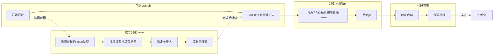
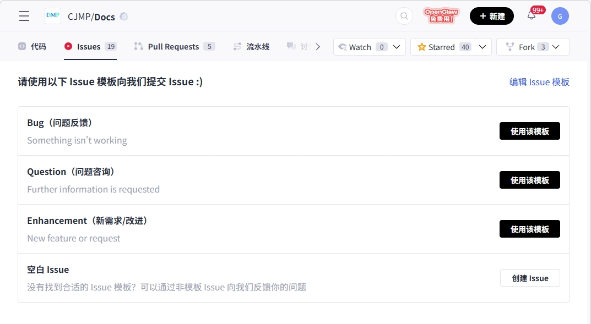
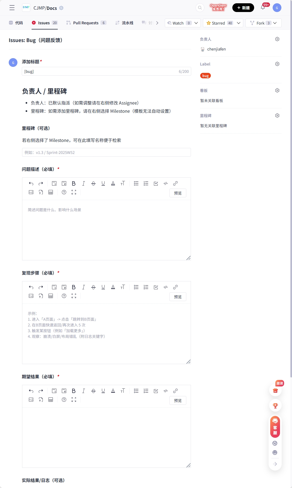
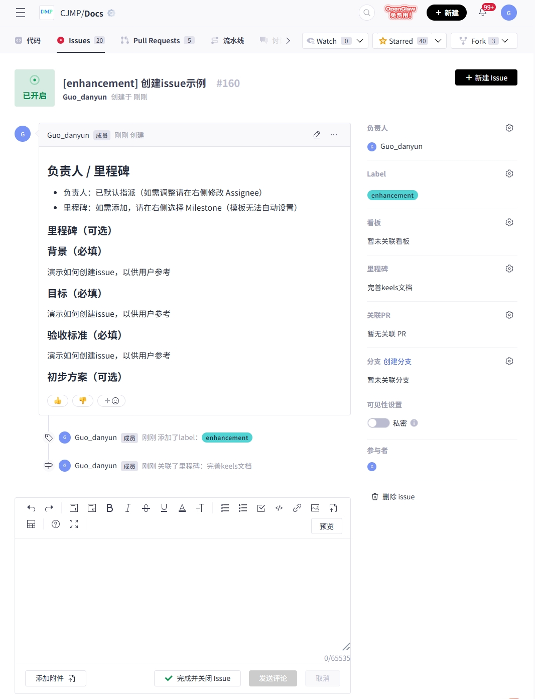
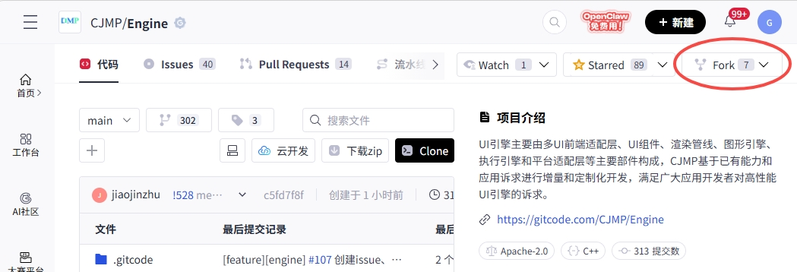
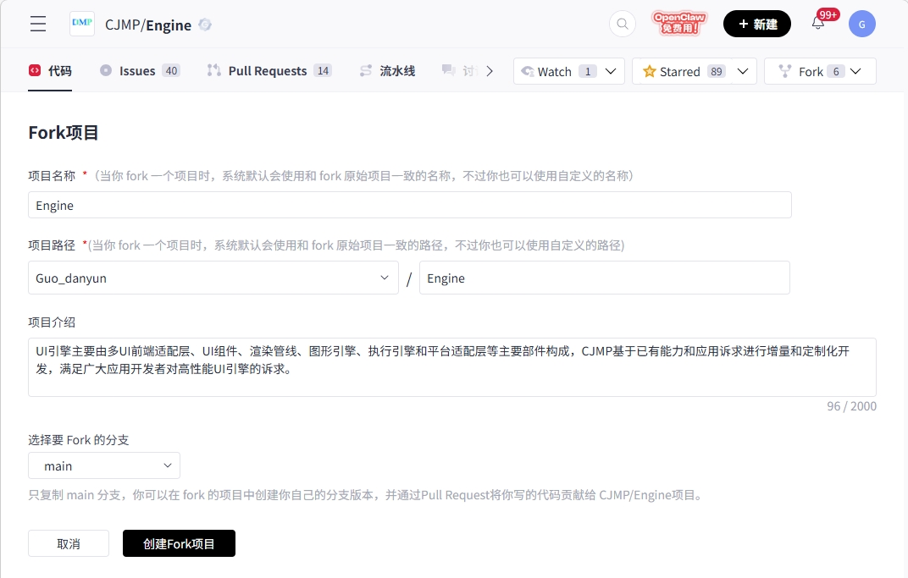
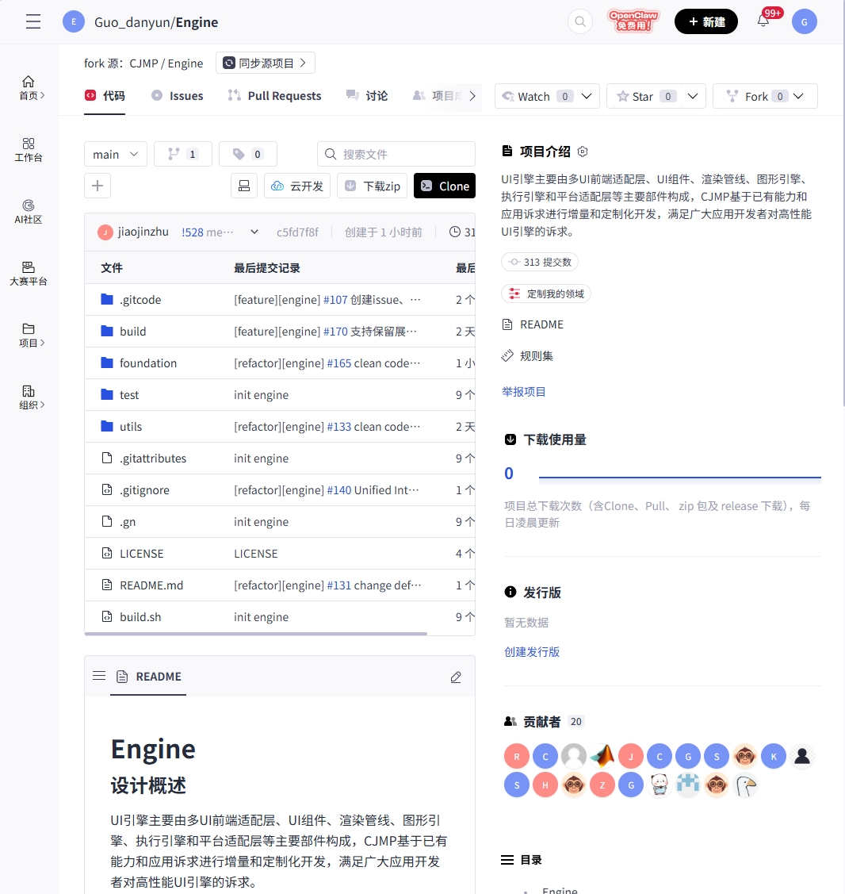
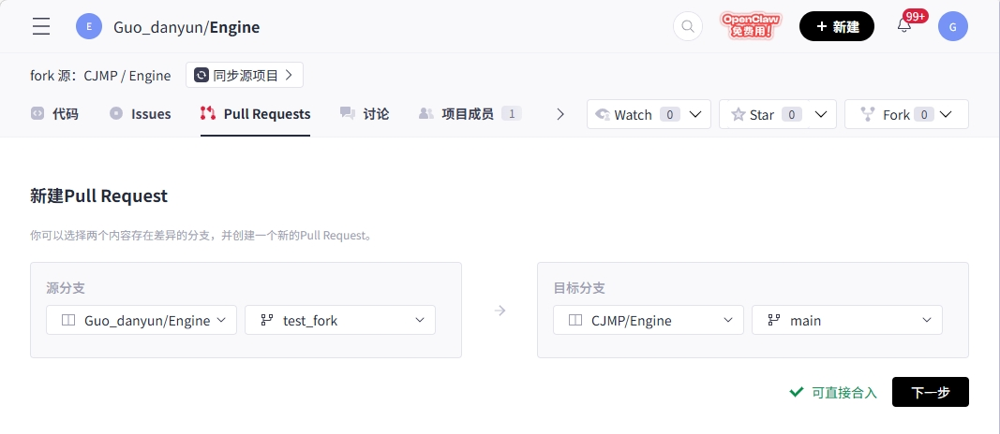
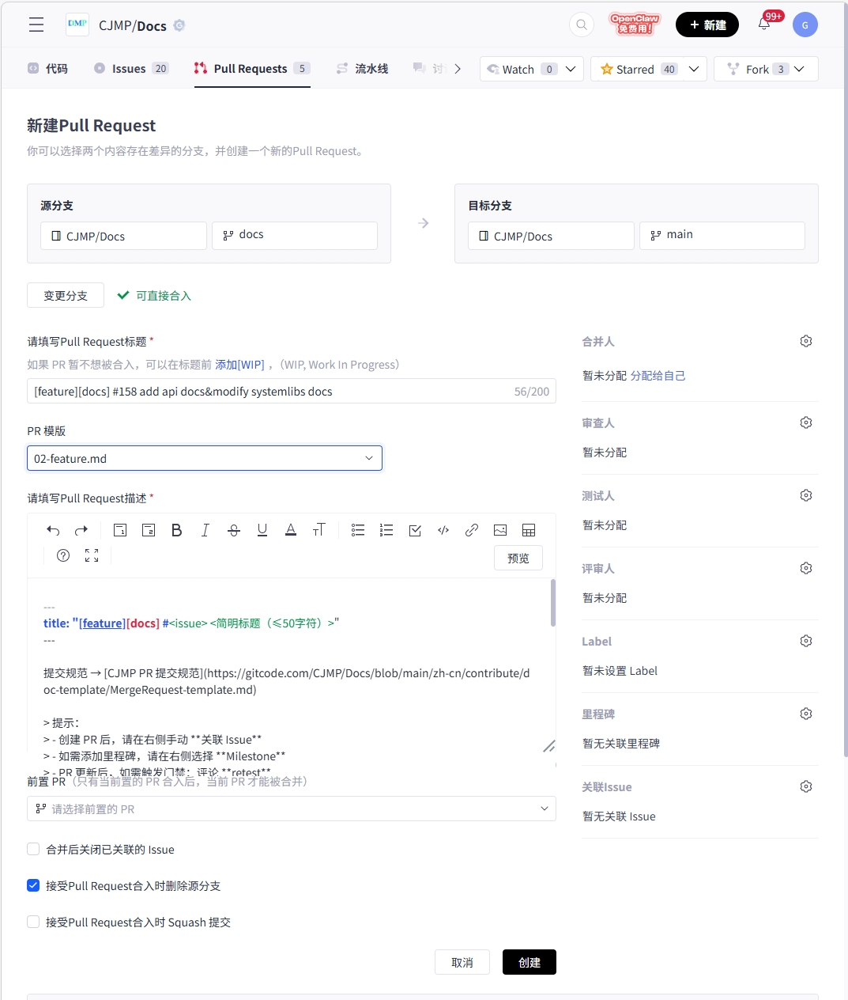
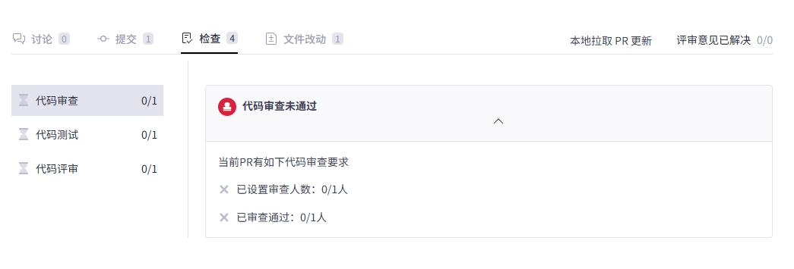

# 社区代码提交流程


## 一、Issue 非必需，按需创建

### 1. 选择正确的 Issue 类型


### 2. 按模板要求清晰阐述问题


### 3. 指定负责人
Issue 模板中已设置默认负责人，如有需要，可在右侧栏调整 Assignee。

### 4. 关联里程碑
如有需要，可在右侧栏中选择对应的 Milestone。



提交代码前无需先创建 Issue，可直接 Fork 仓库、创建分支并提交 PR。仅在需要补充问题背景、方案讨论、任务拆分等情况时，再按需创建 Issue。

## 二、创建分支

### 1. Fork 仓库并创建分支
由于主仓未开放创建分支权限，请先将主仓 Fork 到个人账号下，并在个人 Fork 仓库中创建开发分支。开发完成后，再通过 Pull Request 将变更合入主仓。

建议按以下步骤操作。

#### 1. 在平台上 Fork 主仓
在代码托管平台页面打开主仓，点击右上角的 `Fork`。



进入 Fork 页面后，请确认目标命名空间、仓库名称等信息，然后完成 Fork。



Fork 完成后，可在个人账号下看到一份同名仓库，该仓库即为个人 Fork 仓库。



#### 2. 在本地配置远程仓库
建议本地同时保留两个远程地址：
- 主仓远程用于同步最新代码
- 个人 Fork 仓库远程用于推送开发分支

常见场景如下。

场景一：本地已克隆主仓，仅需添加个人 Fork 仓库远程。

```bash
# 查看当前远程
git remote -v

# 示例：
# gitcode 为主仓远程
gitcode https://gitcode.com/CJMP/Docs (fetch)
gitcode https://gitcode.com/CJMP/Docs (push)

# 添加个人 Fork 仓库远程，名称可自定义，例如 guody
git remote add guody https://gitcode.com/<your_name>/Docs.git

# 再次确认远程配置
git remote -v
```

场景二：本地克隆的是个人 Fork 仓库，需要额外添加主仓远程。

```bash
# origin 为个人 Fork 仓库
git remote add upstream https://gitcode.com/CJMP/Docs
git remote -v
```

远程名称建议约定如下：
- 主仓远程用于同步最新代码，例如命名为 `gitcode` 或 `upstream`
- 个人 Fork 仓库远程用于推送开发分支，例如命名为个人名或 `origin`

#### 3. 基于主仓最新代码创建分支并推送到个人 Fork 仓库
请先同步主仓最新代码，再从主仓默认分支拉出本地开发分支，并推送到个人 Fork 仓库。

```bash
# 以 gitcode 为主仓远程，guody 为个人 Fork 仓库远程为例
git fetch gitcode
git checkout main
git pull gitcode main
git checkout -b feature/xxx
git push -u guody feature/xxx
```

说明：
- `main` 为示例默认分支名，如仓库默认分支为 `master` 或其他名称，请替换为实际分支名。
- `feature/xxx` 为示例开发分支名，请按实际需求命名。
- 首次使用 `git push -u` 后，后续在该分支上执行 `git push` 即可默认推送到个人 Fork 仓库对应分支。

#### 4. 提交代码并发起 Pull Request
开发完成后，先将代码提交并推送到个人 Fork 仓库分支。

```bash
git add .
git commit -m "feat: xxx"
git push
```

随后在代码托管平台上，从个人 Fork 仓库的开发分支向主仓目标分支发起 Pull Request，由主仓维护者审核并合入。实际操作时，请以页面中选择的源仓库、源分支、目标仓库和目标分支为准。



## 三、创建 PR

### 1. 根据PR类型选择模板，并根据提示进行填写


### 2. 关联里程碑
如有需要，可在右侧栏中选择对应的 Milestone。

### 3. Issue 可选关联
如本次提交对应已有 Issue，可在 PR 中填写关联信息；若无对应 Issue，也可直接提交 PR，无需先创建或强制关联 Issue。

## 四、代码审查

### 1. 触发门禁
PR 更新后，如需触发门禁，可在评论区输入“**retest**”。  
门禁通常由静态检查、编译构建、UT 等环节组成。
门禁通过后，`ci-robot` 会在“测试人员”区域 `+1`。

### 2. 代码检视
可联系对应责任田的审查人进行代码审查。审查通过后需获得 `+1`，且至少需要 1 名审查人 `+1`。

## 五、PR 合入

PR 需获得 1 名评审人通过和 1 名测试人员通过后，方可合入。


