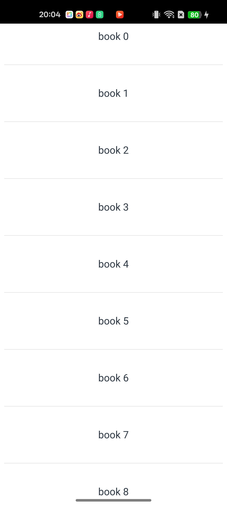
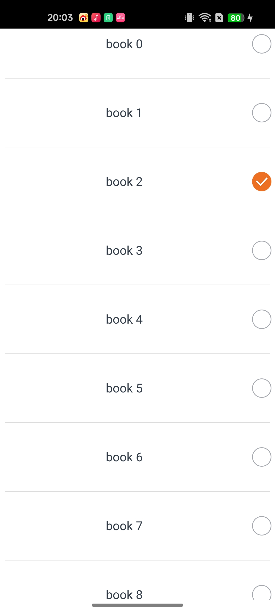
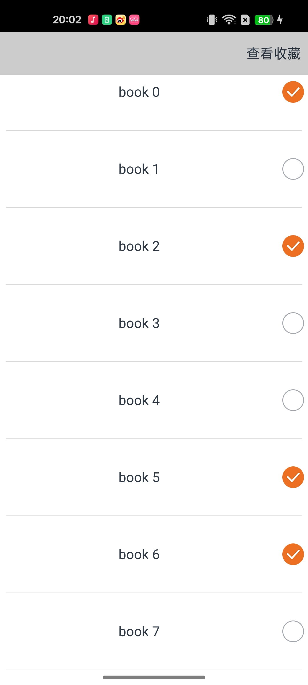
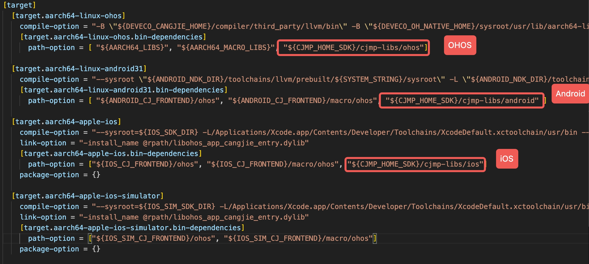

<a id="创建 CJMP 应用"></a>
# 一、创建 CJMP 应用
这是创建您的第一个 CJMP 应用程序的指南，跟随该指南，您将创建一个简单的书本收藏应用程序，用户可以选择收藏和取消收藏书籍，并可以点击导航栏右上角的查看已经收藏的书籍，还可以返回到原页面。

```
    你会学到什么
    * 利用插件创建CJMP项目的基本工作流程
    * 如何创建一个可滚动的延迟加载列表
    * 状态管理装饰器的使用
    * 用户交互事件的处理
    * 页面导航和参数传递
    * 新页面的构建和数据展示
```

在`vscode`上安装与配置 CJMP 的相关插件可参考[CJMP 插件使用快速指南](start-plugins.md)，命令行的使用可参考[CJMP 命令行工具介绍](../tools/tools-cmd.md)，更多支持的组件可见[已支持的仓颉组件](../../framework-dev/cj-ui/README.md)。

<a id="新建项目"></a>
## 新建项目
安装好插件后我们可以通过 CJMP 入门应用模板新建 CJMP 项目：

1. 打开 **查看（View）> 命令面板（Command Palette...）**

2. 输入 **cjmp**，选择 `CJMP: Create CJMP Project` 命令

3. 在弹出的窗口中选择项目放置的路径，点击 `Select Folder for CJMP Project` 确认选择

4. 选择项目的模板类型：`app`

5. 输入自定义项目名称

项目创建成功后，vscode会在**Explorer**中自动打开刚刚创建的项目文件夹

<a id="构建项目"></a>
## 构建项目

点击编辑区域的右上角三角形的 `CJMP Build` 按钮，根据连接的终端选择编译类型和平台：  
- Android 设备选择 `apk` 和 `android-arm64`  
- HarmonyOS 设备选择 `hap` 和 `ohos-arm64`  

最后选择 `debug` 开始构建，构建成功后vscode终端会输出类似内容
```
BUILD SUCCESSFUL in 23s
31 actionable tasks: 31 executed
Build apk success.
```

<a id="运行项目"></a>
## 运行项目

1. 在 Visual Studio Code 主窗口左侧点击 三角形的 `运行和调试` 按键，点击蓝色字样 `创建launch.json文件`，然后在下拉的列表中选择 `Keels Debug`，会自动生成一个 launch.json 文件，点击保存。

2. 点击左边的 **运行和调试** 旁边的绿色三角形标志，在弹出的窗口中 **选择设备** 后开始运行项目。

3. 运行成功后会将应用推送至终端，显示界面为 `Hello Keels`。

<a id="项目调试"></a>
## 项目调试

1. 成功将应用推送至终端设备后，当 VS Code 右下角弹出 **prepared done, start debugging!** 时，说明已经准备好开始调试。

2. 打开 `lib/index.cj` 文件，点击第21行打上断点。然后点击终端屏幕上的 `Hello Keels` 字样。`lib/index.cj` 文件第21行标黄，代表程序已经成功停在断点处。

> 注意：目前暂不支持在模拟器上调试。

真机画面如下：  


<a id="创建一个可以滚动的列表"></a>
# 二、创建一个可以滚动的列表
在这一步，你将在`lib/index.cj` 页面创建一个可以滚动的列表，展示书籍的名称。利用`LazyForEach`，可以从提供的数据源中按需迭代数据，并在每次迭代过程中创建相应的组件。当在滚动容器，比如列表中使用`LazyForEach`，框架会根据滚动容器可视区域按需创建组件，当组件滑出可视区域外时，框架会进行组件销毁回收以降低内存占用。

`lib/index.cj`中存在`EntryView`类，这是UI组件的容器，负责管理组件的状态、生命周期和用户交互。因此我们通常将数据模型、数据源、工具函数等放在类外，因为它们不依赖于UI组件的状态和生命周期，可以独立存在和复用；类内定义的是与UI组件状态和生命周期相关的逻辑。

1. 首先，为了使用`LazyForEach`进行数据驱动UI更新，我们需要在`EntryView`类外定义一个数据模型（Book）和一个实现`IDataSource`接口的数据源（BookDataSource）。`IDataSource`为`LazyForEach`的数据源，需要开发者实现相关接口，用于`LazyForEach`的初始化，更多说明可见[仓颉组件-LazyForEach](https://developer.huawei.com/consumer/cn/doc/cangjie-references-V5/cj-rendering-control-lazyforeach-V5)。
```
    public class Book {
        public Book(
            let name: String,
            let id: Int64
        ) {}
    }

    class BookDataSource <: IDataSource<Book> {
        public BookDataSource(let data_: ArrayList<Book>) {}
        public var listenerOp: Option<DataChangeListener> = None
        public func totalCount(): Int64 {
            return data_.size
        }
        public func getData(index: Int64): Book {
            return data_[index]
        }

        public func onRegisterDataChangeListener(listener: DataChangeListener): Unit {
            listenerOp = listener
        }

        public func onUnregisterDataChangeListener(listener: DataChangeListener): Unit {
            listenerOp = None
        }

        public func notifyChange(): Unit {
            let listener: DataChangeListener = listenerOp.getOrThrow()
            listener.onDataReloaded()
        }
    }
```
2. 在`EntryView`类外创建数据源，定义一个`getDS`函数，生成包含50本书的`ArrayList`，并返回`BookDataSource`。
```
//头文件新增
import std.collection.ArrayList


func getDS(): BookDataSource
{
    let data: ArrayList<Book> = ArrayList<Book>()
    for (i in 0..50) {
        data.add(Book("book ${i}", i * i))
    }
    let dataSourcebook: BookDataSource = BookDataSource(data)
    return dataSourcebook
}

let dataSourcebook: BookDataSource = getDS()
```

3. 在`EntryView`类内利用 `List` 组件创建一个列表，在`List`内部，使用遍历`BookDataSource`。`LazyForEach`会根据需要动态创建和销毁列表项。对于每个对象，创建一个`ListItem`，显示书籍名称。还可以为列表添加分割线
```
@Entry
@Component
class EntryView {
    public func build(): Unit {
        Column() {
            List(space: 50, initialIndex: 0) {
                LazyForEach(dataSourcebook, itemGeneratorFunc: {book: Book, idx: Int64 =>
                    ListItem() {
                        Flex(FlexParams(justifyContent: FlexAlign.SpaceEvenly, alignItems: ItemAlign.Center)){
                            Text(book.name)
                            .width(100.percent).height(40).fontSize(16)
                            .textAlign(TextAlign.Center).borderRadius(10)
                        }
                    }
                })
            }
            .divider(strokeWidth: 2.px, color: Color(0xDCDCDC), startMargin: 20.px, endMargin: 20.px)
        }
        .position(x:0, y:0)
    }
}
```

* 完整文件参考([index.cj](examples/index_for_chapter2.cj))

* 真机画面如下：  


<a id="添加一个有状态的组件"></a>
# 三、添加一个有状态的组件
有状态组件的核心是使用`@State`、`@Link`、`@Prop`等装饰器来管理组件，这些装饰器赋予组件“状态”的能力，即数据变化驱动UI自动更新的能力，不同装饰器的说明可见[仓颉组件-状态管理](https://developer.huawei.com/consumer/cn/doc/cangjie-references-V5/cj-state-management-manual-V5#state)

在`lib/index.cj` 页面，在`EntryView`类内，我们可以添加一个由`@State`装饰的`book_saved`, 用于记录用户收藏的书籍信息。
```
    // 头文件新增
    import std.collection.HashMap


    @State var book_saved: HashMap<Int64, String> = HashMap<Int64, String>();
```

* 完整文件参考([index.cj](examples/index_for_chapter3.cj))

<a id="添加交互"></a>
# 四、添加交互
在这一步中，你将为`lib/index.cj` 页面中的每一个列表项添加一个可点击的开关，当用户点击对应条目开关，开关被选择时，表示该书籍被收藏，开关被取消选择时，书籍被取消收藏
1. 在`EntryView`类内，利用`Toggle`组件，初始状态为未选中。当Toggle状态发生变化时，会触发`onChange`回调，回调参数是`isOn`状态，表示当前开关是否被选择。利用可变化的`book_saved`记录用户收藏的书单

```
    List(space: 50, initialIndex: 0) {
        LazyForEach(dataSourcebook, itemGeneratorFunc: {book: Book, idx: Int64 =>
            ListItem() {
                Flex(FlexParams(justifyContent: FlexAlign.SpaceEvenly, alignItems: ItemAlign.Center)){
                    Text(book.name)
                    .width(100.percent).height(40).fontSize(16)
                    .textAlign(TextAlign.Center).borderRadius(10)

                    Toggle(ToggleType.CheckboxType, isOn: false)
                    .size(width: 28, height: 28)
                    .selectedColor(0xed6f21)
                    .onChange({isOn: Bool =>
                        AppLog.info("Component status: ${isOn}")
                        if (isOn) {
                            // 当isOn为true时，将book加入book_saved
                            book_saved.add(book.id, book.name)
                        } else {
                            // 当isOn为false时，从book_saved中移除book
                            book_saved.remove(book.id)
                        }
                    })
                }
            }
        })
    }
    .divider(strokeWidth: 2.px, color: Color(0xDCDCDC), startMargin: 20.px, endMargin: 20.px)
```

* 完整文件参考([index.cj](examples/index_for_chapter4.cj))

* 真机画面如下：  



<a id="导航到新页面"></a>
# 五、导航到新页面
这一步中，在`lib/index.cj` 页面，你将添加一个可跳转至新页面的顶部状态栏。

1. 在`EntryView`类外，由于目前`Router`仅支持传递`String`类型的参数，我们需要写一个将`book_saved`转换为`String`的函数才能传递参数。
```
    // 头文件新增
    import ohos.router.*


    func hashMapToString(map: HashMap<Int64, String>): String {
        var result: String = ""
        var first: Bool = true
        
        for ((key, value) in map) {
            if (!first) {
                result += "|"
            } else {
                first = false
            }
            result += "${value}"
        }
        return result
    }
```
2. 在`EntryView`类内的List前方添加一个`Column`作为顶部状态栏，状态栏中显示`查看收藏`的文本，在`.onClick`中结合`Router`实现点击跳转页面的事件
```
    Column() {
        Text('查看收藏')
        .width(20.percent)
        .height(50)
        .onClick{ e => 
            Router.push(
                url:"SavedPage",
                params: hashMapToString(this.book_saved)
            )
        }
    }
    .width(100.percent)
    .height(50)
    .backgroundColor(0xCCCCCC)
    .alignItems(HorizontalAlign.End)
```

* 完整文件参考([index.cj](examples/index_for_chapter5.cj))

<a id="构建新页面-savedpaged-cj"></a>
# 六、构建新页面
1. 在`lib`文件夹下创建一个`savedPaged.cj`文件，用以编写新页面。为了管理组件的状态和生命周期，我们需定义一个`SavedPage`类。其中应该包括构建自定义组件的必需方法`build()`。
```
package ohos_app_cangjie_entry

import ohos.base.*
import ohos.component.*
import ohos.state_manage.*
import ohos.state_macro_manage.*
import std.collection.ArrayList
import ohos.router.*

@Entry
@Component
class SavedPage{
    func build() {
        
    }
}
```
2. 首先在`SavedPage`类外，定义一个处理`params`参数的函数`parseSavedBooks`, 将`String` 类型的参数转换为`ArrayList<String>`, 以供`List`组件使用。
```
    func parseSavedBooks(savedBooksStr: String): ArrayList<String> {
    let result: ArrayList<String> = ArrayList<String>()
            
    if (savedBooksStr.size > 0) {
        // 按 | 分割键值对
        let parts = savedBooksStr.split("|")
                
        for (part in parts) {
            let name = part
            result.add(name)
        }
    }
    return result
}
```

3. 为了能在页面渲染时直接展示收藏的书名，在`SavedPage`类内需要在`aboutToAppear()`中获取`Router`传递的参数。`aboutToAppear()`是组件即将出现时的生命周期回调，在创建自定义组件的新实例后，在执行其`build()`函数之前执行，两者在类中处于同一层级。允许在`aboutToAppear()`函数中改变状态变量，更改将在后续执行build()函数中生效。更多自定义组件的生命周期相关函数的介绍可参考[仓颉组件-自定义组件的声明周期](https://developer.huawei.com/consumer/cn/doc/cangjie-references-V5/cj-custom-component-lifecycle-V5)。
```
    public override func aboutToAppear(): Unit{
        var str: Option<String> = Router.getParams()
        match(str) {
            case Some(v) => 
                this.message = v
                bookList = parseSavedBooks(message)
            case None => this.message = ""
        }
    }
```

4. 在`SavedPage`类的`build()`内定义一个带有`返回`按钮的顶部状态栏，用于返回初始页面。
```
    Column() {
        Text('返回')
        .width(20.percent)
        .height(50)
        .onClick{e => Router.back()}
    }
    .width(100.percent)
    .height(50)
    .backgroundColor(0xCCCCCC)
    .alignItems(HorizontalAlign.Start)
```

5. 在`build()`内使用`List`组件展示收藏的书籍名称。
```
    List(space: 50, initialIndex: 0){
        ForEach(this.bookList, itemGeneratorFunc: {item:String, _: Int64 =>
            ListItem(){
                Text(item).width(100.percent).height(40).fontSize(16)
                .textAlign(TextAlign.Center).borderRadius(10)
            }
        })
    }
    .divider(strokeWidth: 2.px, color: Color(0xDCDCDC), startMargin: 20.px, endMargin: 20.px)
```

* 完整文件参考([savedPaged.cj](examples/savedPaged.cj))

* 真机画面如下：  



# 七、引入逻辑（systemlibs）库
1. 在cjmp.toml文件中，根据不同平台，在path-option添加对应的依赖。
- HarmonyOS：path-option添加`"${CJMP_HOME_SDK}/cjmp-libs/ohos"`
- Android：path-option添加`"${CJMP_HOME_SDK}/cjmp-libs/android"`
- iOS：path-option添加`"${CJMP_HOME_SDK}/cjmp-libs/ios"`
- iOS simulator：暂未支持

2. 这样就可以在cj文件中，使用`import cjmp.xxx`引入对应的逻辑库了。
