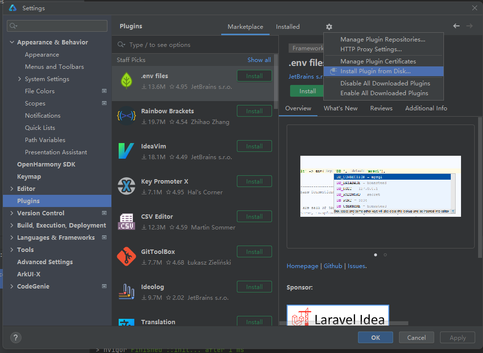

# 开发准备

##  安装 CJMP SDK

### 1. 下载 CJMP SDK

在 [SDK仓](https://gitcode.com/CJMP/SDK) 找到所需版本和平台的分支，直接下载zip包或者通过git指令拉取对应分支，SDK 详细说明见分支中 README。**注意本地存储路径中不要有空格或中文**。

| 版本   | 平台     | 下载/源码地址                                                       |
|--------|----------|---------------------------------------------------------------------|
| v0.1.4 | Windows  | [cjmp-sdk-windows-v0.1.4](https://gitcode.com/CJMP/SDK/tree/cjmp-sdk-windows-v0.1.4) |
| v0.1.4 | macOS    | [cjmp-sdk-mac-v0.1.4](https://gitcode.com/CJMP/SDK/tree/cjmp-sdk-mac-v0.1.4)     |

### 2. 配置 CJMP SDK

CJMP 工程构建依赖 `CJMP_SDK_HOME` 环境变量，请将其设置为 SDK 安装目录。如需在终端直接使用 keels 命令，请将 `CJMP_SDK_HOME/cjmp-tools/bin` 添加到 PATH 环境变量中。

- **Windows:**

    1. 右键【此电脑】→ 属性 → 高级系统设置 → 环境变量。  
    2. 新建系统环境变量： CJMP_SDK_HOME → <SDK_DIR>（CJMP SDK 实际安装路径）。
    3. 编辑系统变量 Path，新建条目： `%CJMP_SDK_HOME%\cjmp-tools\bin;`。
    4. 确认保存所有更改，重启命令行终端使配置生效。

- **macOS:**

    1. 编辑 Shell 配置文件（～/.zshrc），在末尾添加：
    
        ```bash
        # CJMP 配置
        export CJMP_SDK_HOME=/path/to/your/cjmp-sdk
        export PATH=$CJMP_SDK_HOME/cjmp-tools/bin:$PATH
        ```
    2. 添加完毕后执行 `source ~/.zshrc` 使修改生效。

### 3. 安装 Visual Studio Code（可选，推荐安装）

如果想基于IDE开发管理 CJMP 应用工程，可通过安装 VS Code 及其 CJMP 插件来实现。
- 访问[官网](https://code.visualstudio.com/)下载并安装适用于您系统的 VS Code。
- 按照[CJMP插件使用指南](start-plugins.md)的说明，在 VS Code 中完成 CJMP 插件的安装。

## 安装依赖工具

CJMP 命令行基于Python开发，请确保已安装Python >= 3.8的稳定版本。

### Android 端依赖工具

#### 1. 下载 Android SDK 及其扩展工具

CJMP 工程编译构建 Android 端依赖 Android SDK 及其扩展工具，若本地未安装，可通过以下两种方式之一进行安装。

- **方式一：通过 Android Studio 安装（推荐）：**

    1. 官网下载 [Android Studio](https://developer.android.google.cn/studio?hl=zh-cn) 安装包，运行安装程序，按照提示安装 Android SDK。**注意安装路径中不要有空格或中文**。
    2. 安装扩展工具，打开 Android Studio 中的 `SDK Manager`，进入 `SDK Tools` 页面，勾选右下角 `Show Package Details`，选择安装以下工具：
        - Android SDK Build-Tools
        - Android SDK Platform-Tools
        - NDK (Side by side) - **需要版本 26.3.11579264（对应R26D）**

- **方式二：通过命令行工具安装：**

    1. 官网下载 [命令行工具](https://developer.android.google.cn/studio?hl=zh-cn) 压缩包（进入官方网页后搜索“命令行”，下载 commandlinetools 的 ZIP 压缩包）。
    2. 创建 Android SDK 目录。**注意路径中不要有空格或中文**。
    3. 安装扩展工具，解压命令行工具到上一步创建的目录，进入 `cmdline-tools/bin`，执行以下命令：

        ```bash
        # 安装指定版本的 Android 平台（示例为 Android 12 / API 31）
        sdkmanager --sdk_root=/path/to/your/sdk "platforms;android-31"

        # 安装 Android SDK Build-Tools 应用编译和打包工具，须指定版本号（示例为 35.0.0）
        sdkmanager --sdk_root=/path/to/your/sdk "build-tools;35.0.0"

        # 安装 Android SDK Platform-Tools，用于设备连接和调试（通常安装最新版即可）
        sdkmanager --sdk_root=/path/to/your/sdk "platform-tools"

        # 安装 NDK (Side by side)，需要安装指定版本 26.3.11579264（对应 R26D）
        sdkmanager --sdk_root=/path/to/your/sdk "ndk;26.3.11579264" 
        ```
    
        注：--sdk_root 参数用于明确指定 SDK 的根目录，确保组件被安装到正确的位置。如果 sdkmanager 环境已正确配置，此参数在某些情况下可以省略。

#### 2. 下载 JDK

Android SDK 依赖 JDK 环境，若本地未安装，请访问 [Oracle JDK](https://www.oracle.com/java/technologies/downloads/) 或 [OpenJDK](https://jdk.java.net/) 下载 JDK17（此版本已通过验证，推荐使用）压缩包，解压至本地目录。**注意安装路径中不要有空格或中文**。

#### 3. 配置环境变量

- **Windows:**

    1. 右键【此电脑】→ 属性 → 高级系统设置 → 环境变量。  
    2. 新建系统环境变量： 
        - ANDROID_SDK_ROOT → <SDK_DIR>（Android SDK 实际安装路径）。
        - JAVA_HOME → <JDK_DIR>（JDK 实际安装路径）。
    3. 编辑系统变量 Path，新建以下条目：
        - `%ANDROID_SDK_ROOT%\platform-tools;`
        - `%JAVA_HOME%\bin;`
    4. 确认保存所有更改，重启命令行终端使配置生效。

- **macOS:**

    1. 编辑 Shell 配置文件（～/.zshrc），在末尾添加：
    
        ```bash
        # Android SDK 配置
        export ANDROID_SDK_ROOT=/path/to/your/android/sdk
        export PATH=$ANDROID_SDK_ROOT/platform-tools:$PATH

        # Java JDK 配置
        export JAVA_HOME=/path/to/your/jdk
        export PATH=$JAVA_HOME/bin:$PATH
        ```
    2. 添加完毕后执行 `source ~/.zshrc` 使修改生效。

#### 4. 验证安装

```bash
adb --version          # 查看adb版本
java --version         # 查看jdk版本
```

### HarmonyOS 端依赖工具

#### 1. 下载 DevEco Studio

CJMP 工程编译构建 HarmonyOS 端依赖 DevEco SDK，若本地未安装，可通过以下两种方式之一进行安装。

- **方式一：通过 DevEco Studio 安装（推荐）：**

    访问[华为开发者官网](https://developer.huawei.com/consumer/cn/deveco-studio/#download)，下载 DevEco Studio 5.1.0 Release 版本，选择与您操作系统对应的安装包。**注意安装路径中不要有空格或中文**。


- **方式二：通过命令行工具安装：**

    访问[华为开发者官网](https://developer.huawei.com/consumer/cn/deveco-studio/#download)，下载 Command Line Tools 5.1.0 Release 工具，选择与您操作系统对应的安装包。**注意安装路径中不要有空格或中文**。

#### 2. 安装 Cangjie 插件

根据您的开发平台，在 [CJMP SDK仓](https://gitcode.com/CJMP/SDK) 选择对应分支（Windows用户请选择cjmp-sdk-windows-v0.1.4分支， macOS用户请选择cjmp-sdk-mac-v0.1.4分支），进入 cjmp-tools/plugins 目录，下载5.1.0 版本的 DevEco Studio Cangjie 插件（devecostudio-cangjie-plugin-xxxx-5.1.0.828.zip），通过以下两种方式之一进行安装。

- **方式一：通过 DevEco Studio 安装（推荐）：**

    1. 打开 DevEco，依次点击左上角 **File** -> **Settings**，在设置页面选择 **Plugins**。
    2. 点击页面上方的 ⚙️ 标志，在下拉窗口中选择 **Install Plugin from Disk...**，选择刚刚下载的插件压缩包，点击 **OK** 确认安装。安装完毕后重启 DevEco。
    

- **方式二：通过命令行工具安装：**

    1. 在用户主目录下新建  `.cangjie-sdk/5.1/ ` 文件夹。
    2. 解压下载的插件压缩包，获取其中的 harmonyos-cangjie-sdk-xxxx.zip 包，并将其解压到上一步创建的 `.cangjie-sdk/5.1/ ` 目录中。
    3. 参考命令：

        ``` bash
        # Windows 系统示例
        mkdir -p C:\Users\<username>\.cangjie-sdk\5.1\
        tar -xvf harmonyos-cangjie-sdk-windows.zip -C C:\Users\<username>\.cangjie-sdk\5.1\
        
        # macOS 系统示例
        mkdir -p /User/<username>/.cangjie-sdk/5.1/
        tar -xvf harmonyos-cangjie-sdk-mac-arm.zip -C /User/<username>/.cangjie-sdk/5.1/
        ```

#### 3. 配置环境变量

- **Windows:**

    1. 右键【此电脑】→ 属性 → 高级系统设置 → 环境变量。  
    2. 新建系统环境变量： 
        - DEVECO_SDK_HOME → <SDK_DIR>（DevEco sdk 文件夹所在路径）。
        - TOOL_HOME → <TOOLS_DIR>（DevEco tools 文件夹所在路径）。
    3. 编辑系统变量 Path，新建以下条目：
        - `%DEVECO_SDK_HOME%\default\openharmony\toolchains;`
        - `%TOOL_HOME%\node;`
    4. 确认保存所有更改，重启命令行终端使配置生效。

- **macOS:**

    1. 编辑 Shell 配置文件（～/.zshrc），在末尾添加：
    
        ```bash
        # 通过 DevEco Studio 安装
        # 根据实际的 Deveco Studio 安装路径修改环境变量的值
        export TOOL_HOME=/Applications/DevEco-Studio.app/Contents/tools
        export DEVECO_SDK_HOME=/Applications/DevEco-Studio.app/Contents/sdk
        export PATH=$TOOL_HOME/node/bin:$PATH
        export PATH=$DEVECO_SDK_HOME/default/openharmony/toolchains:$PATH

        # 通过命令行工具安装
        # 根据实际的 Command Line Tools 安装路径修改环境变量的值
        export TOOL_HOME=$HOME/{command-line-tools路径}
        export DEVECO_SDK_HOME=$TOOL_HOME/sdk
        export PATH=$TOOL_HOME/tool/node/bin:$PATH
        export PATH=$DEVECO_SDK_HOME/default/openharmony/toolchains:$PATH
        ```
    2. 添加完毕后执行 `source ~/.zshrc` 使修改生效。

#### 4. 验证安装

```bash
hdc --version          # 查看hdc版本
```

### iOS 端依赖工具

#### 1. 下载 Xcode

CJMP 工程在 macOS 平台编译构建 iOS 端时依赖 Xcode，若本地未安装，可通过App Store 官方下载 [Xcode](https://apps.apple.com/cn/app/xcode/id497799835?mt=12)（版本推荐 16.0+），不要安装多个版本，避免路径冲突。

#### 2. 配置环境变量

- 编辑 Shell 配置文件（～/.zshrc），在末尾添加：

    ```bash
    # 配置 Xcode SDK 路径，根据实际安装路径修改变量值
    export IOS_SDK_DIR=/Applications/Xcode.app/Contents/Developer/Platforms/iPhoneOS.platform/Developer/SDKs/iPhoneOS.sdk                    
    ```
- 添加完毕后执行 `source ~/.zshrc` 使修改生效。

#### 3. 下载第三方工具

1. 第三方工具安装依赖 macOS 的包管理工具 Homebrew，若本地未安装，可执行以下命令：

    ```bash
    # 安装 Homebrew，安装过程会要求输入密码（输入时不会显示字符，直接回车确认即可）
    /bin/bash -c "$(curl -fsSL https://raw.githubusercontent.com/Homebrew/install/HEAD/install.sh)"

    # 安装完成后，将 Homebrew 添加到 PATH
    echo 'eval "$(/opt/homebrew/bin/brew shellenv)"' >> ~/.zshrc
    source ~/.zshrc

    # 验证是否安装成功
    brew --version
    ```
2. 查询iOS设备依赖 idevice_id 工具，若本地未安装，可执行以下命令：

    ```bash
    # 安装libimobiledevice
    brew install libimobiledevice

    # 验证是否安装成功
    ideviceinfo --version
    ```

3. 编译过程中自动加载动态库依赖 Ruby 和 xcodeproj库，若本地未安装，可执行以下命令：

    ```bash
    # 安装 Ruby
    brew install ruby

    # 安装完成后，将 Ruby 添加到 PATH
    echo 'export PATH="/opt/homebrew/opt/ruby/bin:$PATH"' >> ~/.zshrc
    source ~/.zshrc

    # 安装 xcodeproj 库
    gem install xcodeproj
    ```

4. 推送应用到iOS设备依赖 ios-deploy 命令行工具，若本地未安装，可执行以下命令：

    ```bash
    # 安装 ios-deploy
    npm install -g ios-deploy
    ```

    如果安装报错，确认下是否已安装过 Node，可以通过安装 nvm 管理多个 Node 版本。若本地未安装nvm，可执行以下命令：

    ```bash
    # 安装 nvm
    curl -o- https://raw.githubusercontent.com/nvm-sh/nvm/v0.39.7/install.sh | bash

    # 配置 nvm 环境变量
    echo 'export NVM_DIR="$HOME/.nvm"; [ -s "$NVM_DIR/nvm.sh" ] && \. "$NVM_DIR/nvm.sh"' >> ~/.zshrc
    source ~/.zshrc

    # 安装 npm
    nvm install --lts

    # 安装 ios-deploy
    npm install -g ios-deploy
    ```

### 模拟器依赖工具（可选）

若要在MacOS上使用 Android、HarmonyOS、iOS 模拟器，需要进行如下操作：

**创建 Android 模拟器**
- Android Studio ——> Main Menu ——> Tools ——> Device Manager ——> Create Virtual Device

**创建 HarmonyOS 模拟器**
- DevEco Studio ——> Main Menu ——> Tools ——> Device Manager ——> New Emulator
- 若修改了 Local Emulator Location, 则需要配置OHOS_EMULATOR_HOME

    ```bash
    export OHOS_EMULATOR_HOME=%USERPROFILE%\\AppData\\Local\\Huawei\\Emulator\\deployed # windows 默认路径
    export OHOS_EMULATOR_HOME=~/.Huawei/Emulator/deployed # MacOS 默认路径
    ```
- 若修改了 Local Image Location, 则需要配置OHOS_IMAGE_HOME
    ```bash
    export OHOS_IMAGE_HOME=%USERPROFILE%\\AppData\\Local\\Huawei\\Sdk # windows默认路径
    export OHOS_IMAGE_HOME=~/Library/Huawei/Sdk # MacOS 默认路径
    ```

**创建iOS模拟器**
- 配置xcode simulator SDK路径，根据实际安装路径修改变量值

    ```bash
    export IOS_SIM_SDK_DIR=/Applications/Xcode.app/Contents/Developer/Platforms/iPhoneSimulator.platform/Developer/SDKs/iPhoneSimulator.sdk
    ``` 

### 环境检查（可选）

切换到 CJMP SDK 根目录并执行以下命令进行环境检查：

```bash
# Windows
.\cjmp-tools\bin\keels.bat doctor -v

# macOS
./cjmp-tools/bin/keels doctor -v
```

## 更多环境配置（可选）


### 服务端连接参数配置

如果需要在主机A上控制主机B上连接的 Android/HarmonyOS 设备，需要进行本章节的配置，**否则应该跳过，避免与本地环境变量冲突**。

#### 1. 环境变量配置

- **Windows:**

    **方法1：** 图形界面设置：
    右键【此电脑】→ 属性 → 高级系统设置 → 环境变量。
    用户变量/系统变量 → 新建变量名：
    HDC_SERVER → 变量值：[主机B的IP地址]
    HDC_SERVER_PORT → 变量值：[主机B的HDC服务监听端口](默认8710)
    ADB_SERVER_SOCKET → 变量值：tcp:[主机B的IP地址]:[主机B的ADB服务监听端口](默认5037)

    **方法2：** 命令行设置：
    打开 powershell

    ```powershell
    export HDC_SERVER "[主机B的IP地址]"
    export HDC_SERVER_PORT "[主机B的HDC服务监听端口]"     # 默认8710
    export ADB_SERVER_SOCKET "tcp:[主机B的IP地址]:[主机B的ADB服务监听端口]"      # ADB服务监听端口默认5037

- **macOS:**

    **注意：** macOS用户如果是首次使用zsh需要手动创建文件：

    ```bash
    touch ~/.zshrc                  # 创建文件
    nano ~/.zshrc                   # 在文件中添加变量
    source ~/.zshrc                 # 立即生效
    ```

    打开配置文件 （~/.zshrc），在文件末尾添加：

    ```bash
    export HDC_SERVER=[主机B的IP地址]
    export HDC_SERVER_PORT=[主机B的HDC服务监听端口]     # 默认8710
    export ADB_SERVER_SOCKET=tcp:[主机B的IP地址]:[主机B的ADB服务监听端口]  # ADB服务监听端口默认5037
    ```

    添加完毕后执行 `source ~/.zshrc` 使修改生效。

#### 2. 必备条件检查

    - 已有主机A（需要运行keels命令的主机）和主机B（连接 Android/HarmonyOS 设备的主机）。
    - 主机A需要能够连接到主机B。
    - 确保防火墙已开放相关端口（默认 **5037**（ADB）、**8710**（HDC））。

#### 3. 检测 Android 设备

- **在主机B启动 ADB 服务：**

    以管理员身份打开主机B的终端或命令行，执行以下命令：

    ```bash
    adb kill-server
    adb -a start-server
    ```

    预期输出：

    ```bash
    * daemon not running; starting now at tcp:5037
    * daemon started successfully
    ```

- **验证 ADB 端口监听状态：**

    ```bash
    # Windows
    netstat -ano | findstr 5037
    # Linux/macOS
    netstat -ano | grep 5037
    ```

    预期显示为：

    ```bash
    TCP    0.0.0.0:5037    0.0.0.0:0    LISTENING    <PID>    # bind 0.0.0.0 地址
    ```

#### 4. 检测 HarmonyOS 设备

- **在主机B启动 HDC 服务:**

    以管理员身份打开主机B终端，执行

    ```bash
    hdc kill -server
    hdc -s 0.0.0.0:8710 start
    ```

    **注意：** 保持此终端窗口运行（服务需持续后台执行）。

- **验证 HDC 端口监听状态:**

    ```bash
    # Windows
    netstat -ano | findstr 8710
    # Linux/macOS
    netstat -ano | grep 8710
    ```

    预期显示为：

    ```bash
    TCP    0.0.0.0:8710    0.0.0.0:0    LISTENING    <PID>    # bind 0.0.0.0 地址
    ```

#### 5. 验证设备连接

在主机B上连接 Android/HarmonyOS 设备，然后打开主机A终端，执行：

```bash
# Windows
.\cjmp-sdk-<version>\cjmp-tools\bin\keels.bat devices

# macOS
./cjmp-sdk-<version>/cjmp-tools/bin/keels devices
```