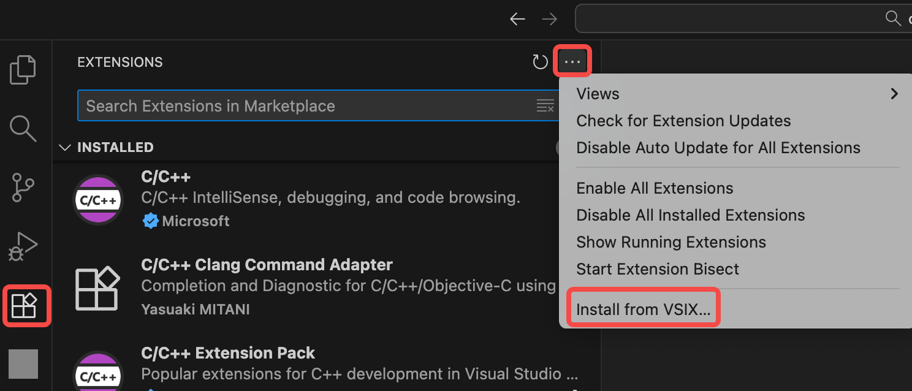
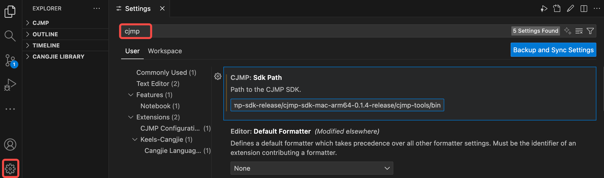
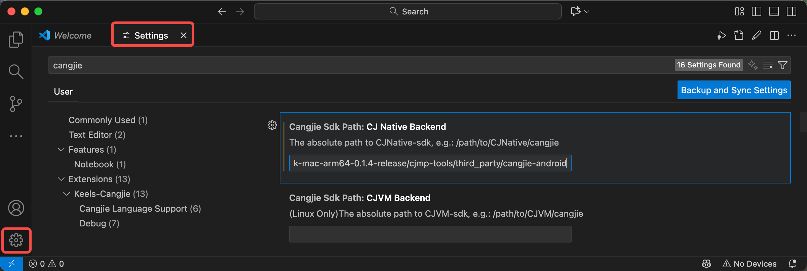
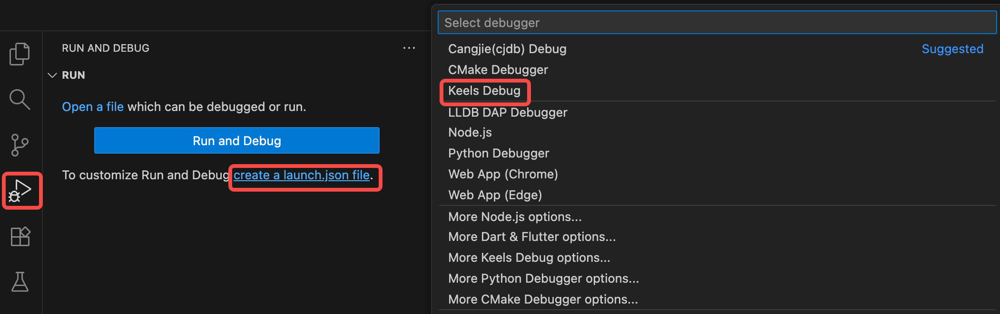
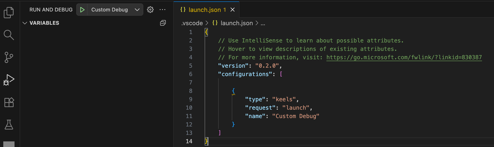

# CJMP 插件使用指南

## 简介

CJMP 插件为 Visual Studio Code 提供了完整的 CJMP 应用开发支持，通过深度集成项目创建、多平台构建、设备调试等核心功能，实现 HarmonyOS 和 Android 应用的一站式开发体验。

## 使用说明

### 环境准备

**前置条件：** 开始之前需要按照 [开发准备](start-overview.md) 完成对应平台的环境配置，并连接一台终端设备。推荐参照 [环境检查](start-overview.md#环境检查可选) 的步骤检查应用开发环境是否完备。

### 安装 VS Code 的 CJMP 插件

安装插件所需的文件位于 CJMP SDK 的 `cjmp-tools/plugins/` 路径下。

#### 安装方法

- 在 VS Code 中右击 **CJMP-0.1.4.vsix** 和 **keels-cangjie-0.1.0.vsix** 文件（版本仅供参考），在下拉列表中选择 **安装插件 VSIX（Install Extension VSIX）** 安装插件。
- 或者依次点击页面左侧的 **扩展** 按键 -> 上方的 **...**，然后在下拉列表中选择 **从 VSIX 安装 ...** 安装扩展。

安装完成后在右下角显示 **已完成安装插件**。

#### 验证 VS Code 的设置

1. 点击页面左侧的 **插件** 按键，在扩展中搜索 `CJMP`和`cangjie`，可以看到已经安装的 `CJMP` 和 `keels-cangjie` 插件。

2. 打开**查看（View）> 命令面板（Command Palette...）**，也可以按下 `Ctrl+Shift+P`（macOS用户为 `Command+Shift+P`），输入 CJMP 之后，可以看到控制面板中出现：
    - CJMP: Create CJMP Project
    - CJMP: CJMP Build
    - CJMP: CJMP Launch Emulator
    - CJMP: Select CJMP Device

3. 配置 CJMP SDK Path：  
    
    - **方法1：**  
    打开 VSCode 设置页面，搜索 `CJMP`，在搜索结果中选择 `扩展`->`CJMP Configuration`，将 SDK 中的 `bin` 路径（例如：Path to sdk\cjmp-sdk-windows-0.1.4-release\cjmp-tools\bin）添加到配置项。
    

    - **方法2：**  
    VSCode 设置中 CJMP SDK 路径未配置或者配置错误时，点击 `CJMP: Create CJMP Project` 命令，右下方会弹出提醒需要配置 SDK Path，点击 OK，选择 SDK 目录（例如：Path to sdk\cjmp-sdk-windows-0.1.4-release）。

4. 配置 CJ Native Backend：  
    打开 VSCode 设置页面，搜索 `cangjie`，在搜索结果中选择 `扩展`->`Keels-Cangjie`->`Cangjie Language Support`，将 SDK 中的 `cangjie-android` 路径（例如：Path to sdk\cjmp-sdk-windows-0.1.4-release\cjmp-tools\third_party\cangjie-android）添加到配置项。
    

### 创建项目

通过 CJMP 入门应用模板新建 CJMP 项目：

1. 打开 **查看（View）> 命令面板（Command Palette...）**，也可以按下 `Ctrl+Shift+P`（macOS用户为 `Command+Shift+P`）。

2. 输入 **CJMP**，选择 `CJMP: Create CJMP Project` 命令。

3. 在弹出的窗口中选择项目放置的路径，点击 `Select Folder for CJMP Project` 确认选择。

4. 选择项目的模板类型：`app`, `logic-module`->`native`， `logic-module`->`keels` 或 `module`。

5. 输入自定义项目名称，命名规范参考 [create 命令介绍](../tools/tools-cmd.md#create-命令)。

### 构建项目

1. 点击编辑区域的右上角三角形的 `CJMP Build` 按钮，根据连接的终端选择编译类型和平台：

    app:
    - Android 设备选择 `apk` 和 `android-arm64`  
    - HarmonyOS 设备选择 `hap` 和 `ohos-arm64`  
    - iOS 设备选择 `ios`/`ipa`和`ios-arm64`
    - iOS 模拟器选择 `ios-sim`和`ios-sim-arm64`

    logic-module-keels/logic-module-native/module:
    - Android 设备选择 `aar` 和 `android-arm64`  
    - HarmonyOS 设备选择 `har` 和 `ohos-arm64`
    - iOS 设备选择 `framework` 和 `ios-arm64`
    - iOS 模拟器选择 `framework-sim` 和 `ios-sim-arm64`

    最后根据需要点击 `debug` 或 `release` 开始构建。

2. 构建成功后日志输出 **BUILD SUCCESSFUL** 字样。如果是未签名的 HarmonyOS 应用会提示需要签名，参考 [附录A：HarmonyOS 应用签名流程介绍](../tools/tools-cmd.md#附录aharmonyos-应用签名流程介绍) 中 1~5 部分完成签名。

### 运行和调试项目

#### 无断点运行

在 Visual Studio Code 主窗口左上角依次点击 **...** -> **运行** -> **以非调试模式运行**，也可以按下 `Ctrl+F5`（macOS用户为 `Ctrl+Fn+F5`）。

运行成功后会将应用推送至终端并打开初始页面。

#### 断点运行

在 Visual Studio Code 主窗口左侧点击 三角形的 `运行和调试` 按键，点击蓝色字样 `创建launch.json文件`，然后在下拉的列表中选择 `Keels Debug`，会自动生成一个 launch.json 文件，点击保存。

- **方法1：**  
点击左边的 **运行和调试** 旁边的绿色三角形标志，在弹出的窗口中选择设备后开始运行项目。

- **方法2：**  
在 Visual Studio Code 主窗口左上角依次点击 **...** -> **运行** -> **启动调试**，也可以按下 `F5`，然后在弹出的窗口中选择设备后开始运行项目。

运行成功后会将应用推送至终端并打开初始页面。将应用推送至终端设备后，当 VS Code 右下角弹出 **prepared done, start debugging!** 时，说明已经准备好开始调试。

在项目源代码中按需设置断点，在设备运行项目时会停在断点处：

- 在左侧的 **调试侧边栏** 显示堆栈帧和变量。
- 底部的 **调试控制台** 面板显示输出的日志详情。

> 注意：目前暂不支持模拟器断点调试。