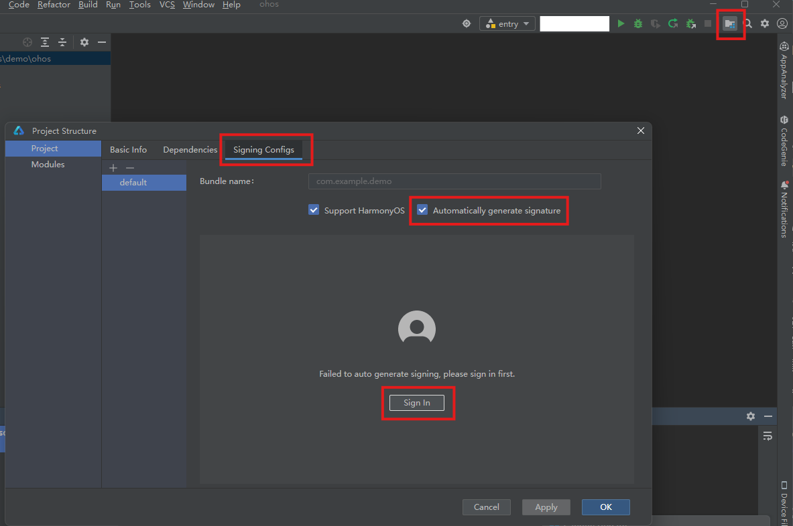
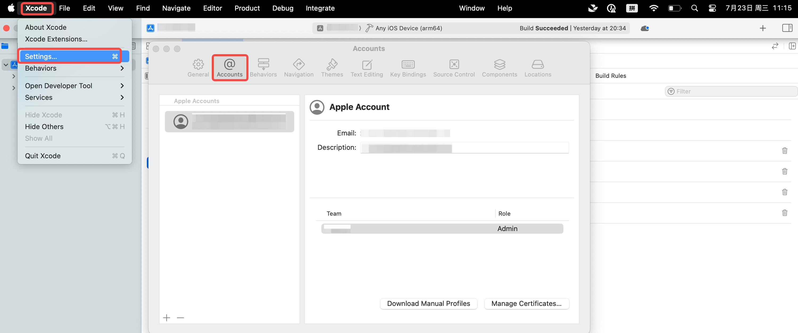
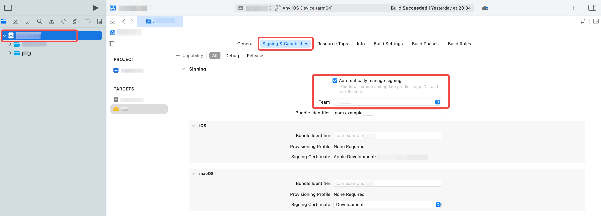

# CJMP 命令行工具介绍

## 前置准备

确认已经完成 [开发准备](../quick-start/start-overview.md) 中的环境配置，并且环境检查通过：

切换到 SDK 根目录并执行以下命令进行环境检查：

```bash
# Linux/macOS
./cjmp-tools/bin/keels doctor -v

# Windows
.\cjmp-tools\bin\keels.bat doctor -v
```

CJMP 命令行工具是开发框架的核心控制接口，提供标准化开发流程管理。通过执行 CJMP SDK 中的 `keels`（Unix 系统）或 `keels.bat`（Windows）可调用命令，其设计融合了工程化规范与开发效率优化，适用于项目全生命周期操作。CJMP SDK 下载和环境配置详见[开发准备](../quick-start/start-overview.md)。

## keels 基础命令介绍

### doctor 命令

用于检查当前环境配置。

```bash
keels doctor [options]
```

|参数|功能|
|---|---|
|`-h`，`--help` | 显示命令的帮助信息，不执行命令本身。|
|`-v`，`--verbose` | 对当前环境进行检查，并输出所有检查项。|

### devices 命令

用于检测当前连接的设备。

```bash
keels devices [options]
```

**注意：** 当前只支持 Android，HarmonyOS 和 iOS 的 `arm64` 平台设备。

|参数|功能|
|---|---|
|`-h`，`--help` | 显示命令的帮助信息，不执行命令本身。|
|`-v`，`--verbose` | 输出adb和hdc的详细日志和所有已连接的设备信息。|
|`-d <name or id>`，`--device-id <name or id>` | 用户可以通过输入设备名称和id，打印指定设备信息。|
|`--machine` | 输出JSON格式的设备信息。|

### create 命令

用于在指定的路径下创建一个 CJMP 工程。

```bash
keels create [options] <path>
```

**注意：** 创建的 CJMP 工程在不通过选项指定工程名称的情况下，默认使用工程文件名作为工程名称。工程名称需要符合以下命名规范：

1. 使用全小写字母
2. 请使用下划线分隔单词
3. 避免特殊字符（除了下划线外）
4. 不以数字开头

|参数|功能|
|---|---|
|`-h`，`--help` | 显示命令的帮助信息，不执行命令本身。|
|`-v`，`--verbose` | 显示执行过程中的详细信息。|
|`-t <app, logic-module, module>`，`--template <app, logic-module, module>` | 创建应用工程，logic-module工程或者module工程。|
|`--app` | 等价于 `-t app`。|
|`--logic-module` | 等价于 `-t logic-module`。|
|`--module` | 等价于 `-t module`。|
|`--app-type [keels, native]` | 用于在logic-module模式下指定壳工程的类型。keels表示壳工程使用keels UI框架构建，native表示使用各平台原生语言和UI框架构建。|
|`-n`，`--name` | 工程名称，会影响bundleName。|

### build 命令

用于编译一个 CJMP 工程。在 CJMP 工程路径下，会编译打包指定平台的构建产物。

```bash
keels build <package> [options]
```

**注意：**

1. HarmonyOS 工程支持`--autosign`自动化签名，但不用于实际版本发布，仅提高开发测试效率。亦可以使用DevEco进行手动签名，手动签名的详细流程见[附录A：HarmonyOS 应用签名流程介绍](tools-cmd.md#附录aharmonyos-应用签名流程介绍)。
2. iOS工程首次构建需要在Xcode中设置自动签名。详细流程见 [附录B：iOS 应用签名流程介绍](#附录bios-应用签名流程介绍)。

|参数|功能|
|---|---|
|`-h`，`--help` | 显示命令的帮助信息，不执行命令本身。|
|`-v`，`--verbose` | 显示执行过程中的详细信息。|
|`package`| app工程支持 `apk`， `hap`， `ios` 和 `ipa`，分别对应 Android 和 HarmonyOS 平台的打包文件，iOS 平台的`app`和`ipa`打包文件；logic-module和module工程支持`aar` 和 `har`，分别对应 Android 和 HarmonyOS 平台的打包文件。|
|`-d <name or id>`，`--device-id <name or id>` | 指定目标终端。`-d`和`--platform`只能指定一个。如果只有一个目标平台，默认为该平台；如果有多个需要指定，使用`--platform`指定默认平台。|
|`--platform` | 指定编译的目标平台。支持的平台包括：ohos-arm64（ HarmonyOS 默认）、android-arm64（ Android 默认）、ios-arm64（iOS默认）|
|`--debug`| 编译debug版本的应用，和`--release`只能同时指定一个，默认为debug版本。|
|`--release`| 编译release版本的应用，和`--debug`只能同时指定一个，默认为debug版本。|
|`--autosign`| 自动签名，仅对 HarmonyOS 工程有效。不用于实际版本发布，仅提高开发测试效率。|

### run 命令

用于运行一个 CJMP 工程。

```bash
keels run [options]
```

|参数|功能|
|---|---|
|`-h`，`--help` | 显示命令的帮助信息，不执行命令本身。|
|`-v`，`--verbose` | 显示执行过程中的详细信息。|
|`-d <name or id>`，`--device-id <name or id>` | 指定运行的目标终端。如果只有一个目标平台，默认为该平台；如果无法确认，通过交互明确。|
|`--debug`| 运行debug版本的应用，和`--release`只能同时指定一个，默认为debug版本。|
|`--release`| 运行release版本的应用，和`--debug`只能同时指定一个，默认为debug版本。|

### emulators 命令
用于检测当前可用的模拟器，以及启动指定模拟器。

```
keels emulators [options]
```
|参数|功能|
|---|---|
|`-h`，`--help` | 显示命令的帮助信息，不执行命令本身。|
|`-v`，`--verbose` | 显示执行过程中的详细信息。|
|`--list` | 检测当前可用的模拟器。|
|`--launch <emulator id>`| 根据模拟器id启动指定模拟器。|
|`--cold`| 与`--launch`一起使用，用于冷启动模拟器，仅适用于 Android 工程。|

## 附录

### 附录A：HarmonyOS 应用签名流程介绍

如果没有对 CJMP 工程签名，那么在 HarmonyOS 终端上执行 `build` 或者 `run` 的时候会提示对当前项目签名。详细流程如下：

1. 参考开发准备中[HarmonyOS 工具](../quick-start/start-overview.md#harmonyos-端依赖工具)章节，确认已安装 DevEco Studio 并配置了相关环境。

2. 使用 DevEco Studio 打开 CJMP 应用工程中的 `hos/` 文件。然后点击右上方的文件夹图标，在弹出的页面中选择 **Signing Configs**，选中 **Automatically generate signature** 后，点击下方的 **Sign in**。
    

3. 在跳转的网页中登录华为账号并点击 **允许**，显示 **“您已成功登录HUAWEI DevEco Studio客户端，请返回DevEco Studio进行下一步操作。”**

4. 回到 Deveco Studio 后会看到签名页面自动填入签名信息，点击 **OK** 退出即可。

5. 以上设置完成后，执行 `build` 或者 `run` 不再报错签名相关问题。

### 附录B：iOS 应用签名流程介绍

iOS 应用构建需要 Apple 开发者账户，并在 Xcode 设置应用自动签名。

1. 打开 Xcode，依次点击左上角的 **Xcode** -> **Settings...**，在设置窗口中选择 **Accounts**，登录 Apple 开发者账号。
    

2. 打开需要签名的应用下 `ios/` 文件夹，在右边的窗口中选择 **Signing & Capabilities**，选中下方的 **Automatically namage signing**，并选择刚刚登录账号对应的 **Team**。
    
