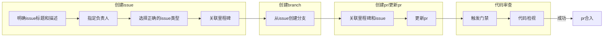
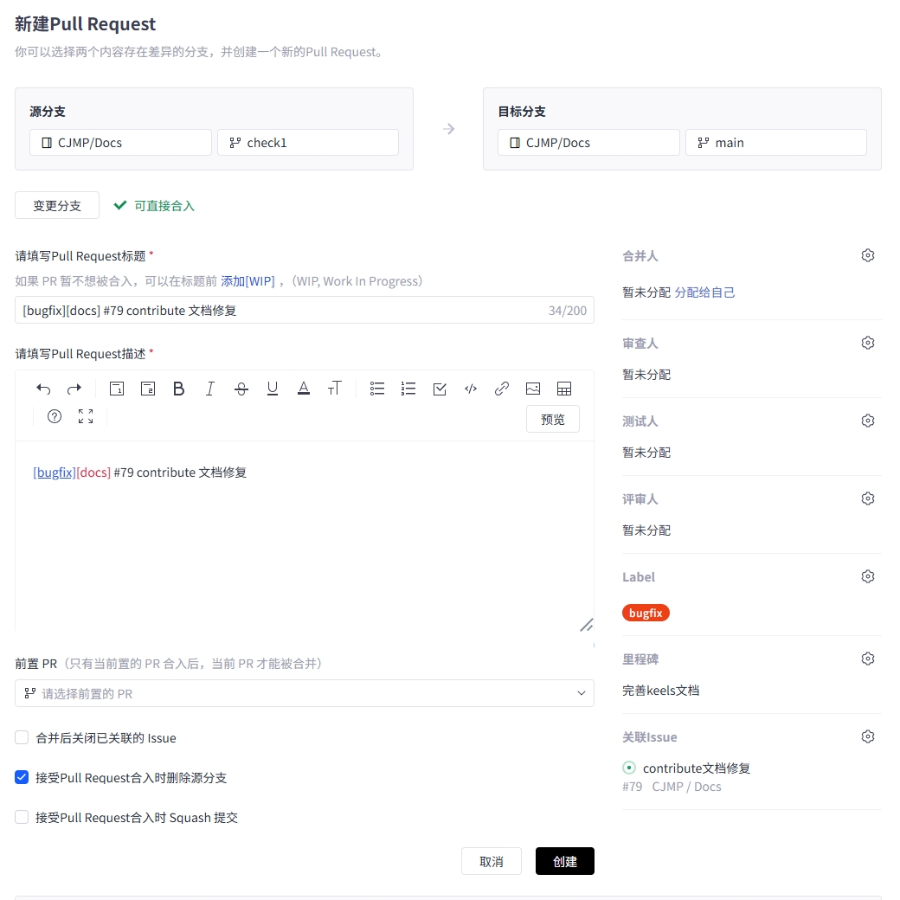
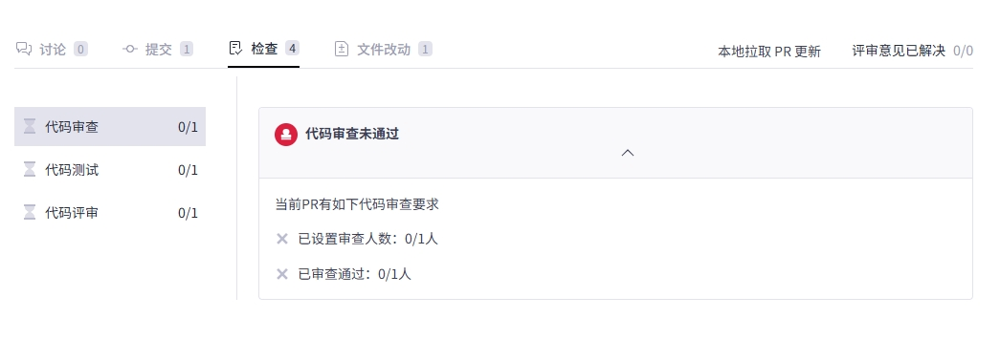

# 社区代码提交流程

## 一、创建issue

### 1. 标题清晰阐述问题

### 2. 指定负责人

### 3. 选择正确的issue类型

### 4. 关联里程碑

## 二、 创建分支

### 1. 从issue创建分支

## 三、 创建PR

### 1. 选择正确的PR类型

### 2. 关联里程碑

### 3. 关联issue

##  四、代码审查
### 1. 触发门禁
PR更新后，在评论区评论“**retest**”以触发门禁（若有）。  
门禁通常由静态检查、编译构建 、UT组成。
门禁通过后，ci-robot会在“测试人员”区+1。
### 2. 代码检视
可联系责任田的审查人进行代码审查，审查通过后+1，至少需要1个审查人+1 。

## 五、 PR合入
需要 1名评审人 + 1名测试人员 通过后才能合入。

