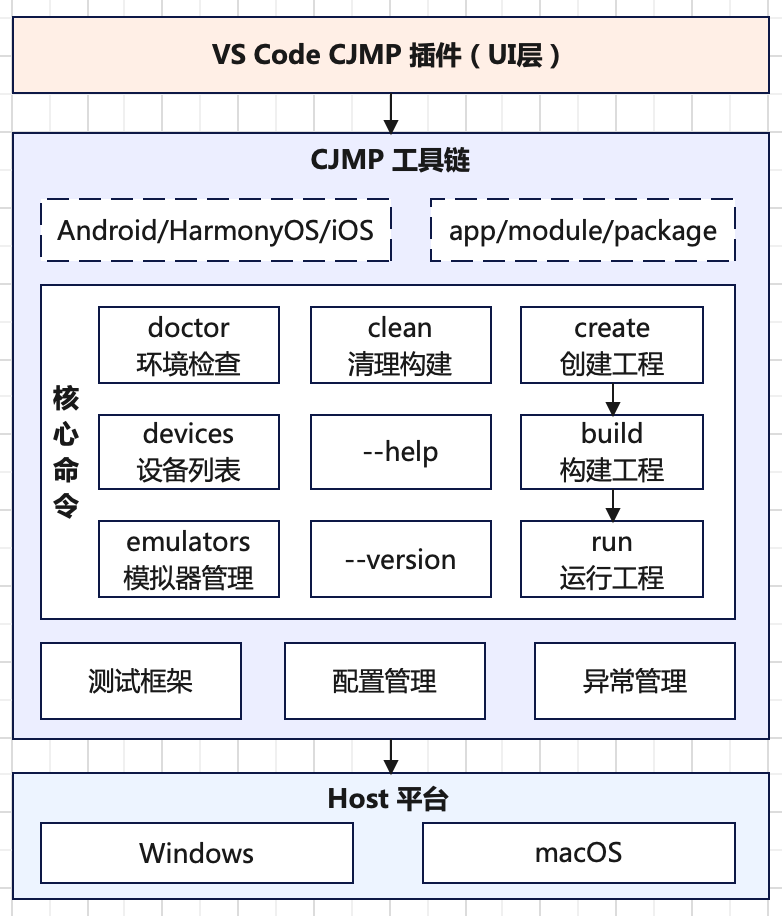
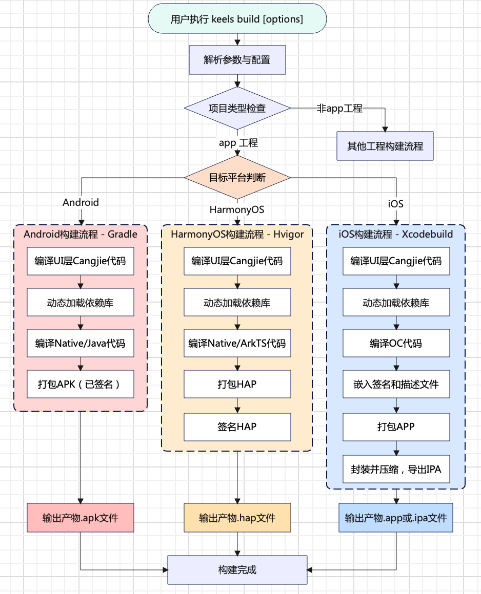
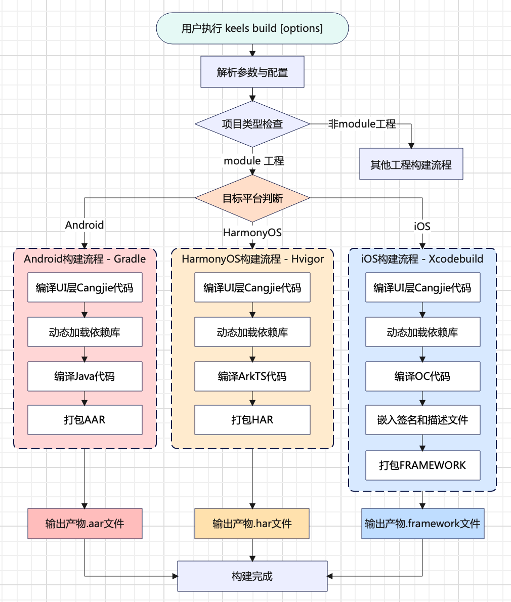
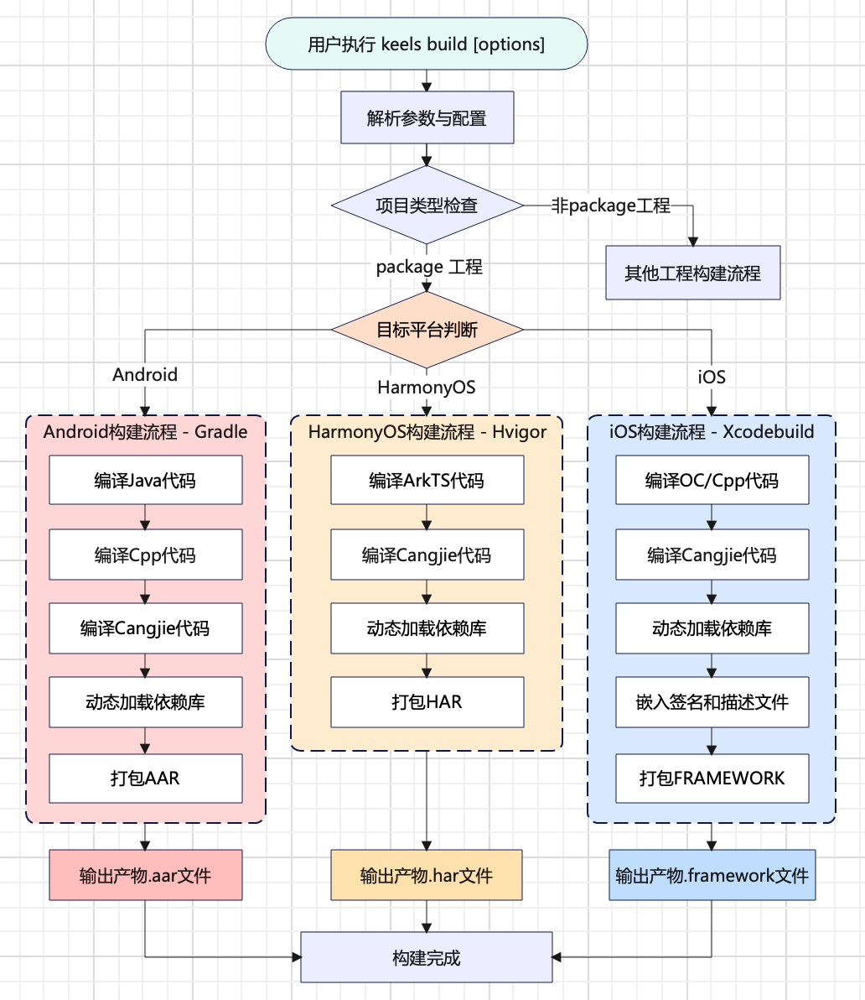

# **CJMP 命令行工具设计文档**

## **1. 文档信息**
- **特性名称**：CJMP 命令行工具
- **文档状态**：草案
- **作者**：郭梦薇
- **关联需求**：暂无
- **版本历史**：
  | 版本 | 日期       | 修改说明         |  
  |------|------------|------------------|  
  | v1.0 | 2025-12-04 | 初稿              |  


## **2. 特性概述**

### **2.1 目标**

为 CJMP(CangJie MultiPlatform) 工程提供统一的管理入口，旨在让开发者通过一组简洁的命令，即可高效、一致地完成从工程创建、构建到运行的全生命周期操作，**核心目标是标准化工程规范、自动化复杂流程，并显著提升多平台协作与集成的研发效能**。

### **2.2 范围**

#### **2.2.1 包含的功能**

**工具类**：
- **doctor**：诊断当前开发环境，检查 CJMP 工程所需的工具链、依赖和环境变量是否已正确安装和配置，并提供修复指引。
- **devices**：列出所有已连接到开发机的真实物理设备（如手机、平板）和本地已启动的模拟器，并显示其名称、标识符、操作系统版本等，方便选择运行的目标。
- **emulators**：管理本地模拟器，支持列出所有可用模拟器、启动指定模拟器配置。

**工程管理**：
- **create**：基于自定义模板，快速生成一个符合 CJMP 标准目录结构和基础配置的新工程，包含 UI/逻辑 和 多平台（Android/HarmonyOS/iOS）的初始代码。
- **build**：编译 CJMP 工程，根据指定的目标平台和构建类型（如调试版、发布版），生成对应的可执行文件或应用包（例如 .hap, .apk, .app, .ipa等）。
- **run**：在指定的目标设备或模拟器上，自动执行构建、安装并启动 CJMP 应用程序，用于快速开发调试。
- **clean**：清理当前工程的构建缓存和临时生成文件，确保下一次构建从干净状态开始，解决因缓存导致的构建问题。

#### **2.2.2 不包含的功能**
- **替代原生 IDE**：不提供图形化代码编辑、可视化界面设计或高级调试功能，这些仍是 Android Studio、Xcode 等专业 IDE 的核心职责。
- **监控与告警**：不提供对线上应用性能、崩溃等指标的实时监控和告警功能。

### **2.3 架构设计**



## **3. 详细设计**

### **3.1 keels doctor**

#### **3.1.1 功能描述**

`keels doctor` 用于验证当前系统是否符合 CJMP 工程开发与构建的基本要求，包含开发环境、工具链、依赖项和关键配置检查，并给出清晰的检查结果与修复指引。

#### **3.1.2 命令语法与选项**

**基础语法**：

```bash
keels doctor [options]
```

**选项说明**：

| 选项 | 缩写 | 参数 | 必选 | 默认值 | 说明 |
|-----|-----|------|-----|-------|-----|
| `--help`  | `-h` | 无 | 否 | `false` | 显示命令的帮助信息，不执行命令本身。|
| `--verbose` | `-v` | 无 | 否 | `false` | 对当前环境进行检查，并输出每个检查步骤的详细执行过程和中间结果。|

**使用示例**：

```bash
# 快速诊断所有平台环境（概要信息）
keels doctor

# 详细诊断所有平台环境（完整信息）
keels doctor -v

# 输出命令的帮助信息
keels doctor -h
```

#### **3.1.3 检查流程**

`keels doctor` 按以下模块依次进行检查，任何一步失败都只打印错误，不中断整个命令。

**Android 开发环境检查**：

| 检查项 | 检查方法 |  通过标准 | 失败修复指引 |
|-------|---------|----------|------------|
| Android SDK | 检查 `ANDROID_SDK_ROOT` 或 `ANDROID_HOME` 环境变量。| 变量已设置，并指向有效的 SDK 目录。| 通过 Android Studio 或者命令行工具安装，并配置环境变量。 |
| Android API 版本 | 检查 `$ANDROID_SDK_ROOT/platforms/` 目录下是否存在符合要求的 `android-<API版本>` 文件夹。| 存在平台目录，且API版本 >= 26。| 通过 Android Studio 或者命令行工具安装。|
| Android Build-Tools | 检查 `$ANDROID_SDK_ROOT/build-tools/` 目录下是否存在子文件夹（如`35.0.0.0`）。| 存在有效子文件夹。| 通过 Android Studio 或者命令行工具安装。|
| Android NDK | 检查 `$ANDROID_SDK_ROOT/ndk/` 目录下是否存在 `26.3.11579264` 文件夹。| 目录下存在指定版本的文件夹。| 通过 Android Studio 或者命令行工具安装。|
| Java JDK | 检查 JAVA_HOME 环境变量以及 JDK 版本。 | 变量已设置，且 JDK 版本 >= 17。 | 安装 JDK17+ 并配置环境变量。|

**注**：当前只验证过 JDK17 可用，是否支持更高或者更低版本，还需验证。

**HarmonyOS 开发环境检查**：

| 检查项 | 检查方法 |  通过标准 | 失败修复指引 |
|-------|---------|----------|------------|
| Harmony SDK | 检查 `DEVECO_SDK_HOME` 环境变量。| 变量已设置，并指向有效的 SDK 目录。| 通过 DevEco Studio 或者命令行工具安装，并配置环境变量。|
| Harmony API 版本 | 解析 `$DEVECO_SDK_HOME/default/sdk-pkg.json` 文件中的 `apiVersion` 字段。| API版本 >= 18。| 安装/升级 DevEco Studio 至 5.1.0 或更高版本，并安装对应 API Level 的 SDK。|
| Ohpm | 检查 `$DEVECO_SDK_HOME/../tools/ohpm/bin` 目录是否存在，并尝试执行 `ohpm --version`。| 命令执行成功并返回有效版本号。| 通过 DevEco Studio 的 SDK Manager 安装或修复 Ohpm，或手动配置环境变量 `PATH`。|
| Node | 检查 `$DEVECO_SDK_HOME/../tools/node` 目录下是否存在，并尝试执行  `node --version`。| 命令执行成功并返回有效版本号。| 通过 DevEco Studio 的 SDK Manager 安装 Node.js，或从官网安装并确保位于工具链路径中。|
| Hvigor | 检查 `$DEVECO_SDK_HOME/../tools/hvigor` 目录下是否存在，并尝试执行 `hvigor --version` 或 `hvigorw --version`。| 命令执行成功并返回有效版本号。| 通过 DevEco Studio 的 SDK Manager 安装或更新 Hvigor，或检查工具链完整性。|

**iOS 开发环境检查**：

| 检查项 | 检查方法 |  通过标准 | 失败修复指引 |
|-------|---------|----------|------------|
| Xcode 安装 | 执行`xcodebuild -version`。 | 命令成功执行并返回有效版本号，或应用包存在且可访问。| 从 App Store 或 Apple 开发者网站下载安装。|
| Xcode 命令行工具 | 执行 `xcode-select -p` 检查路径，并用 `xcode-select --install` 检查是否已安装。| 路径有效，且命令行完整。| 执行 `xcode-select --install` 安装。|

**平台说明**：iOS 开发环境检查仅在 macOS 平台执行。在 Windows 平台运行时，`keels doctor` 将自动跳过此项检查，报告中也不会出现相关内容。

**VS Code 检查**：

| 检查项 | 检查方法 |  通过标准 | 失败修复指引 |
|-------|---------|----------|------------|
| VS Code 安装 | 执行`code -version`，或检查默认安装路径。 | 命令成功执行并返回版本号，或应用包存在且可访问。| 从 VS Code 官网下载安装。|

**代理检查**：

| 检查项 | 检查方法 |  通过标准 | 失败修复指引 |
|-------|---------|----------|------------|
| HTTP/HTTPS 代理 | 检查 `HTTP_PROXY` 和 `HTTPS_PROXY` 环境变量是否配置。| 未设置代理：网络正常，判定通过；<br>已设置代理：能成功通过代理访问测试网站。| 检查代理配置是否正确，或者更换代理。|

**注**：具体测试的网站可参考：
- Gradle 构建 Android 应用时依赖的地址。
- Hivigor 构建 Harmony 应用时依赖的地址。

#### **3.1.4 优化策略**

为提升 CJMP 开发环境检查的准确性和用户体验，我们在实现 `keels doctor` 的检查功能时，可对关键环境的检查策略进行优化。本节以 **Android SDK 检查** 为例，详述优化思路与具体策略。

**现状调研**：

- **Flutter方案（检查优先级由高到低）**：
  - 显式配置：通过 `flutter config --android-sdk \<path>` 设置的路径。
  - 环境变量：检查  `ANDROID_HOME` 或 `ANDROID_SDK_ROOT` 环境变量。
  - 默认路径：查找常见平台的默认安装位置。
  - 工具推导：根据 `aapt`、`adb` 等工具所在目录向上推导。

- **KMP方案（检查优先级由高到低）**：
  - 显式配置：检查 `local.properties` 文件中 `sdk.dir` 设置的路径。
  - 环境变量：检查 `ANDROID_HOME` 或 `ANDROID_SDK_ROOT` 环境变量。

**问题分析**：

基于以上调研，发现当前方案存在以下局限性：

- 环境变量依赖强：将环境变量作为唯一检查方式，增加用户配置负担。
- 容错性不足：单一方式检查失败即判定为环境缺失，未充分利用多路径验证。

**CJMP 优化策略**：

为解决上述问题，可采用多层级、渐进式检查策略。该策略按优先级从高到低进行以下尝试：

- 层级一：优先检查 `ANDROID_HOME` 或 `ANDROID_SDK_ROOT` 环境变量，尊重用户的主动配置。
- 层级二：搜索当前平台的常规安装路径，覆盖通过 IDE 或命令行工具安装的典型场景。
- 层级三：通过调用 `which adb` 等命令查找工具路径，并向上追溯至 SDK 根目录，适用于环境变量丢失但工具已在 PATH 中的情况。
- 失败处理：当所有层级检查都未返回有效路径时，抛出清晰的错误信息，并附上详细的配置文档链接或修复建议。
如果都没有找到，报错提示，并给出修复建议。

**注**：如果不强制要求配置 `ANDROID_SDK_ROOT` 等环境变量，开发“支持原生IDE编译”功能时需考虑如何获取 Android SDK 根目录，例如通过 local.properties 文件配置等。

#### **3.1.5 输出设计**

执行 `keels doctor` 命令后，按模块依次检查，并按模块输出检查结果，保证结构清晰，便于快速阅读。

**输出格式规范**：
```bash
[状态图标] 模块1名称 - 模块描述
- [状态图标] 检查项1: 详情信息
- [状态图标] 检查项2: 详情信息

  （空行分隔下一个模块）

[状态图标] 模块2名称 - 模块描述
- [状态图标] 检查项1: 详情信息
- [状态图标] 检查项2: 详情信息
```

其中状态图标有以下三种标识：
- <span style="color: green">[✓]</span> 绿色对勾，表示检查通过
- <span style="color: yellow">[!]</span> 黄色感叹号，表示异常但不影响核心功能
- <span style="color: red">[✗]</span> 红色叉号，表示检查失败需要修复

**异常处理**：

对于检查失败的项，需要在详情信息后附加**可能原因**以及**修复建议**，确保用户能根据提示完成环境修复。

**输出示例**：

<span style="color: red">[✗]</span> Android toolchain - develop for Android devices (Android SDK version 35.0.0)
- <span style="color: green">✓</span> ANDROID_SDK_ROOT: /path/to/Android/sdk
- <span style="color: green">✓</span> Platform android-36, build-tools 35.0.0
- <span style="color: green">✓</span> NDK 26.3.11579264 at /path/to/Android/sdk/ndk/26.3.11579264
- <span style="color: red">✗</span> No Java Development Kit (JDK) found; You must have the environment variable JAVA_HOME set and the java binary in your PATH. 'You can download the JDK from https://www.oracle.com/technetwork/java/javase/downloads/.'

<span style="color: yellow">[!]</span> Network resources
- <span style="color: yellow">!</span> https://github.com: timed out
- <span style="color: yellow">!</span> https://maven.google.com: timed out


### **3.2 keels devices**

#### **3.2.1 功能描述**

`keels devices` 用于检测并列出所有已连接到本机的物理设备和已启动的模拟器。对于每台设备，该命令输出其名称、唯一标识符（UDID）、平台类型、操作系统版本。

#### **3.2.2 命令语法与选项**

**基础语法**：

```bash
keels devices [options]
```

**选项说明**：

| 参数 | 缩写 | 参数值 | 必选 | 默认值 | 说明 |
|-----|-----|------|-----|-------|-----|
| `--help`  | `-h` | 无 | 否 | `false` | 显示命令的帮助信息，不执行命令本身。|
| `--verbose` | `-v` | 无 | 否 | `false` | 启用详细模式，输出设备检查具体步骤。|
| `--device-id` | `-d` | \<name or id> | 否 |  无 | 通过输入设备名称和id，查看指定设备信息。|
| `--machine` | 无 | 无 | 否 | `false` | 以JSON格式输出设备信息，便于其他脚本或工具进行解析和处理。|

**扩展功能（可选）**：

开发者可根据实际需求评估是否实现以下增强选项。

| 参数 | 缩写 | 参数值 | 必选 | 默认值 | 说明 |
|-----|-----|------|-----|-------|-----|
| `--platform` | 无 | \<platform name> | 否 | 无 | 筛选指定平台设备。|
| `--device-timeout` | 无 | \<seconds> | 否 | `10` | 设置设备检测阶段的超时时间。|

**使用示例**：

```bash
# 1. 列出所有可用设备（默认操作）
keels devices

# 2. 列出所有设备，并显示详细的检查过程
keels devices --verbose

# 3. 只查设备 ID 为 23E0223B28002705 的设备信息
keels devices --device-id "23E0223B28002705"

# 4. 以 JSON 格式输出，便于自动化处理
keels devices --machine
```

#### **3.2.3 设备检查流程**

`keels devices` 按以下平台依次执行检查，任何一步失败都只打印错误，不中断整个命令。

- **基于 adb 工具检测 Android 设备**：
  - 定位工具：检查 `$ANDROID_SDK_ROOT/platform-tools/adb` 路径是否存在且可执行。
  - 列出设备：执行 `adb devices -l` 命令。
  - 解析并丰富信息：解析命令输出，获取设备ID和状态。对于状态为 `device` 的设备，使用 `adb -s <设备ID> shell getprop` 命令获取型号（如 ro.product.model）和Android版本（如 ro.build.version.release）等详细参数。

- **基于 hdc 工具检测 Harmony 设备**：
  - 定位工具：检查 `$DEVECO_SDK_HOME/default/openharmony/toolchains/hdc ` 路径是否存在且可执行。
  - 列出设备：执行 `hdc list targets`命令。
  - 解析并丰富信息：解析命令输出，获取设备ID。对于每个在线设备，使用 `hdc -t <设备ID> shell param get` 命令获取名称（如 const.product.name）和 API版本（如 const.ohos.apiversion）等详细参数。

- **基于 devicectl 工具检测 iOS 真机**：
  - 列出设备：执行 `xcrun devicectl list devices` 命令。此命令会列出所有曾与此Mac配对过的设备。
  - 解析信息：先解析输出中的 State 列，获取状态为 available 或 booted 的设备，再解析设备名称，UDID等详细信息。

- **基于 simctl 工具检测 iOS 模拟器**：
  - 列出设备：执行 `xcrun simctl list devices booted iOS` 命令。此命令仅列出当前已启动的模拟器。
  - 获取信息：解析输出中的设备名称、UDID和运行时版本等详细信息。

#### **3.2.4 输出设计**

将检测到的设备按行排列，每个设备依次显示名称，唯一标识符或 UDID，平台类型，操作系统版本。

**输出格式规范**：

```bash
Found X connected devices:
  设备1名称 (类型)    • UDID/设备标识符    • 平台架构    • 操作系统版本
  设备2信息...
  （设备列表）
```

**输出示例**：

```bash
$ keels devices

Found 3 connected devices:
  ALN-AL80 (mobile)            • 23E0223B28002653                      • android-arm64  • Android 12 (API 31)
  HUAWEI Mate 60 Pro (mobile)  • 23E0223B28002705                      • ohos-arm64     • OpenHarmony 5.1.0 (API 18)
  iPhone 16 (mobile)           • 1194114F-0AF5-457E-AC1E-CD3CF8D758FC  • ios-arm64  • iOS 18.5(simulator)
```

**详细模式 (-v)**:

启用 `--verbose` 后，在默认列表下方增加详细信息块，包含工具链路径、执行的底层命令、失败信息等。

**异常处理**：

若某项检查失败，应遵循 “友好提示，流程继续” 的原则。在主输出内容之后统一附加 [Warning] 信息块，给出**可能原因**以及**修复建议**。以获取 `adb` 失败为例，详细输出内容如下：

```bash
$ keels devices -v

Found 2 connected devices:
  HUAWEI Mate 60 Pro (mobile)  • 23E0223B28002705                      • ohos-arm64     • OpenHarmony 5.1.0 (API 18)
  iPhone 16 (mobile)           • 1194114F-0AF5-457E-AC1E-CD3CF8D758FC  • ios-arm64  • iOS 18.5(simulator)

[Warning]
• Android: Could not find adb executable. Please try either: 
    1. Add adb to system PATH environment variable.
    2. Set ANDROID_SDK_ROOT environment variable to your SDK root directory.
```

### **3.3 keels emulators**

#### **3.3.1 功能描述**

`keels emulators` 用于检测并列出所有已安装的模拟器，`--launch`选项支持启动指定的模拟器。

#### **3.3.2 命令语法与选项**

**基础语法**：

```bash
keels emulators [options]
```

**选项说明**：

| 参数 | 缩写 | 参数值 | 必选 | 默认值 | 说明 |
|-----|-----|------|-----|-------|-----|
| `--help`  | `-h` | 无 | 否 | `false` | 显示命令的帮助信息，不执行命令本身。|
| `--verbose` | `-v` | 无 | 否 | `false` | 启用详细模式，输出模拟器检查具体步骤。|
| `--launch` | 无 | \<emulator id> | 否 | 无 | 根据模拟器 ID 启动指定模拟器。|
| `--cold` | 无 | 无 | 否 | `false` | 与 `--launch` 一起使用，用于冷启动模拟器，**仅适用于 Android 平台**。|

**使用示例**：

```bash
# 查看所有可用模拟器
keels emulators

# 启动一个特定的 iOS 模拟器
keels emulators --launch 6955D10B-1663-4574-B120-AF57CBE3C034 

# 以冷启动方式启动一个特定的 Android 模拟器
keels emulators --launch Pixel_4_API_33 --cold
```

#### **3.3.3 模拟器检查流程**

`keels emulators` 按以下平台依次执行检查，任何一步失败都只打印错误，不中断整个命令。

- **Android**:
  - 定位工具：检查 `$ANDROID_SDK_ROOT/emulator/emulator` 工具是否存在。
  - 列出设备：执行 `emulator -list-avds` 命令。
  - 解析信息：解析上述命令的输出，获取模拟器名称（AVD Name）作为其 ID 和显示名称。

- **HarmonyOS**:
  - 定位部署目录：优先检查 `OHOS_EMULATOR_HOME` 环境变量；若未配置，则检查默认安装路径（例如：在macOS上为 `~/.Huawei/Emulator/deployed`）。
  - 读取设备列表：尝试读取并解析部署目录下的 `lists.json` 配置文件，获取已创建的本地模拟器信息。

- **iOS**:
  - 检查模拟器应用：检查 `/Applications/Xcode.app/Contents/Developer/Applications/Simulator.app` 或等价路径是否存在。
  - 列出设备：执行 `xcrun simctl list devices` 命令。
  - 解析并丰富信息：解析命令输出，获取设备 UDID 作为 ID，以及设备名称等。


#### **3.3.4 模拟器启动流程**

`keels emulators --launch <emulator id>` 根据输入的 `<emulator id>` 判断目标平台，然后执行对应的启动流程。

- **Android**:
  - 前置检查：检查 `$ANDROID_SDK_ROOT/platform-tools/adb` 和 `$ANDROID_SDK_ROOT/emulator/emulator` 工具是否存在。
  - 启动服务：执行 `adb start-server` 以确保 ADB 守护进程运行。
  - 启动模拟器：执行 `emulator -avd <emulator id>` 命令。如果指定了 `--cold` 选项，则会附加 `-no-snapshot-load` 参数。

- **HarmonyOS**:
  - 前置检查与路径准备：
    - 定位工具：检查 `$DEVECO_SDK_HOME/default/openharmony/toolchains/hdc` 和 `$DEVECO_SDK_HOME/../tools/emulator/Emulator` 工具是否存在。
    - 确认部署路径：通过检查 `OHOS_EMULATOR_HOME` 环境变量或默认安装路径（如 macOS 的 `~/.Huawei/Emulator/deployed`），确认 `<emulator_id>` 对应的模拟器是否已部署，并获取 `<deployed path>`。
    - 确认镜像路径：通过检查 `OHOS_IMAGE_HOME` 环境变量或默认安装路径（如 macOS 的 `~/Library/Huawei/Sdk`），确认系统镜像是否存在，并获取 `<image path>`。
  - 启动服务：执行 `hdc start` 命令启动设备连接服务。
  - 启动模拟器：执行 `emulator -hdv <emulator id> -path <deployed path> -imageRoot <image path>` 命令启动模拟器。

- **iOS**:
  - 前置检查：检查 `/Applications/Xcode.app/Contents/Developer/Applications/Simulator.app` 或等价路径是否存在。
  - 启动模拟器：执行 `xcrun simctl boot <emulator id>` 命令启动指定 UDID 的设备。
  - 打开模拟器：执行 `open -n -a <simulator app path> --args -StartLastDeviceOnLaunch 0` 命令，其中 `<simulator app path>` 为**前置检查**中 `Simulator.app` 的路径，，此命令将打开应用窗口并显示已启动的设备。

#### **3.3.5 输出设计**

为提供一致、清晰且信息丰富的用户体验，`keels emulators` 命令的输出应遵循以下格式规范。

**输出格式规范**：

- **`keels emulators` 输出格式规范**：

    ```bash
    Found X available emulator(s):[或：No available emulators found]

    Emulator ID            Name            Platform
    ------------------------------------------------------------
    模拟器1信息...
    模拟器2信息...
    （模拟器列表）

    To launch an emulator, run `keels emulators --launch <emulator id>`.
    ```

- **`keels emulators --launch <emulator id>` 输出格式规范**：

    ```bash
    Launching the <emulator id>(<platform>) emulator ...

    # 启动成功：需要输出成功的提示信息
    Successfully launched the '<emulator id>' emulator. You can now run your app on this device.

    # 启动失败：需要输出可能失败原因和修复建议
    Failed to launch the '<emulator id>' emulator.
    <具体错误原因和修复建议>
    ```

**输出示例**：

**示例一**：`keels emulators`

```bash
Found 3 available emulators:

Emulator ID                               Name                              Platform
---------------------------------------------------------------------------------------
Pixel_4_API_33                            • Pixel 4 API 33                  • Android
Huawei_Phone                              • Huawei Phone                    • OHOS  
6955D10B-1663-4574-B120-AF57CBE3C034      • iPhone 16                       • iOS  

[Warning]
• HarmonyOS: No local emulator found. To get started, please create at least one. For guidance, see: https://developer.harmonyos.com/cn/docs/documentation/doc-guides/creating_emulator-0000001050166285.

To run an emulator, run `keels emulators --launch <emulator id>`.
```

**示例二**： `keels emulators --launch`（成功）

```bash
Launching the 'Pixel_4_API_33' (Android) emulator...
Successfully launched the 'Pixel_4_API_33' emulator. You can now run your app on this device.
```

**示例三**： `keels emulators --launch`（失败）

```bash
Launching the 'Non_Existent_AVD' (Android) emulator...
Failed to launch the 'Non_Existent_AVD' emulator.
Error: AVD 'Non_Existent_AVD' not found. Use `keels emulators` to see available devices.
```

**详细模式 (-v)**：

启用 `--verbose` 后，输出更详细的信息，例如找不到 HarmonyOS 模拟器等异常处理的信息。

```bash
$ keels emulators -v

Found 2 available emulators:

Emulator ID                               Name                              Platform
---------------------------------------------------------------------------------------
Pixel_4_API_33                            • Pixel 4 API 33                  • Android
6955D10B-1663-4574-B120-AF57CBE3C034      • iPhone 16                       • iOS  

[Warning]
• HarmonyOS: No local emulator found. To get started, please create at least one. For guidance, see: https://developer.harmonyos.com/cn/docs/documentation/doc-guides/creating_emulator-0000001050166285.

To run an emulator, run `keels emulators --launch <emulator id>`.
```

**异常处理**：

若遇到某个平台检查失败、工具缺失或环境未就绪等情况，应遵循 “友好提示，流程继续” 的原则。在主输出内容之后、操作指引之前，统一输出 [Warning] 信息块。具体示例见上述“详细模式”章节。

```bash
[Warning]
• <Platform 1>: <问题描述与修复建议> <相关文档链接 (可选)>
• <Platform 2>: <问题描述与修复建议>
```

### **3.4 keels create**

#### **3.4.1 功能描述**

`keels create` 用于创建 CJMP 模板工程，支持三种工程类型：

- **app**：标准的CJMP应用工程，包含完整的 Cangjie UI 层和原生平台层，用于开发全新的独立 App。
- **module**：专为混合开发设计，可将 CJMP 组件或页面嵌入到已有的原生项目中，作为项目的一部分运行。
- **package**： 用于封装可复用的功能，可以是纯 Cangjie 逻辑，也可以是统一了原生平台特定功能的 Cangjie API 接口，产出为依赖包，可在其他工程中共享和复用。
  创建 package 工程时有 keels 和 native 两种壳工程：
  - keels 壳工程：提供 Cangjie UI 入口，直接调用 package 中 Cangjie 接口。
  - native 壳工程：提供原生 UI 入口，通过桥接层调用 package 中 Cangjie 接口。

#### **3.4.2 命令语法与选项**

**基础语法**：

```bash
keels create [options] <project_path>
```

**参数说明**：
| 参数 | 必选 | 默认值 | 说明 |
|------|-----|-------|-----|
| `<project_path>` | 是 | 无 | 项目创建路径，支持相对路径和绝对路径。如目录已存在且非空，创建失败。|

**选项说明**：

| 选项 | 缩写 | 参数 | 必选 | 默认值 | 说明 |
|-----|-----|------|-----|-------|-----|
| `--help`  | `-h` | 无 | 否 | `false` | 显示命令的帮助信息，不执行命令本身。|
| `--verbose` | `-v` | 无 | 否 | `false` | 启用详细模式。|
| `--app` | 无 | 无 | 否 | `false` | 创建 `app` 工程。｜
| `--module` | 无 | 无 | 否 | `false` | 创建 `module` 工程。｜
| `--package` | 无 | \<keels, native> | 否 | `keels` | 创建 `package` 工程，壳工程为 `keels` 或 `native`。｜
| `--org` | 无 | \<organization> | 否 | `com.example` | 设置项目的反向域名标识符。|
| `--name` | `-n` | \<project_name> | 否 | 从路径推断。| 设置项目名称，默认从路径最后一段获取。|

**使用示例**：

```bash

# 1. 创建默认app工程
keels create myapp

# 2. 创建module工程并指定组织标识
keels create --module mymodule --org com.cjmp

# 3. 创建package工程，使用native壳工程
keels create --package --app-type native mypackage --org com.mycompany

# 4. 获取帮助信息
keels create --help
```

#### **3.4.3 模版示例内容**

**app 模板**：
- **目标**：展示 CJMP 完整开发流程。
- **功能**：
  - 应用启动后主界面是 CJMP 页面。
  - 页面显示常用的 UI 组件（如文本、按钮等）。
  - 点击按钮显示当前平台信息。
- **适用场景**：三端统一 UI 渲染，原生平台集成。

**module 模板**：
- **目标**：展示 CJMP 与原生混合开发模式。
- **功能**：
  - 应用启动后主界面是原生页面（各平台使用标准UI组件）。
  - 原生页面点击按钮可跳转到 CJMP 页面。
  - CJMP 页面又可返回到原生页面。
- **适用场景**：原生与 Cangjie 页面/组件互跳，数据传递。

**package-keels 模板**：
- **目标**：展示逻辑层封装，以及 package 在 CJMP 工程中的调用链路。
- **功能**：
  - 应用启动后主界面是 CJMP 页面。
  - 点击按钮显示当前平台信息。
  - UI层 Cangjie 调用 package 包提供的 Cangjie 接口，进而调用平台底层实现。
- **适用场景**：通过 Cangjie 调用 package 包。

**package-native 模板**：
- **目标**：展示逻辑层封装，以及 package 在原生工程中的调用链路。
- **功能**：
  - 应用启动后主界面是原生页面。
  - 点击按钮显示当前平台信息。
  - UI层原生代码通过桥接层调用 package 包提供的 Cangjie 接口，进而调用平台底层实现。
- **适用场景**：原生代码中调用 package 包。

**扩展示例**：
- **互操作**：被动响应。
- **C/S**：暂不支持。

#### **3.4.4 工程设计原则**

`keels create` 在开发时应遵循以下原则：

- **可移植性**：工程创建和初始化过程中，应使用相对路径或环境变量，避免硬编码绝对路径，确保工程可在不同位置正确工作。
- **Git 同步**：工程创建时自动初始化 Git 仓库（除非在已有仓库中），并生成标准的 .gitignore 文件，排除构建产物、依赖目录等。
- **支持原生IDE编译**：工程创建时，必须包含原生平台的 IDE 工程文件，且将Cangjie编译等集成到原生IDE构建流程中。
- **工程结构标准化**：所有类型的工程（app、module、package）都应遵循统一的目录结构和文件组织规范，确保在不同开发者环境、CI/CD 流水线中保持一致性。

**app 工程目录结构规范**:

`app` 工程创建命令执行成功后，必须在指定位置生成一个结构完整的 CJMP 工程。该工程必须包含三端（Android, HarmonyOS, iOS）统一的 **UI 层源码目录**和三端独立的**原生平台层目录**。

``` bash
demo/
├── android/                     # Android 应用
├── ohos/                        # HarmonyOS 应用
├── ios/                         # iOS 应用
├── src/                         # UI 层 Cangjie 源码
|    ├── cjpm.toml               # Cangjie 配置文件
|    ├── index.cj                # UI 入口
|    └── ...
├── res/                         # 三端共享的资源文件
└── ...
```

**module 工程目录结构规范**:

`module` 工程创建命令执行成功后，必须在指定位置生成一个结构完整的 CJMP 工程。该工程必须包含三端（Android, HarmonyOS, iOS）独立的**原生平台层目录**和三端统一的 **CJMP UI 页面源码目录**。三端原生平台中必须包含原生页面跳转 CJMP 页面的示例代码。

``` bash
demo/
├── android/                     # Android 应用
├── ohos/                        # HarmonyOS 应用
├── ios/                         # iOS 应用
├── src/                         # UI 层 Cangjie 源码
|    ├── cjpm.toml               # UI 层 Cangjie 包管理配置文件
|    ├── index.cj
|    └── ...
├── res/                         # 三端共享的资源文件
└── ...
```

**package 工程目录结构规范**:

`package` 工程创建命令执行成功后，必须在指定位置生成一个结构完整的 CJMP 工程。该工程必须包含三端（Android, HarmonyOS, iOS）独立的**原生平台层目录**和 三端统一的**逻辑层目录**。其中 `keels` 壳工程还必须包含三端统一的 **UI 层 Cangjie 源码目录**。

``` bash
demo/
├── android/                     # Android 应用
├── ohos/                        # HarmonyOS 应用
├── ios/                         # iOS 应用
├── src/                         # UI 层 Cangjie 源码（仅 keels 壳工程有）
|    ├── cjpm.toml               # Cangjie 配置文件
|    ├── index.cj                # UI 入口
|    └── ...
├── package/                     # 核心package目录
|    ├── src/                    # 逻辑层 Cangjie 源码
|    |    ├── cjpm.toml          # 逻辑层 Cangjie 包管理配置文件
|    |    └── demo.cj            # 逻辑层主模块或示例文件
|    ├── android/
|    |    ├── cpp/               # Android C++ 桥接代码
|    |    └── java/              # Android 原生 java 代码
|    ├── ohos/
|    ├── ios/
|    |    ├── cpp/               # iOS C++ 桥接代码
|    |    └── oc/                # iOS 原生 Objective-C 代码
|    └── ...
├── res/                         # 三端共享的资源文件
└── ...
```

**异常处理**：

创建失败必须给出**可能错误原因**和**修复建议**。以下场景必须考虑，其余场景开发者可自行评估后发散补充：
- 命令异常：缺少参数、参数不合法、选项冲突等。
- 目标路径异常：路径不合法、目录已存在且非空等。

### **3.5 keels build**

#### **3.5.1 功能描述**

`keels build` 用于编译构建 CJMP 工程，根据指定的目标平台和构建类型，生成对应的应用程序包或依赖库。

#### **3.5.2 命令语法与选项**

**基础语法**：

```bash
keels build <package_type> [options]
```

**参数说明**：

| 参数 | 必选 | 默认值 | 说明 |
|------|-----|-------|-----|
| `<package_type>` | 是 | 无 | 构建产物的类型。app 工程支持 `apk`，`hap`，`ios` 和 `ipa`；module 和 package 工程支持 `aar`，`har`，`framework`。|

**选项说明**：

| 选项 | 缩写 | 参数 | 必选 | 默认值 | 说明 |
|-----|-----|------|-----|-------|-----|
| `--help`  | `-h` | 无 | 否 | `false` | 显示命令的帮助信息，不执行命令本身。|
| `--verbose` | `-v` | 无 | 否 | `false` | 启用详细模式，打印构建过程中执行的命令等详细信息。|
| `--device-id` | `-d` | \<device name or id> | 否 | 无 | 指定目标设备名称或 ID。|
| `--platform` | `-p` | \<platform> | 否 | 自动选择 | 指定目标平台架构。不同平台可选参数见下方 `--platform` 参数详解。|
| `--debug` | 无 | 无 | 否 | `true` | 指定构建类型。与 `--release` 互斥。|
| `--release` | 无 | 无 | 否 | `false` | 指定构建类型。与 `--debug` 互斥。|
| `--export-method` | 无 | \<export-method> | 否 | `app store` | [仅 ipa] 指定 IPA 文件的分发方式，决定了签名类型和描述文件类型。可选参数见下方参数详解。|
| `--export-options-plist` | 无 | \<ExportOptions.plist> | 否 | `ExportOptions.plist` | [仅 ipa] 通过 .plist 配置文件来详细控制导出 IPA 的所有选项。|
| `--simulator` | 无 | 无 | 否 | `false` | [仅ios/framework] 指定构建 iOS 模拟器版本的应用或框架。|
| `--static` | 无 | 无 | 否 | `false` | [仅 ios/ipa/framework] 指定构建静态框架，或构建时使用静态库链接。|

`--platform` 参数详解：
- Android 平台
  - `android-arm`：32位 ARM 架构（armeabi-v7a），兼容旧设备。
  - `android-arm64`：64位 ARM 架构（arm64-v8a），用于现代设备和 Apple Silicon Mac 上模拟器。
  - `android-x64`：64位 Intel 架构（x86_64），用于 Intel Mac/Windows 上的模拟器。

- HarmonyOS 平台
  - `harmonyos-arm64`：HarmonyOS ARM64 架构，用于真机和 Apple Silicon Mac 上的模拟器。
  - `harmonyos-x64`：HarmonyOS x64 架构（x86_64），用于 Intel Mac/Windows 模拟器。

- iOS 平台
  - `ios-arm64`：iOS ARM64 架构，用于真机和 Apple Silicon Mac 上模拟器。
  - `ios-x64`：iOS x64架构（x86_64），用于 Intel Mac 上的模拟器。

- 未指定 `--platform` 时，根据构建类型自动选择：
  - `apk/aar` 默认为 `android-arm64`，`hap/har` 默认为`harmonyos-arm64`，`ios/ipa/framework` 真机默认为 `ios-arm64`，模拟器自动检测主机架构，Intel Mac 使用 `ios-x64`，Apple Silicon Mac 使用 `ios-arm64`。

`--export-method` 参数详解：
- **app-store**：提交到 App Store。不能直接安装到设备，必须通过 App Store 分发。
- **ad-hoc**：内部测试分发，需要分发证书和 Ad Hoc 描述文件，可以安装到指定设备。
- **development**：开发测试，需要开发证书和开发描述文件，只能安装到注册的开发者设备。
- **enterprise**：企业内部分发，需要企业证书和企业描述文件，可以无限设备分发。

**使用示例**：

```bash
# app工程构建 Android 应用包
keels build apk

# app 工程构建 HarmonyOS 发布版本
keels build hap --release

# module 工程构建 iOS 调试版本
keels build framework --platform ios-arm64

# 查看命令帮助信息
keels build ipa -h
```

#### **3.5.3 构建流程设计**

CJMP 构建必须支持原生 IDE 编译构建，例如 Cangjie 代码编译、资源处理等构建逻辑须深度集成到原生平台的构建系统中（Gradle/Hvigor/Xcodebuild），确保用户可以使用原生 IDE（Android Studio/DevEco Studio/Xcode）直接构建和调试 CJMP 项目。

**app 工程**：



**module 工程**：



**package 工程**：



**动态加载依赖库**：

遵循“按需加载”原则，只加载实际依赖的库，避免冗余。依赖库必须考虑以下来源：
- **Cangjie Runtime**：Cangjie 语言运行时，提供基础执行环境。
- **Cangjie Stdx**：Cangjie 标准库，提供核心数据结构和算法。
- **Cangjie UI**：跨平台UI框架，提供统一的UI组件系统。
- **UI Engine**：UI 渲染引擎。
- **Systemlibs**：CJMP 提供的三方功能库。
- **用户自定义库**：本地项目私有库或其他三方库。

**注**：根据 Apple App Store 上架规范，**iOS 平台的所有 Cangjie 代码必须编译为静态库**，禁止使用动态库。

#### **3.5.4 输出产物路径**

构建生成的所有文件统一放到工程 `build/` 目录下。以 demo 工程 debug 构建模式为例：

**app 工程**：

``` bash
demo/
├── build/                       # Cangjie 构建产物目录
|    ├── aarch64-linux-android31/
|    ├── aarch64-apple-ios/
|    └── ...
├── android/                     # Android 应用
|    ├── app/
|    |    ├── build/
|    |    |    ├── generated/
|    |    |    ├── intermediates/
|    |    |    ├── outputs/apk/debug/app-debug.apk
|    |    |    └── tmp/
|    |    ├── libs/arm64-v8a
|    |    ├── src/
|    |    └── ...
|    └── ...
├── ohos/                        # HarmonyOS 应用
|    ├── entry/
|    |    ├── build/default
|    |    |    ├── generated/
|    |    |    ├── intermediates/
|    |    |    ├── outputs/default/entry-default-signed.hap
|    |    |    └── cache/
|    |    ├── libs/arm64-v8a
|    |    ├── src/
|    |    └── ...
|    └── ...
├── ios/                         # iOS 应用
|    ├── build/
|    |    ├── Archive/demo.xcarchive
|    |    ├── DerivedData/Build/Products/
|    |    |    ├── Debug-iphoneos/demo.app
|    |    |    └── Debug-iphonesimulator/demo.app
|    |    ├── Export/app-{time_stamp}/demo.ipa
|    |    └── ...
|    ├── libs/
|    ├── src/
|    └── ...
├── src/                         # UI 层 Cangjie 源码
|    ├── cjpm.toml               # Cangjie 配置文件
|    ├── index.cj                # UI 入口
|    └── ...
├── res/                         # 三端共享的资源文件
└── ...
```

**module 工程**：

``` bash
demo/
├── build/                       # Cangjie 构建产物目录
|    ├── aarch64-linux-android31/
|    ├── aarch64-apple-ios/
|    └── ...
├── android/                     # Android 应用
|    ├── app/
|    |    ├── build/
|    |    |    ├── outputs/apk/debug/app-debug.apk
|    |    |    └── ...
|    |    ├── libs/arm64-v8a
|    |    ├── src/
|    |    └── ...
|    ├── demo/
|    |    ├── build/
|    |    |    ├── outputs/aar/debug/demo-debug.aar
|    |    |    └── ...
|    |    ├── libs/arm64-v8a
|    |    ├── src/
|    |    └── ...
|    └── ...
├── ohos/                        # HarmonyOS 应用
|    ├── entry/
|    |    ├── build/default
|    |    |    ├── outputs/default/entry-default-signed.hap
|    |    |    └── ...
|    |    ├── libs/arm64-v8a
|    |    ├── src/
|    |    └── ...
|    ├── demo/
|    |    ├── build/default
|    |    |    ├── outputs/default/demo.har
|    |    |    └── ...
|    |    ├── libs/arm64-v8a
|    |    ├── src/
|    |    └── ...
├── ios/                         # iOS 应用
|    ├── build/
|    |    ├── DerivedData/Build/Products/
|    |    |    ├──Debug-iphoneos/
|    |    |    |    ├── demo.framework
|    |    |    |    └── testdemo.app
|    |    |    └── Debug-iphonesimulator/
|    |    |    |    ├── demo.framework
|    |    |    |    └── testdemo.app
|    |    └── ...
|    ├── libs/
|    ├── demo/
|    ├── testdemo/
|    └── ...
├── src/                         # UI 层 Cangjie 源码
|    ├── cjpm.toml               # UI 层 Cangjie 包管理配置文件
|    ├── index.cj
|    └── ...
├── res/                         # 三端共享的资源文件
└── ...
```

**package 工程**：

``` bash
demo/
├── build/                       # UI 层 Cangjie 构建产物目录
|    ├── aarch64-linux-android31/
|    ├── aarch64-apple-ios/
|    └── ...
├── android/                     # Android 应用
|    ├── app/
|    |    ├── build/
|    |    |    ├── outputs/apk/debug/app-debug.apk
|    |    |    └── ...
|    |    ├── libs/arm64-v8a
|    |    ├── src/
|    |    └── ...
|    ├── demo/
|    |    ├── build/
|    |    |    ├── outputs/aar/debug/demo-debug.aar
|    |    |    └── ...
|    |    ├── libs/arm64-v8a
|    |    ├── src/
|    |    └── ...
|    └── ...
├── ohos/                        # HarmonyOS 应用
|    ├── entry/
|    |    ├── build/default
|    |    |    ├── outputs/default/entry-default-signed.hap
|    |    |    └── ...
|    |    ├── libs/arm64-v8a
|    |    ├── src/
|    |    └── ...
|    ├── demo/
|    |    ├── build/default
|    |    |    ├── outputs/default/demo.har
|    |    |    └── ...
|    |    ├── libs/arm64-v8a
|    |    ├── src/
|    |    └── ...
├── ios/                         # iOS 应用
|    ├── build/
|    |    ├── DerivedData/Build/Products/
|    |    |    ├──Debug-iphoneos/
|    |    |    |    ├── demo.framework
|    |    |    |    └── testdemo.app
|    |    |    └── Debug-iphonesimulator/
|    |    |    |    ├── demo.framework
|    |    |    |    └── testdemo.app
|    |    └── ...
|    ├── libs/
|    ├── demo/
|    ├── testdemo/
|    └── ...
├── src/                         # UI 层 Cangjie 源码（仅 keels 壳工程有）
├── package/                     # 核心package目录
|    ├── build/                  # 逻辑层 Cangjie 构建产物目录
|    |    ├── aarch64-linux-android31/
|    |    ├── aarch64-apple-ios/
|    |    └── ...
|    ├── src/                    # 逻辑层 Cangjie 源码
|    ├── android/
|    ├── ohos/
|    ├── ios/
|    └── ...
├── res/                         # 三端共享的资源文件
└── ...
```

#### **3.5.5 输出设计**

**输出格式规范**：

构建命令的输出采用统一的格式标准，不同级别的信息使用不同颜色区分（如成功绿色、警告黄色、错误红色），确保信息清晰可读。

**输出示例**：

以 app 工程执行 `keels build apk` 命令为例，输出内容如下：

- **Building Cangjie...** 
  - Target: aarch64-linux-android31
  - <span style="color: green">cjpm build success</span>

- **Loading dependency libraries...**
  - Copy: libohos_app_cangjie_entry.so
  - Copy: libkeels_android.so
  - <span style="color: green">Dependency copy completed.</span> Total files copied: 31.

- **Running Gradle task 'assembleDebug'...**
  - Task :app:mergeDebugResources
  - Task :app:mergeDebugShaders
  - <span style="color: green">BUILD SUCCESSFUL</span>

- **<span style="color: green">Build apk success</span>**
  - The built application is at: ./android/app/src/build/outputs/apk/debug/app-debug.apk


**详细模式 (-v)**：

启用 `--verbose` 后，输出更底层的操作细节，例如每个子命令的完整执行参数和完整输出、编译器的详细警告和信息等。以 `keels build apk -v` 命令输出 Cangjie 编译部分为例：

- **Building Cangjie...** 
  - Target: aarch64-linux-android31
  - Command: `cjpm build --target=aarch64-linux-android31 -V`
  - Cangjie 编译的完整输出
  - <span style="color: green">cjpm build success</span>

**异常处理**：

发生错误时立即终止构建，使用红色高亮显示错误原因，并提供修复建议；启用 `-v` 参数可查看包含完整调用堆栈和技术细节的详细错误信息。

- **Building Cangjie...** 
  - Target: aarch64-linux-android31
  - <span style="color: red">error</span>: version of package xxx and its dependent package xxx are imcompatible
  - <span style="color: red">cjpm build failed</span>
- For more detailed error information, run `keels build apk -v`.

### **3.6 keels run**

#### **3.6.1 功能描述**

`keels run` 用于构建、安装并启动应用程序到指定的目标设备。该命令将编译、打包、安装、启动等多个步骤整合为单一操作，可大大提升开发调试效率，支持快速验证功能迭代。

#### **3.6.2 命令语法与选项**

**基础语法**：

```bash
keels run [options]
```

**选项说明**：

| 参数 | 缩写 | 参数值 | 必选 | 默认值 | 说明 |
|-----|-----|------|-----|-------|-----|
| `--help`  | `-h` | 无 | 否 | `false` | 显示命令的帮助信息，不执行命令本身。|
| `--verbose` | `-v` | 无 | 否 | `false` | 启用详细模式，输出命令执行过程中的详细步骤和信息。|
| `--device-id` | `-d` | \<device name or id> | 否 | 自动选择 | 指定运行的目标设备。如果未指定且只有一个可用设备，则使用该设备；如果有多个设备，则必须指定。|
| `--debug` | 无 | 无 | 否 | `true` | 构建并运行调试版本（包含调试符号，未优化）。与 `--release` 互斥。|
| `--release` | 无 | 无 | 否 | `false` | 构建并运行发布版本（优化，去除调试信息）。与 `--debug` 互斥。|
| `--autosign` | 无 | 无 | 否 | `false` | 启用自动签名机制。仅限开发者在构建鸿蒙工程时使用。|
| `--no-build` | 无 | 无 | 否 | `false` | 跳过构建阶段，直接安装并运行上次构建的包。|

**使用示例**：

```bash
# 构建并运行到默认设备（调试模式）
keels run

# 构建并运行发布版本到指定设备
keels run -d xxxxx --release

# 启用详细日志输出
keels run -v
```

#### **3.6.3 运行流程**

`keels run` 的执行流程必须遵循以下步骤：

- **1. 环境检查**：检查本地构建环境（如 SDK、工具链）是否就绪。
- **2. 设备检查**：检查目标设备连接状态（通过 `--device-id` 指定或自动识别）。如果未指定设备且存在多个，列出所有可用设备并提示用户选择。
- **3. 构建准备**：根据 `--debug` 和 `--release` 参数确定构建配置。
- **4. 编译打包**：执行 `keels build` 命令内容进行编译构建，生成目标平台的应用程序包。
- **5. 安装到设备**：将生成的应用程序包推送到目标设备，并在设备上执行安装命令。
- **6. 启动应用**：在设备上启动已安装的应用。`--debug` 模式下可选是否附加调试器。

#### **3.6.4 输出设计**

**输出格式规范**：

构建命令的输出采用统一的格式标准，不同级别的信息使用不同颜色区分（如成功绿色、警告黄色、错误红色），确保信息清晰可读。

**输出示例**：

以 app 工程执行 `keels run -d ABCD1234 --release` 命令为例，输出内容如下：

- **Building Cangjie...** 
  - Target: aarch64-linux-android31
  - <span style="color: green">cjpm build success</span>

- **Loading dependency libraries...**
  - Copy: libohos_app_cangjie_entry.so
  - Copy: libkeels_android.so
  - <span style="color: green">Dependency copy completed.</span> Total files copied: 31.

- **Running Gradle task 'assembleDebug'...**
  - Task :app:mergeDebugResources
  - Task :app:mergeDebugShaders
  - <span style="color: green">BUILD SUCCESSFUL</span>

- **<span style="color: green">Build apk success</span>**
  - The built application is at: ./android/app/src/build/outputs/apk/debug/app-debug.apk

- **Installing application...**
  - Pushing APK to device... [██████████] 100%
  - <span style="color: green">Installation successful</span>

- **Starting application...**
  - Launching: com.example.demo/.MainActivity
  - <span style="color: green">Application started successfully</span>

**详细模式 (-v)**：

启用 `--verbose` 后，输出更底层的操作细节，例如每个子命令的完整执行参数和完整输出、编译器的详细警告和信息等。可参考 [keels build](#35-keels-build) 输出设计。

**异常处理**：

发生错误时立即终止运行，用红色高亮显示错误原因，并提供修复建议；启用 `-v` 参数可查看包含完整调用堆栈和技术细节的详细错误信息。

### **3.7 keels clean**

#### **3.7.1 功能描述**

`keels clean` 命令用于清除项目构建过程中生成的缓存文件和构建产物。可以释放磁盘空间、解决构建缓存导致的奇怪问题，或为全新构建做准备。

#### **3.7.2 命令语法与选项**

**基础语法**：

```bash
keels clean [options]
```

**选项说明**：

| 参数 | 缩写 | 参数值 | 必选 | 默认值 | 说明 |
|-----|-----|------|-----|-------|-----|
| `--help`  | `-h` | 无 | 否 | `false` | 显示命令的帮助信息，不执行命令本身。|
| `--verbose` | `-v` | 无 | 否 | `false` | 启用详细模式，输出详细的操作日志。|
| `--all` | 无 | 无 | 否 | `ture` | 清除构建过程中生成的所有文件，包括缓存文件和构建产物/目录。|
| `--paltform` | `-p` | \<android, harmony, ios> | 否 | 无 | 指令要清除的平台产物。|

**使用示例**：

```bash
# 清除当前项目的构建产物
keels clean
keels clean --all

# 清除特定平台的构建产物
keels clean -p android
keels clean -p android,ios
```

#### **3.7.3 清除内容**

根据不同的选项，`keels clean` 会删除指定的构建产物和缓存文件。若目标文件或目录不存在，命令应跳过该目标并继续执行。

**默认模式（无参数 或 -all 参数）**：

运行 `keels clean` 或 `keels clean --all` 将清除所有构建产物：

```bash
demo/
├── build/                           # UI 层 Cangjie 构建产物
├── android/                         # Android 项目相关构建目录
│   ├── app/build/                   # Android 应用构建产物
│   └── demo/build/                  # Android 模块 (AAR) 构建产物
├── ohos/                            # HarmonyOS 项目相关构建目录
│   ├── entry/build/                 # HarmonyOS 应用 (HAP) 构建产物
│   └── demo/build/                  # HarmonyOS 模块 (HAR) 构建产物
├── ios/                             # iOS 项目相关构建目录
│   └── build/                       # iOS 应用和框架构建产物
└── package/                         # Package 项目构建目录
    └── build/                       # 逻辑层 Cangjie 构建产物
```

**平台特定模式（-p 参数）**:

- `-p android`：清除 `android/app/build/`, `android/demo/build/`, `build/aarch64-linux-android*/`, `package/build/aarch64-linux-android*/`。
- `-p harmony`：清除 `ohos/entry/buiuld/`, `ohos/demo/build/`。
- `-p ios`： 清除 `ios/build/`, `build/aarch64-appale-*/`, `package/build/aarch64-appale-*/`。

#### **3.7.4 输出设计**

**输出格式规范**：

构建命令的输出采用统一的格式标准，不同级别的信息使用不同颜色区分（如成功绿色、警告黄色、错误红色），确保信息清晰可读。

**输出示例**：

```bash
$ keels clean --platform android

Starting Android build clean...

Deleting files...
  Deleting build/aarch64-linux-android31 [████████░░] 80%
  Deleting android/app/build/... [██████████] 100%

Clean completed!
```

**详细模式 (-v)**:

启用 `--verbose` 后，输出更底层的操作细节，例如扫描的文件目录以及大小、删除的总文件个数等。

```bash
$ keels clean --platform android -v

Starting Android build clean...

Scanning target directories...
  build/aarch64-linux-android31/ (found, 3.6 MB)
  android/app/build/ (found, 118 MB)
  ...

Deleting files...
  Deleting build/aarch64-linux-android31/... [████████░░] 80%
  Deleting android/app/build/... [██████████] 100%
  ...

Clean completed!
  Files deleted: 1,284
  Space freed: 432.8 MB
  Time elapsed: 3.7 seconds
```


### **3.8 keels --version**
全局参数


## **4. 性能要求**

### **4.1 构建速度**

构建速度需要对标竞品 KMP 和 Flutter。待调研。

### **4.2 包体积**

包体积优化。待调研。

## **5. 测试策略**
工具链核心代码基于 Python 开发，测试框架基于 pytest 进行，需要能够同时做到单个用例，单个命令，整体流程的全量看护，以及开发过程中的便捷补充和验证。

### **5.1 测试方案**
测试需要满足以下要求：
- 单个命令：包括 doctor/clean/build 等7个核心命令，要求做到核心功能全部覆盖，边界场景按需覆盖
- 工作流：确保三端、app/module/package 各有一套完整流程覆盖
- issue：每个 issue 修复后，需要有对应的测试看护
- host：要求可支持 Windows 和 macOS(arm64) 作为 host 的使用场景

主要包括以下功能：
1. 环境检测和设置：包括 Python 版本需要>=3.8，keels 和 pytest 需要都已添加进入 PATH
2. 基础测试：包括 doctor、emulators、devices、clean 命令，和 version、help 等选项
3. 命令测试：包括 create、build、run 命令
4. issue测试：单个文件、单个用例测试

测试框架开发要求：
- 提供一键式全量执行能力
- 提供针对单个新增用例的单独测试能力
- 提供针对单个命令的测试能力
- 单个命令的测试方案由开发设计中进一步扩散补充，如 run 过程中连接手机检测正确执行等，不在本测试框架中进一步发散设计
- 用例执行结果需要能够准确输出，包括错误用例、错误信息、执行通过数量、执行失败数量
- 用例需要能并行执行
- 执行失败不阻塞继续测试，记录错误，继续执行后续用例，结果统一输出
- 框架可复用度高，测试能力尽可能提取公共
- 新增用例开发代码量少，支持关键参数可配置，方便补充和修改，易于快速验证

参考目录结构(基于AI推荐结构修改)：
keels_cli_tests/
├── main.py                    # 测试主入口
├── conftest.py               # pytest配置和共享fixtures
├── README.md                # 使用说明
├── util/                    # 公共能力模块
│   ├── __init__.py
│   ├── constants.py         # 枚举和常量
│   ├── cli_wrapper.py       # keels封装
│   └── test_utils.py        # 测试工具函数
├── tests/                   # 测试用例
│   ├── test_basic.py       # 基础命令测试
│   ├── test_workflows.py   # 完整工作流测试
│   ├── test_issue/ # 修改专用测试（目录）
│   │   ├── __init__.py
│   │   ├── test_new_feature.py  # 新功能测试
│   │   └── test_bugfix.py  # bugfix测试
│   └── commands/           # 按命令分类的测试
│       ├── __init__.py
│       ├── test_create.py
│       ├── test_build.py
│       ├── test_run.py
│       └── test_clean.py   # 其他命令...
└── scripts/                # 实用脚本
    ├── quick_test.py      # 快速验证脚本
    └── setup_env.py       # 环境设置脚本

### **5.2 测试约束**
- 部分极端边界场景问题驱动，按需补充
- 已开发代码按节奏向前收编，覆盖率前期可降低要求
- 此前已修复 issue 按重要程度补充，后续问题驱动
- 部分用户特殊使用场景，如绝对路径可能导致的目录迁移后工程不可用问题，macOS 和 Windows 构建产物不兼容问题等，暂不做特殊看护

