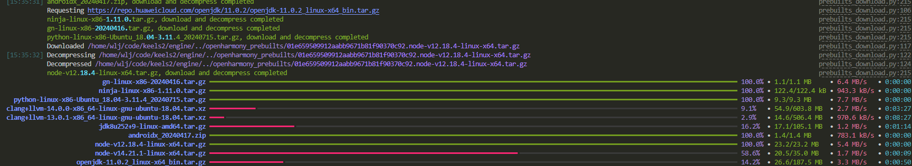
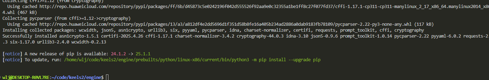
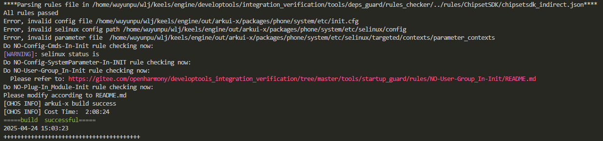

## Engine编译
除了统一构建入口之外，开发者可以单独在仓内进行构建。2者本质上调用的构建命令是一样的。

1.  进入engine仓根目录，执行预编译命令，会下载编译所需依赖（需外网权限）：

```shell
./build/prebuilts_download.sh --build-keels -skip-ssl
```

预构建会下载相关依赖工具，此过程一般只需要**执行一次**。



2.  编译Engine仓：

```shell
./build.sh --product-name keels --target-os android --runtime-mode=[release|debug|profile]
```

若中途报错，根据提示安装缺失的依赖，重新执行编译命令。编译成功后如下图所示：


默认Engine仓编译产物使用`api level 31`，不支持Android 8，原因是Android 8与更高版本的tls实现差距较大。
提供特殊编译命令，可以编译支持Android 8版本的engine，其副作用为产物codesize较大，在部分tls相关等场景下性能降低。
```shell
./build.sh --product-name keels --target-os android --runtime-mode=[release|debug|profile] --gn-args ndk_api_level=26
```

3.  编译产物
```
Engine/out/keels/aosp_clang_arm64_release/arkui/keels/libkeels_android.so
Engine/out/keels/aosp_clang_arm64_release/keels_android_adapter.jar
```