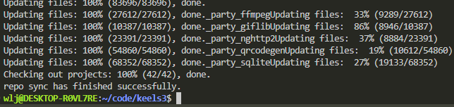

# CJMP代码下载


## 前提条件
1. 注册GitCode帐号。

2. 凭证管理
    - 若采用ssh + repo下载，注册GitCode SSH公钥，请参考[GitCode帮助中心](https://docs.gitcode.com/docs/users/ssh-key/)。

    - 若采用https + repo下载，需新建个人[访问令牌](https://docs.gitcode.com/docs/help/home/user_center/security_management/user_pat)。

4. 安装[git客户端](https://git-scm.com/book/zh/v2/%E8%B5%B7%E6%AD%A5-%E5%AE%89%E8%A3%85-Git)和[git-lfs](https://docs.gitcode.com/docs/help/home/org_project/project_manage/file_operations/lfs/)并配置用户信息。

```shell
git config --global user.name "yourname"
git config --global user.email "your-email-address"
git config --global credential.helper store # 若采用http + repo方式下载，需执行此步骤
git config --global http.postBuffer 2G
```

4. 安装GitCode repo工具，可以执行如下命令。

```shell
curl https://raw.gitcode.com/gitcode-dev/repo/raw/main/repo-py3 > /usr/local/bin/repo  #如果没有权限，可下载至其他目录，并将其配置到环境变量中
chmod a+x /usr/local/bin/repo
pip3 install -i https://repo.huaweicloud.com/repository/pypi/simple requests
```

## 下载CJMP代码
- **CJMP主干代码main分支获取**

通过repo + https下载。（密码为访问令牌，请参考[GitCode帮助中心](https://docs.gitcode.com/docs/help/home/user_center/security_management/user_pat)）。

```shell
repo init -u https://gitcode.com/CJMP/Manifest.git -b main --no-repo-verify
repo sync -c
repo forall -c 'git lfs pull'
```



下载代码成功后，接下来可以对代码进行[编译构建](start-build.md)
