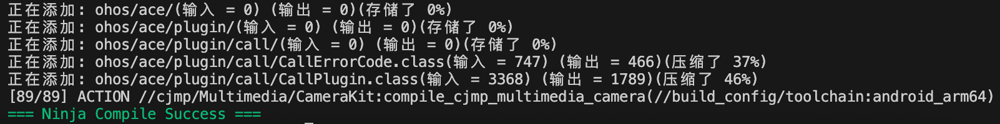

## systemlibs编译

### 编译前准备
1. 通过[repo下载代码](../quick-start/start-download.md)。
2. 环境变量配置
    - 通过[cmc下载](../../app-dev/quick-start/start-overview.md#1-安装-cjmp-sdk)CJMP-SDK，其中包含各平台交叉编译的仓颉sdk以及仓颉stdx(cjmp-libs目录下)，配置CANGJIE_IOS_HOME、CANGJIE_ANDROID_HOME等
        ```
        export CANGJIE_IOS_HOME=~/<本地路径>/cangjie-sdk-mac-aarch64-ios-x.xx.x/
        export CANGJIE_ANDROID_HOME=~/<本地路径>/cangjie-sdk-mac-aarch64-android-x.xx.x/
        export CANGJIE_IOS_STDX=~/<本地路径>/cangjie-stdx-ios-aarch64-0.63.3.1/ios_aarch64_cjnative/static/stdx
        export CANGJIE_ANDROID_STDX=~/<本地路径>/cangjie-stdx-android-aarch64-0.63.3/linux_android31_aarch64_cjnative/static/stdx
        ```
    - [JAVA工具](../../app-dev/quick-start/start-overview.md#andorid-端依赖工具)配置ANDROID_SDK_ROOT、ANDROID_NDK等
        ```
        export ANDROID_SDK_ROOT=~/<本地路径>/Android/sdk
        export ANDROID_NDK=$ANDROID_SDK_ROOT/ndk/26.3.11579264
        export ANDROID_CLANG=$ANDROID_NDK/toolchains/llvm/prebuilt/darwin-x86_64/bin/clang++
        export ANDROID_SYSROOT=$ANDROID_NDK/toolchains/llvm/prebuilt/darwin-x86_64/sysroot
        export ANDROID_LLVM_LIBS1=$ANDROID_NDK/toolchains/llvm/prebuilt/darwin-x86_64/lib/clang/17/lib/linux
        export ANDROID_LLVM_LIBS2=$ANDROID_NDK/toolchains/llvm/prebuilt/darwin-x86_64/sysroot/usr/lib/aarch64-linux-android/31
        ```
    - [IOS工具](../../app-dev/quick-start/start-overview.md#ios-端依赖工具)配置XCODE_HOME、IOS_SDK
        ```
        export XCODE_HOME=/Applications/Xcode.app
        # 在终端创建一个软链接 ln -s $XCODE_HOME/Contents/Developer/Platforms/iPhoneOS.platform/Developer/SDKs/iPhoneOSxx.x.sdk $XCODE_HOME/Contents/Developer/Platforms/iPhoneOS.platform/Developer/SDKs/iPhoneOS.sdk
        export IOS_SDK=$XCODE_HOME/Contents/Developer/Platforms/iPhoneOS.platform/Developer/SDKs/iPhoneOS.sdk
        ```
    - [HarmonyOS工具](../../app-dev/quick-start/start-overview.md#harmonyos-端依赖工具)配置DEVECO_SDK_HOME和安装DevEco Cangjie插件，然后配置CANGJIE_OHOS_HOME
      - Deveco Studio 5.1.0 
        ```
        export CANGJIE_OHOS_HOME=~/<本地路径>/.cangjie-sdk/5.1/cangjie
        export DEVECO_SDK_HOME=/Applications/DevEco-Studio.app/Contents/sdk
        ```
      - Deveco Studio 5.1.1
        ```
        export CANGJIE_OHOS_HOME=/Applications/DevEco-Studio.app/Contents/plugins/cangjie/sdk/cangjie
        export DEVECO_SDK_HOME=/Applications/DevEco-Studio.app/Contents/sdk
        ```

### 编译
通过[根目录的build.sh脚本编译](../quick-start/start-build.md#组件构建)，另外，可以进入各个kit的目录，执行编译脚本编译各个kit。

在根目录，根据对应平台执行相应命令（当前仅支持mac及linux平台，编译生成 arm64产物）。

- 编译命令
  - linux编译命令
    > linux不支持编译ios
    - debug（默认）：`bash build.sh linux [--static|--dynamic] {android|hos}/arm64 [--debug]` 
    - release: `bash build.sh linux [--static|--dynamic] {android|hos}/arm64 --release`

  - mac编译命令
    - debug（默认）：`bash build.sh mac [--static|--dynamic] {android|ios|hos}/{arm64|x86_64}/[device|simulator] [--debug]`
    - release: `bash build.sh mac [--static|--dynamic] {android|ios|hos}/{arm64|x86_64}/[device|simulator] --release`

- 提供选择编译Android、iOS或者HarmonyOS平台`{android|ios|hos}`，必选参数；
- 真机仅支持arm64架构；iOS模拟器支持选择架构`{arm64|x86_64}`，必选参数；。
- 提供选择动态编译和静态编译`[--static|--dynamic]`，可选参数，默认为动态编译；
- 提供选择真机和模拟器编译`[device|simulator]`，可选参数，默认为真机(device)；


构建成功后如图所示：



### 构建产物
构建产物在`<CJMP根目录>/systemlibs/out/libs`中，目录结构如下：
```shell
.
├── libs
│   ├── cjmp
│   │   ├── android
│   │   │   ├── dynamic
│   │   │   │   ├── cjmp
│   │   │   │   │   ├── libcjmp.xxx.so // 仓颉动态库
│   │   │   │   │   ├── ...
│   │   │   │   │   ├── cjmp.xxx.cjo
│   │   │   │   │   ├── ...
│   │   │   │   ├── java
│   │   │   │   │   ├── xxx.jar        // jar包
│   │   │   │   │   ├── ...
│   │   │   │   ├── libxxx.so          // C++动态库
│   │   │   │   ├── ...
│   │   │   ├── static
│   │   │   │   ├── (结构与dynamic一致，生成.a文件)
│   │   │   
│   │   ├── ios
│   │   │   ├── dynamic
│   │   │   │   ├── cjmp
│   │   │   │   │   ├── libcjmp.xxx.dylib // 仓颉动态库
│   │   │   │   │   ├── ...
│   │   │   │   │   ├── cjmp.xxx.cjo
│   │   │   │   │   ├── ...
│   │   │   │   ├── libxxx.dylib          // C++动态库
│   │   │   │   ├── ...
│   │   │   ├── static
│   │   │   │   ├── (结构与dynamic一致，生成.a文件)
│   │   │   
│   │   ├── hos
│   │   │   ├── dynamic
│   │   │   │   ├── cjmp
│   │   │   │   │   ├── libcjmp.xxx.so    // 仓颉动态库
│   │   │   │   │   ├── ...
│   │   │   │   │   ├── cjmp.xxx.cjo
│   │   │   │   │   ├── ...
│   │   │   ├── static
│   │   │   │   ├── (结构与dynamic一致，生成.a文件)
│   │   │
│   │   ├── ios-simulator
│   │   │   ├── arm64
│   │   │   │   ├── dynamic
│   │   │   │   │   ├── cjmp
│   │   │   │   │   │   ├── libcjmp.xxx.dylib // 仓颉动态库
│   │   │   │   │   │   ├── ...
│   │   │   │   │   │   ├── cjmp.xxx.cjo
│   │   │   │   │   │   ├── ...
│   │   │   │   │   ├── libxxx.dylib          // C++动态库
│   │   │   │   │   ├── ...
│   │   │   │   ├── static
│   │   │   │   │   ├── (结构与dynamic一致，生成.a文件)
│   │   │   │
│   │   │   ├── x86_64
│   │   │   │   ├── dynamic
│   │   │   │   │   ├── cjmp
│   │   │   │   │   │   ├── libcjmp.xxx.dylib // 仓颉动态库
│   │   │   │   │   │   ├── ...
│   │   │   │   │   │   ├── cjmp.xxx.cjo
│   │   │   │   │   │   ├── ...
│   │   │   │   │   ├── libxxx.dylib          // C++动态库
│   │   │   │   │   ├── ...
│   │   │   │   │   │
│   │   │   │   ├── static
│   │   │   │   │   ├── (结构与dynamic一致，生成.a文件)
│   │
... ...
```
