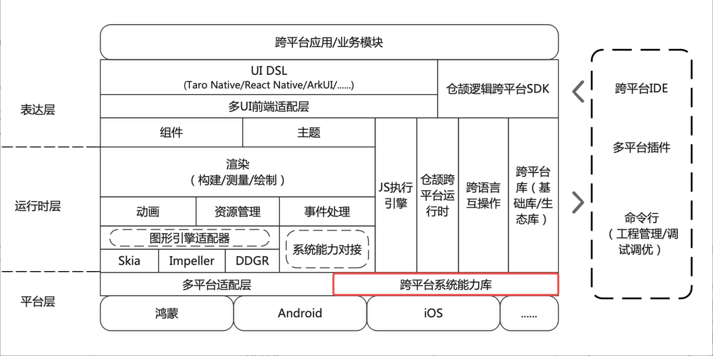
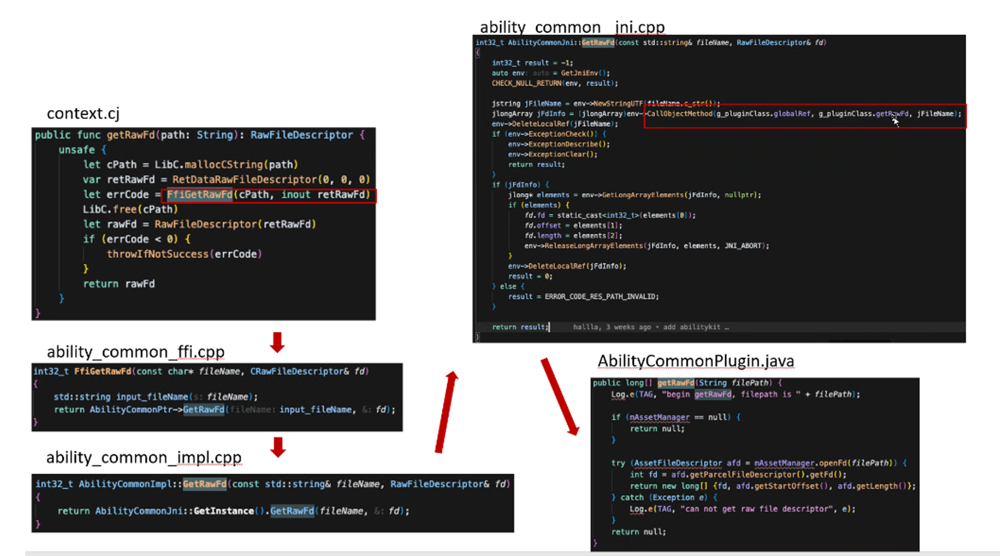

# CJMP系统库跨平台设计总体说明

## 简介

本文档描述CJMP开发框架中系统API跨平台运行能力相关的总体技术方案。

### 范围

CJMP旨在构建一个面向多平台（Android/iOS/HarmonyOS）的移动应用框架，使开发者能够一次编写，多平台共用，即可部署到不同OS平台上。
当前支持Android、iOS、HarmonyOS三端。

当前主要支持的api模块包括：
- ArkData：方舟数据管理
- BasicServicesKit：基础服务
- CameraKit：相机服务
- ConnectivityKit：短矩通信服务
- MediaKit：媒体服务
- NetworkKit：网络服务
- PerformanceAnalysisKit：性能分析服务
- SensorServiceKit：传感器服务
- TelephonyKit：蜂窝通信服务

### 假设和约束
- 当前库中包含仓颉封装Android、iOS、HarmonyOS平台系统api的实现
- Android平台支持：Android版本8.0+，API 26+
- iOS平台支持：iOS版本12.0+

## 总体视图

CJMP项目的跨平台系统能力库位于平台接入层，通过统一抽象接口屏蔽平台差异，为上层应用提供三端一致的API。其输出产物可直接集成使用，实现"一次开发，多端运行"的目标。

## systemlibs方案设计

### systemlibs模块功能介绍 

CJMP的系统库设计主要包括以下几个模块：
- 仓颉接口模块：cjmp文件夹，主要存放当前已实现的相关仓颉实现和接口信息；
- Android/iOS实现模块：platform文件夹，存放java以及其c桥接层，以及oc以及其c桥接层；
- 构建工具链模块：build文件夹，存放gn构建相关配置文件；
- 测试模块：tests文件夹，存放测试代码，cjmp_test目录则是cjmp相关的测试代码，详细介绍可参见[Link](systemlibs-test.md)

对于系统api开发者来说，主要关注的模块为仓颉接口模块，Android/iOS实现模块，测试模块。

### 框架构建系统

CJMP编译构建提供了一套基于GN和Ninja的编译构建框架，通过分层配置和模块化设计实现多平台高效构建。在此基础上，进一步提供了统一构建脚本build.sh，直接debug和release模式构建。

### 仓颉接口设计说明

接口设计沿用仓颉6.0的接口设计。[仓颉开源的系统API接口](https://gitcode.com/org/openharmony/repos)，在搜索框中输入 cangjie 即可获得仓颉接口设计源码。

### 语言互操作说明

未来采用互操作的方式进行接口开发。

仓颉-x互操作，目前`仓颉-java`互操作和`仓颉-oc`互操作均在开发中。

#### java/cangjie互操作

当前方案如下：

 

原生系统API通过JNI封装为CPP接口，仓颉接口需要通过FFI调用该封装好的接口来实现。该实现方案中，CPP代码较多，实现较为繁琐，开发者需要同时了解三种语言才能实现便捷开发。

**计划方案**

仓颉语言将会提供互操作宏，通过互操作宏直接实现仓颉和Java之间的互调，工具文档待外发

### 原生封装说明

针对 Android / iOS / HarmonyOS 平台的原生封装中，主要有以下考虑点：

- **不同平台的API差异**
  - 难点：传感器/蓝牙/摄像头等设备的支持度和API设计不同
  - 方案：实现适配器，定义统一接口
- **不同平台的权限管理差异**
  - 难点：通知，后台任务，权限管理的实现差异
  - 方案：文档中做好差异说明
- **同一平台的不同版本之间的API差异**
  - 难点：比如Android API在不同NDK版本间差异较大
  - 方案：当前支持Android系统版本8.0+（API 26+），对于API变更较大的版本，采取版本控制的方式（开发中），区分版本提供差异化实现

### 测试方案说明
参见[systemlibs 测试说明](systemlibs-test.md)
