# 测试框架使用文档

## 一、工程搭建

### Android平台

#### 1） Android测试构建步骤
1. 在根目录下，[构建系统库](./systemlibs-build.md#systemlibs编译)生成CJMP cangjie**动态**库, c/c++桥接**动态**库, 安卓适配jar包。

2. 在测试框架目录(tests/)执行 `bash build.sh mac android/arm64`。目前仅支持MacOS系统编译。
    - 生成互操作java文件。
      - `out/libs/android/dynamic/tests/TestCangjie.java`
    - 生成测试框架动态库。
      - `out/libs/cjmp/android/dynamic/tests/aarch64-linux-android31/release/cjmp_test`
    - 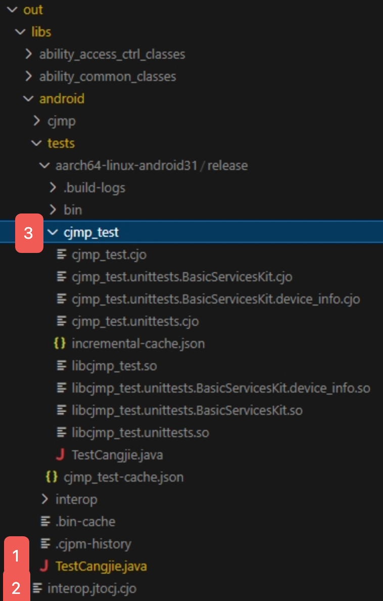
    

3. 用 AndroidStudio 创建新工程，完成前置配置，[配置教程](#2安卓工程配置)。
     - 将步骤2生成的`out/libs/android/tests/TestCangjie.java`复制到工程`app/src/main/java`目录下

4. 将相关动态库打包进android工程`app/libs/arm64-v8a`目录
     - `out/libs/cjmp/android/dynamic/tests/aarch64-linux-android31/release/cjmp_test/*.so`
     - `out/libs/cjmp/android/dynamic/*.so`
     - `out/libs/cjmp/android/dynamic/cjmp/*.so`
     - `$CANGJIE_HOME/runtime/lib/linux_androidxx_aarch64_cjnative/*.so`
     - `$ANDROID_SYSROOT/usr/lib/aarch64-linux-android/libc++_shared.so`
5. 将相关jar包打包进android工程`app/libs`目录
     - `out/libs/cjmp/android/dynamic/java/*.jar`
     - `$CANGJIE_HOME/lib/library-loader.jar`
6. 在`MainActivity.kt`中注册PluginManager。
    - kotlin
        ```kotlin
        import adapter.capability.plugin.PluginManager
        // register activity
        PluginManager.register(this::class.java.name, this)
        ```

    - java
        ```java
        import adapter.capability.plugin.PluginManage
        // register activity
        PluginManager.register(this.getClass().getName(), this)
        ```

#### 2）安卓工程配置

1. **新建android studio工程**：选择**Empty Activity**，gradle建议**Groovy DSL**
    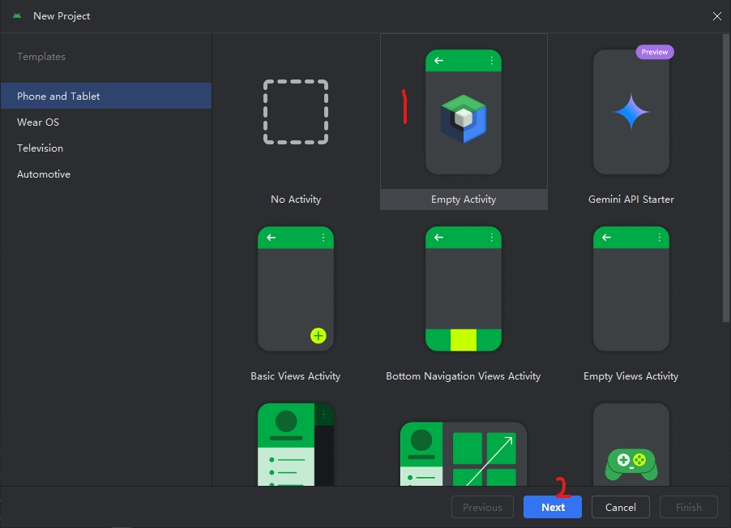  
    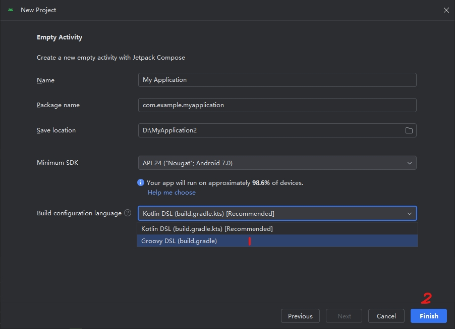  

2. **工程相关配置**
   1. 在`app/`目录下新建`libs`目录以及`libs/arm64-v8a`目录
   2. 打开`app/build.gradle`文件
   3. 设置ndk版本
   4. 设置**步骤1**的目录环境变量
       ```gradle
         sourceSets {
           main {
               jniLibs.srcDirs = ['libs']
           }
         }
       ```
   5. 增加打包选项配置：
       ```gradle
         packagingOptions { 
           jniLibs { 
             useLegacyPackaging = true
           }
         }
       ```
   6. 设置外部jar包和动态库依赖路径 `implementation fileTree(dir: 'libs', include: ['*.jar'])`

   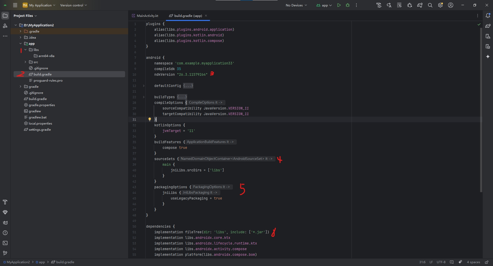  

3. **代码相关配置**
   1. 在`app/src/main/java`目录下新增**TestCangjie.java**文件。TestCangjie.java代码由**互操作生成**。

   2. 在`MainActivity.kt`文件中新增TestCangjie类的引用
       ```kotlin
       import interop.jtocj.TestCangjie

       // run single testCase
       TestCangjie.callCangjieTest("TestDeviceInfo")

       // run all testCase
       TestCangjie.callCangjieTest("")
       ```
   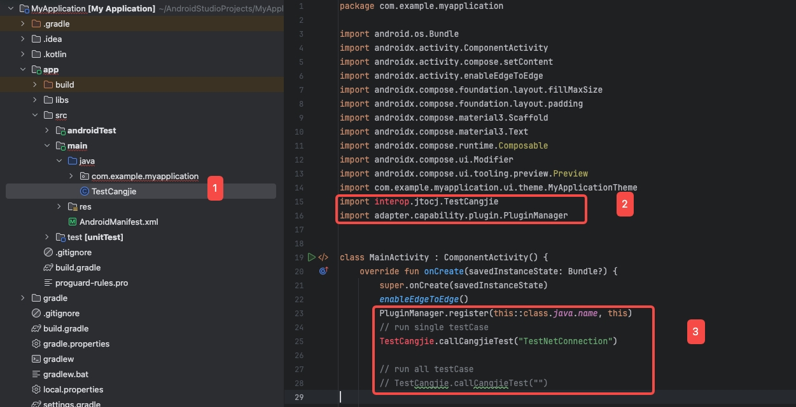  

4. **权限相关配置**：在`app/src/main/AndroidManifest.xml`文件中增加权限声明。部分权限需要先声明，再动态申请。

    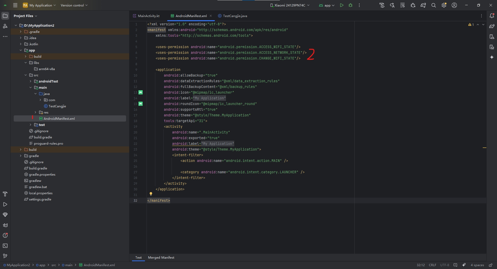 


5. **执行工程**：查看Android模拟器logcat，搜索"ng_test"，查看测试结果。
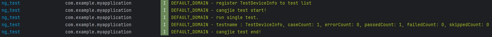  

#### 3）覆盖率
1. 根目录下构建逻辑跨平台库，构建选项加上`--coverage`
    ```shell
    bash build.sh <current_os> android/<cpu> --coverage
    ```
    - 会在`out/`目录生成`.gcno`文件，cangjie生成动态库都为插桩动态库  
    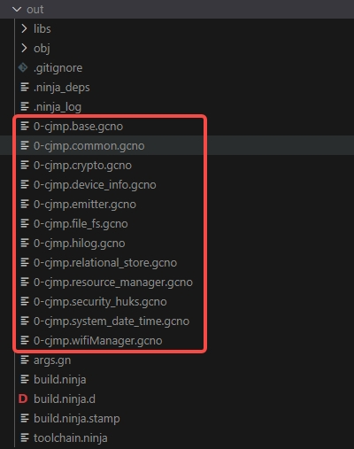  

2. 在当前目录(tests/)执行 `bash build.sh mac android/arm64 --coverage`
3. 同安卓工程配置的[步骤3、4、5、6](#1-android测试构建步骤)完成工程配置。
4. 测试用例在正确执行后，会生成若干`.gcda`文件，文件保存在手机`/storage/emulated/0/Android/data/com.example.myapplication/cov`目录下。可通过在手机打开文件管理器查看`文件管理 -> Android/data/com.example.myapplication/cov`。  
    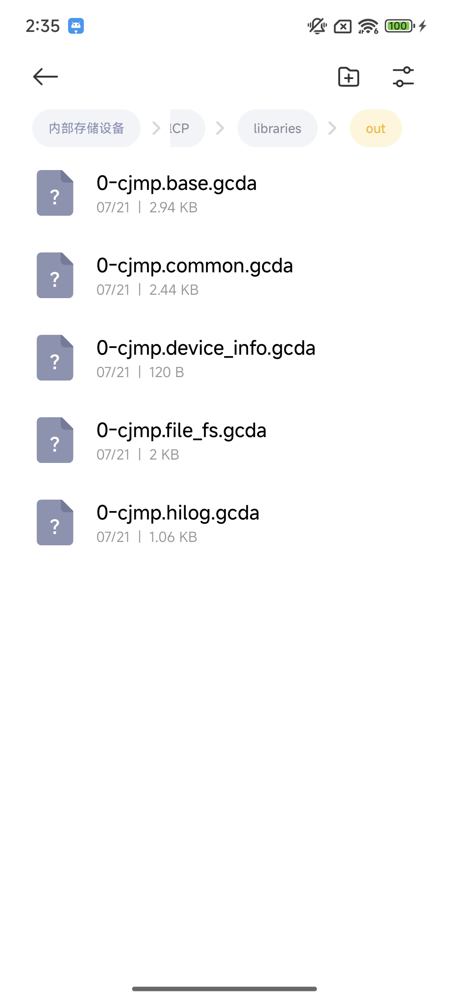  
5. 将所有`.gcda`文件保存到项目`out/`目录，与`.gcno`同层目录。切换路径至`out/`下，并输入以下命令`cjcov -o cov_result --html-details`
    - 更多`cjcov`参数使用可参考[命令说明](https://docs.cangjie-lang.cn/docs/1.0.0/tools/source_zh_cn/tools/cjcov_manual_cjnative.html?highlight=cjcov#%E5%91%BD%E4%BB%A4%E8%AF%B4%E6%98%8E)
    - 执行完命令会在该目录下的`cov_result/`生成若干`html`文件，浏览器打开`index.html`查看覆盖率结果  
    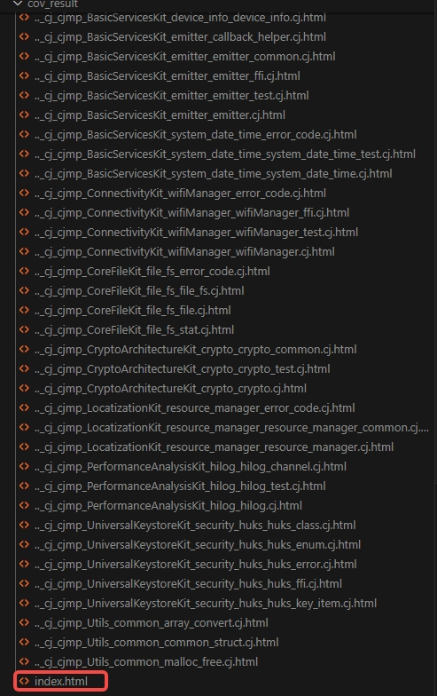  
    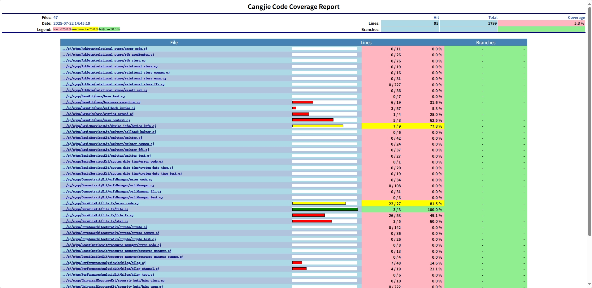  

### iOS平台

#### 1）iOS测试构建步骤

1. 在根目录，[构建系统库](./systemlibs-build.md#systemlibs编译)生成CJMP cangjie**静态**库（--static）, c桥接**静态**库，oc库。

2. 在当前目录(tests/)执行 `bash build.sh mac ios/arm64`。目前仅支持MacOS系统编译。

    该命令行生成测试框架测试用例静态库。产物在`out/libs/cjmp/ios/static/tests/aarch64-apple-ios/release/cjmp_test`目录下。

3. 创建iOS工程，见[Xcode工程配置](#二xcode工程配置)

4. 将相关静态库加入iOS工程中。
    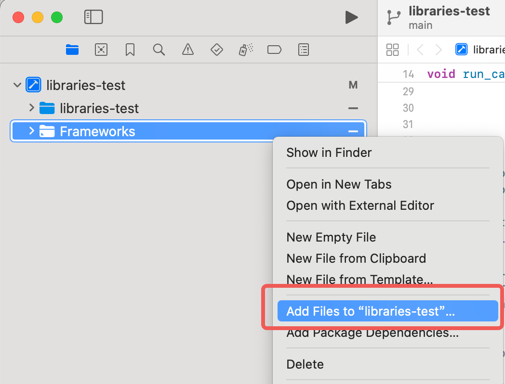
   - 添加`out/libs/cjmp/ios/static/tests/aarch64-apple-ios/release/cjmp_test`下`.a`库至XCode的frameworks文件夹中
   - 添加`out/libs/cjmp/ios/static/`下`.a`库至XCode的Frameworks文件夹中
   - 添加`out/libs/cjmp/ios/static/cjmp`下`.a`库至XCode的Frameworks文件夹中。
   - 添加`$CANGJIE_IOS_HOME/lib/ios_aarch64_cjnative`下`.a`库至XCode的Frameworks文件夹中。
     > **注意：section.o必须移动至cjstart.o前**
   - 在`Build Phases` > `Link Binary with Libraries`中添加依赖的第三方`.frameworks`
   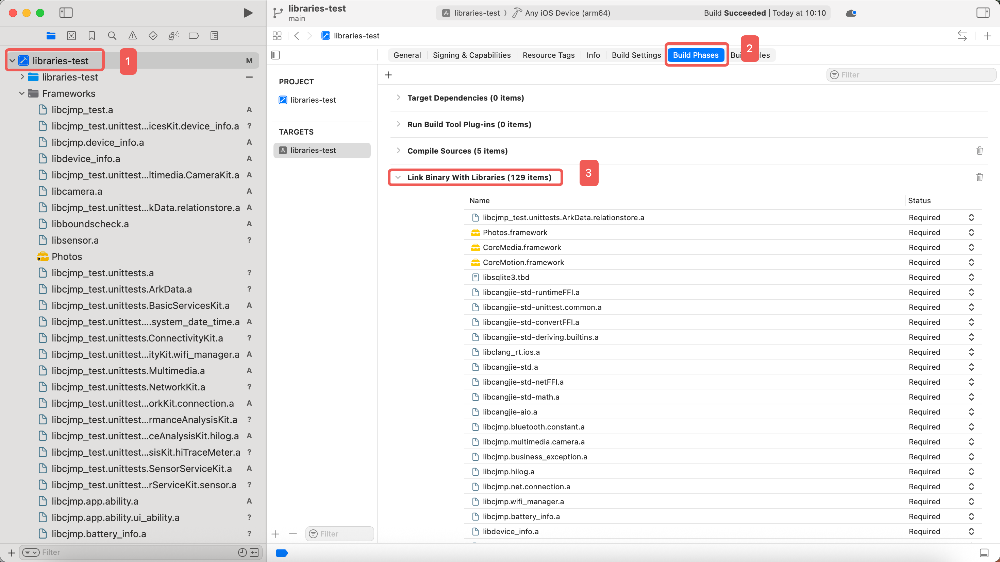

#### 2）XCode工程配置
1. 用 XCode 创建新工程。选择`File` > `new` > `Project...`
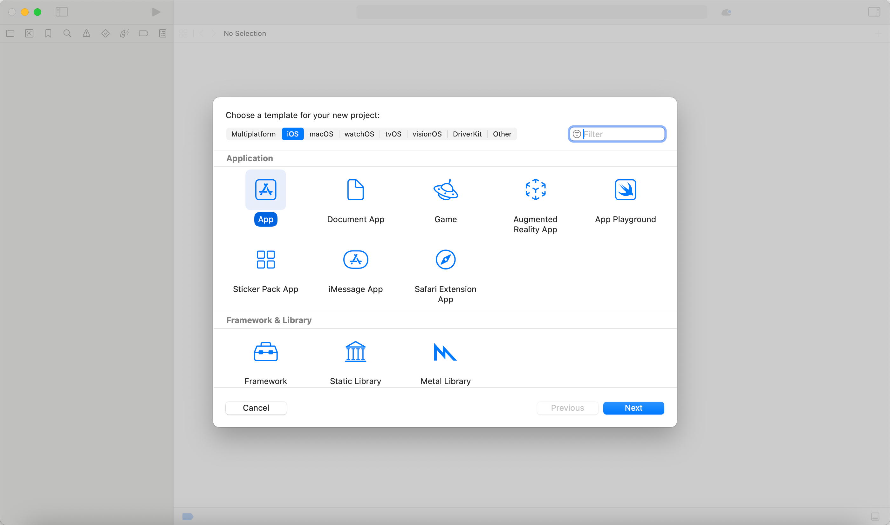

2. 选择`App`工程，填写Product Name信息，并选择工程目录，创建工程。
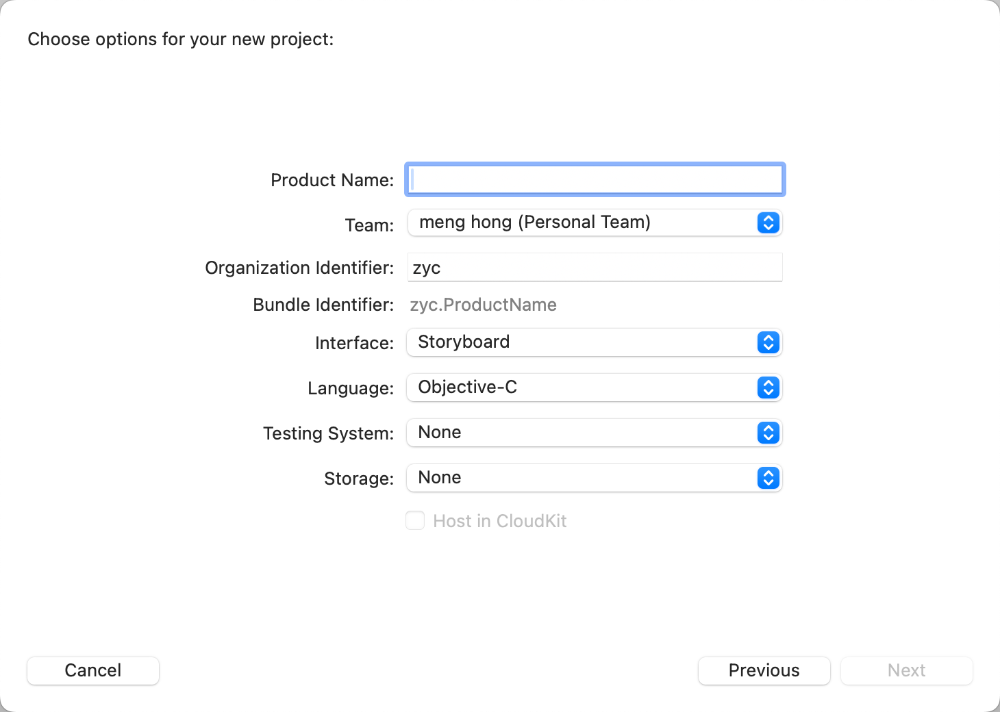

3. 创建文件bridge_cangjie.h和bridge_cangjie.c内容如下
- bridge_cangjie.h
    ```C
    #ifndef bridge_cangjie_h
    #define bridge_cangjie_h

    #include <stdio.h>

    void run_cangjie(void);

    #endif /* bridge_cangjie.h */
    ```
- bridge_cangjie.c
    ```C
    #include "bridge_cangjie.h"
    #include "Cangjie.h"
    #include "unistd.h"

    extern void callCangjieTest(char *);

    void run_cangjie(void) {
        struct RuntimeParam param = {
            .heapParam = {
                .regionSize = 64UL,
                .heapSize = 256* 1024,
                .exemptionThreshold = 0.8,
                .heapUtilization = 0.6,
                .heapGrowth = 0.15,
                .allocationRate = 10240,
                .allocationWaitTime = 1000},
            .gcParam = {
                .gcThreshold = 20480,
                .garbageThreshold = 0.5,
                .gcInterval = 150,
                .backupGCInterval = 240,
                .gcThreads = 8
            },
            .logParam = {.logLevel = RTLOG_ERROR },
            .coParam = {.thStackSize = 64*1024, .coStackSize = 64*1024, .processorNum = 8}
        };
        if(InitCJRuntime(&param) != E_OK) {
            printf("Failed to InitCJRuntime.\n");
        }
        InitCJLibrary("libraries-test");
        // ⬇ run one test
        callCangjieTest("TestDeviceInfo");

        // ⬇ run all tests
        // callCangejieTest("")
    }

    ```
    `InitCJLibrary()`中填写当前ios工程的名称

1. 添加[Cangjie.h](#附录cangjieh头文件)文件
2. 修改main.m文件
    ```C
    int main(int argc, char * argv[]) {
        run_cangjie(); // ⬅ 添加此函数
        ...
    }
    ```
3. 增加仓颉静态标准库间接依赖，Xcode项目配置 > `Build Settings` > `Other Linker Flags`，配置`-lc++`
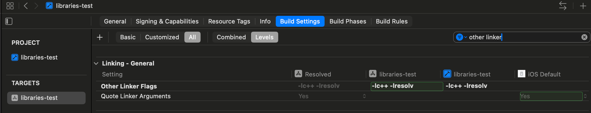
4. 在Xcode项目配置 > `Build Settings` > `Dead Code Stripping`字段中设置值： `No`

#### 3）覆盖率
1. 根目录下构建逻辑跨平台库，构建选项加上`--coverage`
    ```shell
    bash build.sh <current_os> ios/<cpu> --coverage --static
    ```
    - 会在`out/`目录生成`.gcno`文件，cangjie生成动态库都为插桩静态库  
      

2. 在当前目录(tests/)执行 `bash build.sh ios/arm64 --coverage`
3. 接下来同iOS测试构建步骤的[步骤3、4](#1ios测试构建步骤)完成iOS工程构建。在Info选项卡中，添加`UIFileSharingEnabled = YES`和`LSSupportsOpeningDocumentsInPlace = YES`。
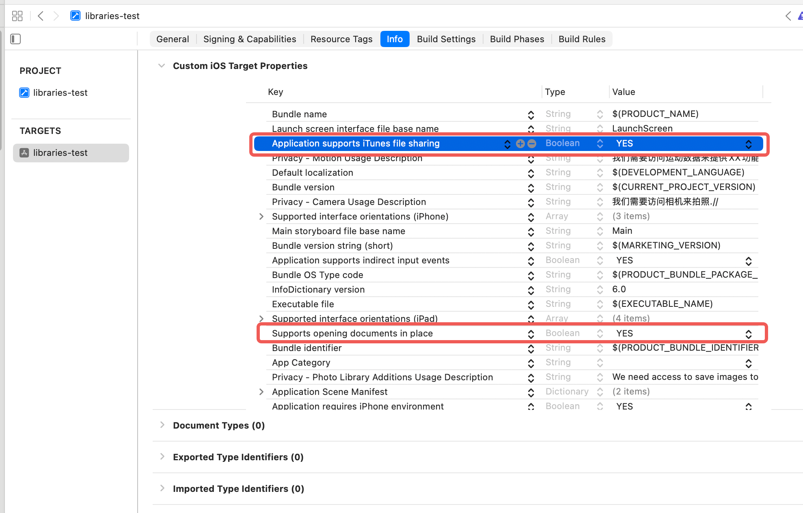
4. 测试用例在正确执行后，会生成若干`.gcda`文件，文件保存在当前App的`coverage文件夹`中。可通过手机连接Mac，在`访达`点击设备，找到当前运行应用，将`coverage文件夹`下载得到`.gcda`文件。  
    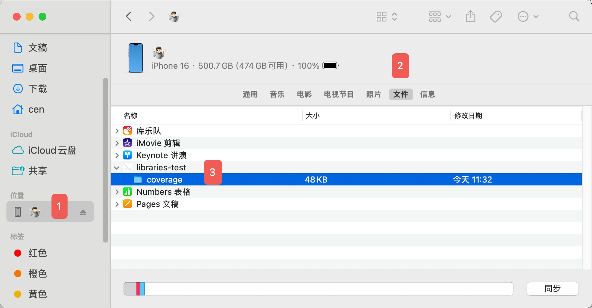  
5. 将所有`.gcda`文件保存到项目`out/`目录，与`.gcno`同层目录。切换路径至`out/`下。输入以下命令`cjcov -o cov_result --html-details`
    - 更多`cjcov`参数使用可参考[命令说明](https://docs.cangjie-lang.cn/docs/1.0.0/tools/source_zh_cn/tools/cjcov_manual_cjnative.html?highlight=cjcov#%E5%91%BD%E4%BB%A4%E8%AF%B4%E6%98%8E)
    - 执行完命令会在该目录下的`cov_result/`生成若干`html`文件，浏览器打开`index.html`查看覆盖率结果  
      
      


## 二、测试用例补充

1. 在`tests/cjmp_test/src/unittests/`目录下按照**kit**补充测试用例

2. 测试用例文件按如下代码格式开发
    ```cangjie
    package cjmp_test.unittests.xxxkit.xxx_module

    import std.unittest.*
    import std.unittest.testmacro.*
    import cjmp.xxx_module.*
    import cjmp_test.unittests.execute

    public let executeTestXXX = {
        => execute(TestXXX())
    }

    @Test
    class TestXXX {
        @TestCase
        func test_func(): Unit {
            let res = ...
            @Expect(res != "")
            @Expect(true)
        }
    }
    ```
3. 在`tests/cjmp_test/src/register_tests.cj`文件中注册新添加的TestCase
    ```cangjie
    let _ = {
        => TestRunner.registerTestCase("TestDeviceInfo") {=> executeTestDeviceInfo()}
        // register your TestCase
        TestRunner.registerTestCase("TestXXX") {=> executeTestXXX()}
    }()
    ```


### 附录：Cangjie.h头文件
    ```
    /*
    * Copyright (c) 2023 Huawei Technologies Co., Ltd.
    * Cangjie is licensed under Mulan PSL v2.
    * You can use this software according to the terms and conditions of the Mulan PSL v2.
    * You may obtain a copy of Mulan PSL v2 at:
    *     http://license.coscl.org.cn/MulanPSL2
    * THIS SOFTWARE IS PROVIDED ON AN "AS IS" BASIS, WITHOUT WARRANTIES OF ANY KIND, EITHER
    * EXPRESS OR IMPLIED, INCLUDING BUT NOT LIMITED TO NON-INFRINGEMENT, MERCHANTABILITY OR
    * FIT FOR A PARTICULAR PURPOSE.
    * See the Mulan PSL v2 for more details.
    */
    #ifndef CANGJIE_H
    #define CANGJIE_H

    #ifdef __cplusplus
    #include <cstddef>
    #include <cstdint>
    #include <functional>
    #ifndef _WIN64
    #include <csignal>
    #endif
    #else
    #include <stdbool.h>
    #include <stddef.h>
    #include <stdint.h>
    #ifndef _WIN64
    #include <signal.h>
    #endif
    #endif

    /* C++ needs to know that types and declarations are C, not C++. */
    #ifdef __cplusplus
    #define CANGJIE_RT_API_DECLS_BEGIN extern "C" {
    #define CANGJIE_RT_API_DECLS_END }
    #else
    #define CANGJIE_RT_API_DECLS_BEGIN
    #define CANGJIE_RT_API_DECLS_END
    #endif

    #ifndef MRT_EXPORT
    #define MRT_EXPORT __attribute__((visibility("default")))
    #endif

    #ifndef MRT_OPTIONAL_DISABLE_TAIL_CALL
    #ifdef __OHOS__
    #define MRT_OPTIONAL_DISABLE_TAIL_CALL __attribute__((disable_tail_calls))
    #else
    #define MRT_OPTIONAL_DISABLE_TAIL_CALL
    #endif
    #endif

    #ifndef MRT_OPTIONAL_BRANCH_PROTECT_NONE
    #if (defined(__OHOS__) && defined(__aarch64__)) || defined(__HOS__)
    #define MRT_OPTIONAL_BRANCH_PROTECT_NONE __attribute__((target("branch-protection=none")))
    #else
    #define MRT_OPTIONAL_BRANCH_PROTECT_NONE
    #endif
    #endif

    #ifdef __cplusplus
    /*
        * @brief CJThread handle returned by Cangjie CJThread scheduler.
        * @attention Currently, the return value of CJThread module is 'void *',
        * it would be changed into 'int' later.
        */
    using CJThreadHandle = void*;

    /*
        * @brief CJThread handle returned by Cangjie cjthread scheduler.
        * @attention Currently, the return value of CJThread module is 'void *',
        * it would be changed into 'int' later.
        */
    using SemiCJThreadHandle = void*;

    /* Prototype function submitted to Cangjie cjthread scheduler. */
    using CJTaskFunc = void* (*)(void*);

    /* Key of cjthread specific data. */
    using CJThreadKey = unsigned int;

    /* Destructor function for the value of cjthread specific data. */
    using DestructorFunc = void (*)(void*);

    /* Post Task function is used for user's event handler system to handle cj task. */
    using PostTaskFunc = bool (*)(void*);

    /* Check for higher priority tasks in event handler system. */
    using HasHigherPriorityTaskFunc = bool (*)();

    /* Update designate stackInfo */
    using UpdateStackInfoFunc = void (*)(unsigned long long, void*, unsigned int);
    #else
    /*
        * @brief CJThread handle returned by Cangjie cjthread scheduler.
        * @attention Currently, the return value of CJThread module is 'void *',
        * it would be changed into 'int' later.
        */
    typedef void* CJThreadHandle;

    /*
        * @brief Semi-cjthread handle returned by CreateCJThread.
        * @attention Currently, SemiCJThreadHandle is provided to lua2cj project.
        * It simulates lua cjthread's behavior, which means it is different from
        * CJThreadHandle. Do not mix up CJThreadHandle and SemiCJThreadHandle.
        */
    typedef void* SemiCJThreadHandle;

    /* Prototype function submitted to Cangjie cjthread scheduler. */
    typedef void* (*CJTaskFunc)(void*);

    /* Key of cjthread specific data. */
    typedef unsigned int CJThreadKey;

    /* Destructor function for the value of cjthread specific data. */
    typedef void (*DestructorFunc)(void*);

    /* Post Task function is used for user's event handler system to handle cj task. */
    typedef bool (*PostTaskFunc)(void*);

    /* Check for higher priority tasks in event handler system. */
    typedef bool (*HasHigherPriorityTaskFunc)(void);

    /* Update designate stackInfo */
    typedef void (*UpdateStackInfoFunc)(unsigned long long, void*, unsigned int);
    #endif

    /*
        * @struct CJThreadSpecificData
        * @brief Data structure to store the cjthread specific data,\n
        * including the key and value of cjthread specific data.
        */
    struct CJThreadSpecificData {
        CJThreadKey key;
        void* value;
    };

    #ifdef __cplusplus
    struct CJErrorObject {
        const char* name;
        const char* message;
        const char* stack;
    };

    struct CJUncaughtExceptionInfo {
        const char* hapPath;
        std::function<void(const char* summary, const CJErrorObject errorObj)> uncaughtTask;
    };
    #endif

    /* CJThread state type. */
    enum CJThreadState {
        CJTHREAD_IDLE,
        CJTHREAD_READY,
        CJTHREAD_RUNNING,
        CJTHREAD_PENDING,
        CJTHREAD_SYSCALL,
    };

    /* Semi CJThread state type */
    enum SemiCJThreadState {
        SEMI_CJTHREAD_INIT,
        SEMI_CJTHREAD_SUSPENDING,
        SEMI_CJTHREAD_RUNNING,
        SEMI_CJTHREAD_DONE,
    };

    /* Log level for Cangjie runtime. */
    enum RTLogLevel {
        RTLOG_VERBOSE,
        RTLOG_DEBUGY,
        RTLOG_INFO,
        RTLOG_WARNING,
        RTLOG_ERROR,
        RTLOG_FATAL_WITHOUT_ABORT,
        RTLOG_FATAL,
        RTLOG_OFF
    };

    enum RTErrorCode { E_OK = 0, E_ARGS = -1, E_TIMEOUT = -2, E_STATE = -3, E_FAILED = -4 };

    /*
        * @struct HeapParam
        * @brief Data structure for Cangjie heap configuration parameters,\n
        * including the heap size, region size at runtime, and etc.
        */
    struct HeapParam {
        /*
            * The reference value of region size, measured in KB, default to 64 KB, must be in range [4KB, 64KB].
            * It will be set to default value if assigned with 0.
            */
        size_t regionSize;

        /*
            * The maximum size of cangjie heap, measured in KB, default to 256 * 1024 KB, must >= 4MB.
            * It will be set to default value if assigned with 0.
            */
        size_t heapSize;

        /*
            * Threshold used to determine whether a region is exempted (i.e., will not be forwarded).
            * If the percentage of live objects in a region is greater than this value, this region will not be exempted.
            * Default to 0.8, must be in range (0, 1].
            * It will be set to default value if assigned with 0.
            */
        double exemptionThreshold;

        /*
            * A hint to guide collector to release physical memory to OS.
            * heap utilization = heap-used-memory / total-heap-memory.
            * During each gc, collector determines how much memory should be cached,
            * and let the heap utilization be close to this value.
            * Default to 0.80, must be in range (0, 1].
            * It will be set to default value if assigned with 0.
            */
        double heapUtilization;

        /*
            * The ratio to expand heap after each GC.
            * GC is probably triggered more often if this value is set to an improperly small number.
            * Default to 0.15, must > 0.
            * It will be set to default value if assigned with 0.
            */
        double heapGrowth;

        /*
            * The rate of allocating memory from heap.
            * this value is the lower bound of the real allocation rate.
            * allocator maybe wait some time if this value is set with an improperly small number.
            * Mesured in MB/s, default to 10240 MB/s, must be > 0 MB/s.
            * It will be set to default value if assigned with 0.
            */
        double allocationRate;

        /*
            * The maximum wait time when allocating memory from heap.
            * The latter allocation will wait a number of time if the two allocation interval is less than the wait time.
            * The real wait time is the minimum of allocationWaitTime and the wait time calculated from real allocation rate.
            * Measured in ns, default to 1000 ns, must > 0 ns.
            * It will be set to default value if assigned with 0.
            */
        size_t allocationWaitTime;
    };

    /*
        * @struct GCParam
        * @brief Data structure for Cangjie garbage collection configuration parameters,\n
        * including the garbage ratio, garbage collection interval and etc.
        */
    struct GCParam {
        /*
            * GC will be triggered when heap allocated size is greater than this threshold.
            * Measured in KB, must be > 0.
            */
        size_t gcThreshold;

        /*
            * The threshold used to determine whether to collect from-space during GC.
            * The from-space will be collected if the percentage of the garbage in from space is greater than this threshold.
            * default to 0.5, must be in range [0.1, 1.0].
            */
        double garbageThreshold;

        /*
            * Minimum interval each GC request will be responded. If two adjacent GC requests with
            * interval less than this value, the latter one is ignored.
            * Measured in ns, default to 150 ms, must be > 0 ms.
            * It will be set default value if the value is 0.
            */
        uint64_t gcInterval;

        /*
            * Minimum interval each backup GC request will be responded.
            * Backup GC will be triggered if there is no GC during this interval.
            * Measured in ns, default to 240 s, must be > 0 s.
            * It will be set default value if the value is 0.
            */
        uint64_t backupGCInterval;

        /*
            * Parameters for adjusting the number of GC threads.
            * The number of gc threads is ((the hardware concurrency / this value) - 1).
            * default to 8, must be > 0.
            * It will be set default value if the value is 0.
            */
        int32_t gcThreads;
    };

    /*
        * @struct LogParam
        * @brief Data structure for Cangjie Log configuration parameters,\n
        * including the log size, log file level and etc.
        */
    struct LogParam {
        /* Logging statements with level less than this value are ignored. Default to ERROR. */
        enum RTLogLevel logLevel;
    };

    /*
        * @struct ConcurrencyParam
        * @brief Data structure for thread and cjthread configuration parameters,\n
        * including the default stack size for threads and cjthread, numbers of processors,\n
        * and the maximum number of cjthreads.
        */
    struct ConcurrencyParam {
        /*
            * Thread stack size. Measured in KB, recommended value is 1 MB, must be > 0.
            * It will be set default value if the value is 0.
            */
        size_t thStackSize;

        /*
            * CJThread stack size. Measured in KB, recommended value is 64KB, must be in range [64KB, 1GB].
            * It will be set default value if the value is 0.
            */
        size_t coStackSize;

        /*
            * Number of processors, recommended value is consistent with the number of CPU cores, must be > 0.
            * It will be set default value if the value is 0.
            */
        uint32_t processorNum;
    };

    /*
        * @struct RuntimeParam
        * @brief Data structure for Cangjie runtime parameters,\n
        * including the config information of heap, garbage collection, cjthread and log.
        */
    struct RuntimeParam {
        struct HeapParam heapParam;
        struct GCParam gcParam;
        struct LogParam logParam;
        struct ConcurrencyParam coParam;
    };

    CANGJIE_RT_API_DECLS_BEGIN

    /* ============ Interfaces to launch Cangjie runtime environment. ============*/

    /*
        * @brief Initialize Cangjie runtime environment.
        * @par This API will create an instance of cangjie runtime.
        * @attention
        * @param  param  [IN] a structure pointer to config Cangjie runtime parameters.
        * @retval Return 0 if OK. Otherwise, return an error code.
        */
    MRT_EXPORT enum RTErrorCode InitCJRuntime(const struct RuntimeParam* param);

    /*
        * @brief register arkVM in Runtime
        * @par This API will record a external VM.
        * @attention
        * @param  param  [IN] arkVM address
        * @retval
        */
    MRT_EXPORT void RegisterArkVMInRuntime(unsigned long long arkVM);

    /*
        * @brief Create and init a Cangjie UI scheduler.
        * @par This API will create a single processor ui scheduler and return the scheduler handle.
        * @attention This API could not be used to create default scheduler.
        * @retval Return the scheduler handle if success. Otherwise, return NULL.
        */
    MRT_EXPORT void* InitUIScheduler(void);

    /*
        * @brief Create and init a Cangjie UI scheduler.
        * @par This API will start a ui-scheduler that created by `InitUIScheduler`.
        * @attention This API should be invoked on the same thread that `InitUIScheduler` called.
        * @param  timeout  [IN] Timeout interval, in milliseconds. If the value is 0, the timeout interval is not set.
        * @retval Return 0 if OK. Otherwise, return an error code.
        */
    MRT_EXPORT enum RTErrorCode RunUIScheduler(unsigned long long timeout);

    /*
        * @brief Set Cangjie command line arguments.
        * @par This API will set the command line arguments of Cangjie program.
        * @attention This API should be used when Cangjie runtime is initialized.
        * @param  argc  [IN]  the count of arguments.
        * @param  argv  [IN]  the array of arguments.
        * @retval Return 0 if OK. Otherwise, return an error code.
        */
    MRT_EXPORT enum RTErrorCode SetCJCommandLineArgs(int argc, const char* argv[]);

    /*
        * @brief Finish Cangjie runtime environment.
        * @par This API will stop scheduler and finish cangjie runtime, and allowed to be used only once.
        * @attention Other threads are not allowed to depend on this function invocation result.
        * @param
        * @retval Return 0 if OK. Otherwise, return an error code.
        */
    MRT_EXPORT enum RTErrorCode FiniCJRuntime(void);

    /*
        * @brief Set Cangjie runtime initialization flag.
        * @attention
        * @param
        * @retval Return 0 if OK. Otherwise, return an error code.
        */
    MRT_EXPORT enum RTErrorCode SetRuntimeInitFlag(void);

    /*
        * @brief Set Cangjie runtime finish flag.
        * @attention
        * @param
        * @retval Return 0 if OK. Otherwise, return an error code.
        */
    MRT_EXPORT enum RTErrorCode SetRuntimeFiniFlag(void);
    /*
        * @brief Submit a task to Cangjie cjthread scheduler.
        * @par This API will create a Cangjie cjthread and return the cjthread handle.
        * @attention The arg fi should be released by API ReleaseHandle.
        * @param  func  [IN]  user defined Cangjie task function prototype.
        * @param  args  [IN]  arguments of the Cangjie task function.
        * @retval Return the cjthread handle if success. Otherwise, return NULL.
        */
    MRT_EXPORT CJThreadHandle RunCJTask(const CJTaskFunc func, void* args);
    MRT_EXPORT CJThreadHandle RunCJTaskSignal(const CJTaskFunc func, void* args);
    /*
        * @brief Submit a task to specify Cangjie cjthread scheduler.
        * @par This API will create a Cangjie cjthread and return the cjthread handle.
        * @attention The arg fi should be released by API ReleaseHandle.
        * @param  func     [IN]  user defined Cangjie task function prototype.
        * @param  args     [IN]  arguments of the Cangjie task function.
        * @param  schedule [IN]  specify cjthread scheduler handle.
        * @retval Return the cjthread handle if success. Otherwise, return NULL.
        */
    MRT_EXPORT CJThreadHandle RunCJTaskToSchedule(const CJTaskFunc func, void* args, void* schedule);

    /*
        * @brief Submit a task with cjthread specific data to Cangjie cjthread scheduler.
        * @par This API will create a Cangjie cjthread with cjthread specific data,\n
        * and return the cjthread handle.
        * @attention
        * @param  func  [IN]  user defined Cangjie task function prototype.
        * @param  args  [IN]  arguments of the Cangjie task function.
        * @param  data  [IN]  pointer to the cjthread specific data.
        * @param  num   [IN]  number of cjthread specific data, num <= CJTHREAD_KEYS_MAX (now defined to 8 in cjthread).
        * @retval Return the cjthread handle if success. Otherwise, return NULL.
        */
    MRT_EXPORT CJThreadHandle RunCJTaskWithLocal(
        const CJTaskFunc func, void* args, struct CJThreadSpecificData* data, int num);

    /* ===================== Interfaces for Lua2CJ Project. ===================== */

    /*
        * @brief Submit a semi-cjthread to Cangjie cjthread scheduler.
        * @par This API will create a Cangjie cjthread and return the semi-cjthread handle.
        * @attention 1. This API is provided to lua2cj project.
        *            2. SemiCJThreadHandle should be released by API DestroyCJThread.
        * @param  func  [IN]  user defined Cangjie task function prototype.
        * @param  args  [IN]  arguments of the Cangjie task function.
        * @param  data  [IN]  pointer to the cjthread specific data.
        * @param  num   [IN]  number of cjthread specific data, num <= CJTHREAD_KEYS_MAX (now defined to 8 in cjthread).
        * @retval Return the semi-cjthread handle if success. Otherwise, return nullptr.
        */
    MRT_EXPORT SemiCJThreadHandle CreateCJThread(
        const CJTaskFunc func, void* arg, struct CJThreadSpecificData* data, int num);

    /*
        * @brief Suspend the execution of the calling semi-cjthread, and the latest ResumeCJThread
        *        in the main thread will return.
        * @attention 1. This API is provided to lua2cj project.
        *            2. Only can be called in the semi-cjthread's context.
        *            3. SuspendCJThread will return only after main thread called ResumeCJThread.
        * @retval Return 0 if success. Otherwise, return an error code.
        */
    MRT_EXPORT int SuspendCJThread(void);

    /*
        * @brief Start or continue the execution of semi-cjthread co.
        * @par   The first time you resume a cjthread, it starts running its body.
        *        If the cjthread has suspended, resume restarts it.
        * @attention 1. This API is provided to lua2cj project.
        *            2. ResumeCJThread will return only after co called SuspendCJThread
        *               or finished its body.
        * @retval Return 0 if success. Otherwise, return an error code.
        */
    MRT_EXPORT int ResumeCJThread(SemiCJThreadHandle co);

    /*
        * @brief Get the state of semi-cjthread co.
        * @attention 1. This API is provided to lua2cj project.
        * @retval Return #SemiCJThreadState if success. Otherwise, return an error code.
        */
    MRT_EXPORT int GetCJThreadState(SemiCJThreadHandle co);

    /*
        * @brief Get the result of semi-cjthread co.
        * @attention 1. This API is provided to lua2cj project.
        *            2. This API should be called after co finished.
        * @retval Return the return value of user func if success. Otherwise, return nullptr
        *         (maybe user func returns nullptr too).
        */
    MRT_EXPORT void* GetCJThreadResult(SemiCJThreadHandle co);

    /*
        * @brief destroy semi-cjthread co.
        * @attention 1. This API is provided to lua2cj project.
        *            2. This API should be called before co starts or after co finished, to
        *               avoid memory leak.
        *            3. Afther destoryed, co should not be used again.
        * @retval Return 0 if success. Otherwise, return an error code.
        */
    MRT_EXPORT int DestoryCJThread(SemiCJThreadHandle co);

    /*
        * @brief Suspend the schedule
        * @par This API will suspend the schedule, the current tasks continue to execute to the end,
        but does not allow to create new tasks.
        * @attention This API should be used when schedule's state is running.
        * @param
        * @retval Return 0 if successfully suspend the schedule. Otherwise, return an error code.
        */
    MRT_EXPORT int SuspendSchedule(void);

    /*
        * @brief Resume the schedule
        * @par This API will resume the schedule, allow to create new tasks.
        * @attention This API should be used when schedule's state is suspending.
        * @param
        * @retval Return 0 if successfully resume the schedule. Otherwise, return an error code.
        */
    MRT_EXPORT int ResumeSchedule(void);

    /*
        * @brief Query whether a task is currently exists.
        * @attention
        * @param
        * @retval Return Ture if any tasks exists. Otherwise, return False.
        */
    MRT_EXPORT bool AnyTask(void);

    /*
        * @brief The func type which passed into NetPollNotifyAdd func.
        * @attention
        */
    typedef unsigned int (*NetPollNotifyFunc)(int fd, int event, void* arg);

    // NetPollNotifyAdd and NetPollNotifyDel was used for datacom, not available on Windows for the moment.
    #if defined(__linux__) || defined(hongmeng) || defined(__APPLE__)
    /*
        * @brief Add one fd into epoll, call the func when events happen.
        * @attention Only accept C func
        * @param  fd     [IN] the fd user want add to epoll
        * @param  events [IN] the events user interest
        * @param  func   [IN] the func to call when events happen
        * @param  arg    [IN] the argument of func
        * @retval Return poll handle if successfully add the fd into epoll. Otherwise, return nullptr.
        */
    MRT_EXPORT void* NetPollNotifyAdd(int fd, int events, NetPollNotifyFunc func, void* arg);

    /*
        * @brief Delete one fd in epoll.
        * @attention
        * @param  fd     [IN] the fd user want delete in epoll.
        * @param  pd     [IN] the handle which NetPollNotifyAdd return.
        * @retval Return 0 if successfully delete the fd in epoll. Otherwise, return an error code.
        */
    MRT_EXPORT int NetPollNotifyDel(int fd, void* pd);
    #endif

    /*
        * @brief Get the results of the corresponding cjthread in blocking mode.
        * @attention
        * @param  handle  [IN]  specified cjthread handle.
        * @param  ret     [IN]  results of the given Cangjie task.
        * @retval Return 0 if OK. Otherwise, return an error code.
        */
    MRT_EXPORT int GetTaskRet(const CJThreadHandle handle, void** ret);

    /*
        * @brief Get the results of the corresponding cjthread in blocking mode with timeout.
        * @attention
        * @param  handle  [IN]  specified cjthread handle.
        * @param  ret     [IN]  results of the given Cangjie task.
        * @param  timeout [IN]  given timeout, measured in milliseconds. If `timeout` <= 0,\n
        * its behavior is the same as `GetTaskRet(handle, ret)`.
        * @retval Return 0 if successfully get the returned results of cjthread\n
        * within the given timeout. Otherwise, return an error code.
        */
    MRT_EXPORT int GetTaskRetWithTimeout(const CJThreadHandle handle, void** ret, int64_t timeout);

    /*
        * @brief Release the corresponding cjthread handle.
        * @attention
        * @param  handle  [IN]  specified cjthread handle.
        * @retval
        */
    MRT_EXPORT void ReleaseHandle(const CJThreadHandle handle);

    /* ============== Interfaces to handle cjthread specific data. ============== */

    /*
        * @brief Create the key of cjthread specific data.
        * @attention If `destructor` is NULL, the user manages the memory and is responsible for the\n
        * free of the value of cjthread specific data. If `destructor` is non-null, the cjthread\n
        * framework is responsible for destroying the value of cjthread specific data. When the cjthread\n
        * stops, if the stored pointer of cjthread specific data is non-null, and the `destructor` is\
        * non-null, the destruction function will be called. Must be careful not to mix them. Must avoid\n
        * the case that the cjthread free again after the user manually free the memory of cjthread\n
        * specific data. You can create CJTHREAD_KEYS_MAX(now defined to 8 in cjthread)keys at most.
        * @param  key         [IN]  a pointer to the key of cjthread specific data.
        * @param  destructor  [IN]  destructor function for the value of cjthread specific data.
        * @retval Return 0 if OK. Otherwise, return an error code.
        */
    MRT_EXPORT int CJThreadKeyCreate(CJThreadKey* key, DestructorFunc destructor);

    /*
        * @brief Set cjthread specific data.
        * @par This API stores `value` in the cjthread specific data slot identified by `key`.
        * @param  key    [IN]  key of cjthread specific data, got from CJThreadKeyCreate.
        * @param  value  [IN]  value of the cjthread specific data.
        * @retval Return 0 if OK. Otherwise, return an error code.
        */
    MRT_EXPORT int CJThreadSetspecific(CJThreadKey key, void* value);

    /*
        * @brief Get the value of cjthread specific data slot identified by key.
        * @param  key  [IN]  key of cjthread specific data, got from CJThreadKeyCreate.
        * @retval Return the current value of cjthread specific data slot identified by key\n
        * if OK. Otherwise, return NULL.
        */
    MRT_EXPORT void* CJThreadGetspecific(CJThreadKey key);

    /*
        * @brief Register Event handler Callbacks to global schedule manager.
        * PostTaskFunc is used for user's event handler system to handle cj task.
        * HasHigherPriorityTaskFunc is used for checking for higher priority tasks in event handler system.
        * @param  pFunc  [IN]  PostTask function that defined by user.
        * @param  hFunc  [IN]  HasHigherPriorityTask function that defined by user.
        */
    MRT_EXPORT void RegisterEventHandlerCallbacks(PostTaskFunc pFunc, HasHigherPriorityTaskFunc hFunc);

    /*
        * @brief Register UpdateStackInfo Func to global scheduler manager.
        * UpdateStackInfo is used for update arkts stack info when single model cjthread stack changed.\
        * @param  uFunc  [IN]  UpdateStackInfo function that defined by user.
        */
    MRT_EXPORT void RegisterStackInfoCallbacks(UpdateStackInfoFunc uFunc);

    /* ============= Interfaces to manage Cangjie dynamic libraries. ============= */

    /*
        * @brief Load Cangjie dynamic shared library.
        * @par This API will load Cangjie dynamic shared library and parse symbols.
        * @attention This no need to launch Cangjie runtime environment before calling this API if only need to load library.\n
        * Suggest to use LoadCJLibraryWithInit if there is need to run cangjie func later.
        * @param  libName  [IN]  name of Cangjie dynamic shared library.
        * @retval Return 0 if OK. Otherwise, return an error code.
        */
    MRT_EXPORT int LoadCJLibrary(const char* libName);

    /*
        * @brief Initialize Cangjie dynamic shared library.
        * @par This API will invoke `package_global_init` to initialize Cangjie dynamic shared libraries.\n
        * Since `LoadCJLibrary` is provided by `libcangjie-elfloader.so`, which is not dependent with\n
        * Cangjie runtime, and it will be implemented in elibc later. Therefore, the API needs to be\n
        * temporarily extracted out separately.
        * @attention Make sure Cangjie runtime environment must have been launched before calling this API.
        * @param  libName  [IN]  name of Cangjie dynamic shared library.
        * @retval Return 0 if OK. Otherwise, return an error code.
        */
    MRT_EXPORT int InitCJLibrary(const char* libName);

    /*
        * @brief Load and initialize Cangjie dynamic shared library.
        * @par This API will load Cangjie dynamic shared library, parse symbols, and invoke `package_global_init`\n
        * to initialize Cangjie dynamic shared libraries.
        * @attention Make sure Cangjie runtime environment must have been launched before calling this API.
        * @param  libName  [IN]  name of Cangjie dynamic shared library.
        * @retval Return 0 if OK. Otherwise, return an error code.
        */
    MRT_EXPORT int LoadCJLibraryWithInit(const char* libName);

    /*
        * For example (Find Canjie Func address and execute this func):
        * if (InitCJRuntime(&param) != E_OK) {
        *     fprintf(stderr, "failed to init.\n");
        * }
        * if (LoadCJLibraryWithInit(libName) != E_OK) {
        *     fprintf(stderr, "failed to load.\n");
        * }
        * void *funcInCj = FindCJSymbol(libName, "funcInCj");
        * if (funcInCj == NULL) {
        *     fprintf(stderr, "failed to find.\n");
        * }
        * if (RunCJTask((void *(*)(void *))funcInCj, NULL) == NULL) {
        *     fprintf(stderr, "failed to new task.\n");
        * }
        * @brief Find symbol address from Cangjie dynamic shared library.
        * @par This API takes a dynamic loaded Cangjie shared object along with a null-terminated symbol\n
        * name, and returns the address where that symbol is loaded into memory.
        * @attention Make sure Cangjie dynamic shared library has been loaded before calling this API. This no need to\n
        * launch Cangjie runtime environment and initialize cangjie dynamic shared library if only to find symbol address.
        * However, make sure Cangjie runtime environment must has been launched and this Cangjie dynamic shared\n
        * library has been initialized if the finded func symbol need to be executed as example.
        * @param  libName     [IN]  name of Cangjie dynamic shared library.
        * @param  symbolName  [IN]  symbol name of a Cangjie function.
        * @retval Return the address where that symbol is loaded into memory if found. Otherwise,\n
        * return NULL.
        */
    MRT_EXPORT void* FindCJSymbol(const char* libName, const char* symbolName);

    /*
        * @brief Unload Cangjie dynamic shared library.
        * @attention This interface must be used carefully. Make sure there is no global variables and any objects belonging to
        * this shared library are used before calling this API.
        * @param  libName  [IN]  name of Cangjie dynamic shared library.
        * @retval Return 0 if OK. Otherwise, return an error code.
        */
    MRT_EXPORT int UnloadCJLibrary(const char* libName);

    #ifndef _WIN64
    /*
        * @struct SignalAction
        * @brief Data structure to store the signal data,\n
        * including signal handler and other signal params.
        */
    struct SignalAction {
        union {
            void (*saHandler)(int);
            bool (*saSignalAction)(int, siginfo_t*, void*);
        };
        sigset_t scMask;
        uint64_t scFlags;
    };

    /* ================= Interfaces to manage singal in Cangjie. ================= */

    /*
        * @brief Add a new handle to the signal queue.
        * @attention The new signal handler will try to execute at the end.
        * @param  signal  [IN]  target signal.
        * @param  sa  [IN]  The signal action to be registered..
        * @retval.
        */
    MRT_EXPORT void AddHandlerToSignalStack(int signal, struct SignalAction* sa);

    /*
        * @brief Remove an existing handler from the signal queue.
        * @param  signal  [IN]  target signal.
        * @param  fn  [IN]  Signal handler to be removed.
        * @retval.
        */
    MRT_EXPORT void RemoveHandlerFromSignalStack(int signal, bool (*fn)(int, siginfo_t*, void*));
    #endif

    #ifdef __cplusplus
    MRT_EXPORT void RegisterUncaughtExceptionHandler(const CJUncaughtExceptionInfo& handle);
    #endif

    MRT_EXPORT char* CJ_MRT_DemangleHandle(const char* functionName);

    CANGJIE_RT_API_DECLS_END

    #endif // CANGJIE_H
    ```